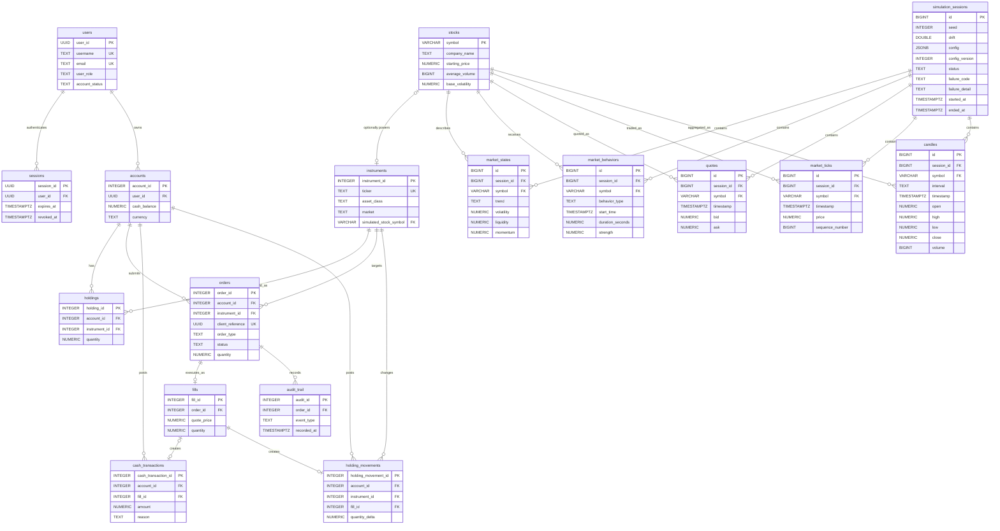

# Trading Season

Trading simulation monorepo with an Angular interface, a Spring Boot backend, and a NestJS authentication service. Reporting applications are placeholders.

## Start here

Install Node.js 22.22.3+ (22.x), npm 11.16.0, JDK 21, Maven 3.9+, and Docker with Compose. From the repository root:

```sh
npm ci
npm --prefix apps/auth-service ci
npm --workspace business-logic-ui start
```

The UI opens on port 4200. Its forms currently perform local validation; API integration is unfinished. Follow [development setup](docs/guides/development.md) to start services and databases.

## Service map

| Area | Responsibility | Local port |
| --- | --- | --- |
| [Business UI](apps/business-logic-ui/README.md) | Login and registration screens | 4200 |
| [Business backend](apps/business-backend/README.md) | Java registration and session login | 8080 |
| [Auth service](apps/auth-service/README.md) | RS256 tokens, refresh tokens, auth database | 3001 |
| [Shared UI](packages/shared-ui-components/README.md) | Reusable Angular components | — |
| [Reporting proposal](docs/reference/reporting.md) | Future analytics UI and service | — |
| [Infrastructure](infrastructure/README.md) | Compose and Jenkins configuration | — |

## Documentation

Browse the [documentation index](docs/README.md) to choose a guide or reference.

- [Development](docs/guides/development.md): setup, commands, tests, contribution workflow.
- [Architecture](docs/reference/architecture.md): boundaries, source navigation, current limitations.
- [API reference](docs/reference/api.md): implemented HTTP contracts.
- [Database](docs/reference/database.md): schema ownership, migrations, and ERD.
- [Operations](docs/guides/operations.md): configuration, CI, deployment limitations, troubleshooting.
- [Agent instructions](AGENTS.md): repository rules and completion checks.

[Javadocs](docs/JAVA_DOCS/index.html) are kept in the repository and generated from Java source; the generation and update requirements are in the development guide.

# Business database ERD

Canonical relationship diagram for the business SQL schema after V001 and V002. SQL defines exact columns and constraints. See the [database reference](docs/reference/database.md) for ownership, initialization, and change rules.

The optional instruments.simulated_stock_symbol links an instrument to a simulator stock. Market data belongs to a simulation session and stock. Keep this diagram synchronized when schema relationships change.


