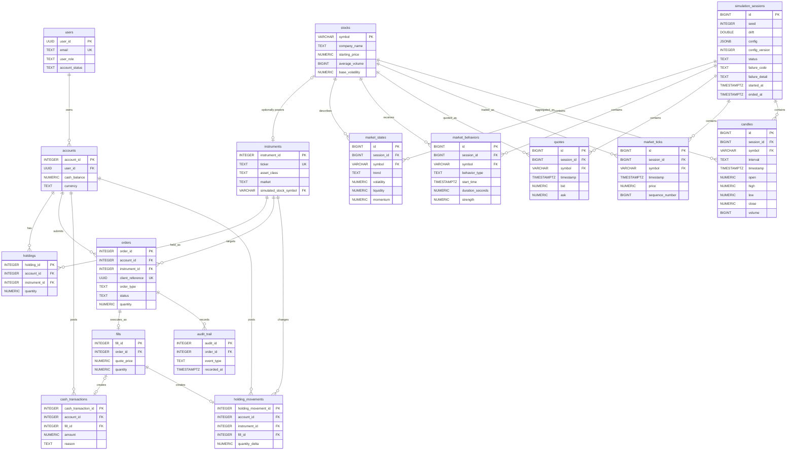

# Trading Season

Trading simulation monorepo with an Angular interface, two Spring Boot microservices, and a NestJS authentication service. Reporting applications are placeholders.

The Java backend is split into two independent microservices:
- **Holdings and Trade Service** (`apps/holdings-and-trade-service/`) – Order submission, validation, execution, and holdings management
- **Order and Sell Service** (`apps/order-and-sell-service/`) – User profile queries and market data access

Both services share a single PostgreSQL database (`trading_season`) and authenticate via the NestJS auth service (`auth_db`).

## Start locally on Windows

Install Node.js 22.22.3+ (22.x), npm 11.16.0, JDK 21, Maven 3.9+, and PostgreSQL (or Docker Compose).

### Quick start with the startup script (requires local databases)

1. Install dependencies from the repository root:

   ```powershell
   npm ci
   npm --prefix apps/auth-service ci
   ```

2. Configure authentication:

   ```powershell
   Copy-Item apps/auth-service/.env.example apps/auth-service/.env
   cd apps/auth-service
   node scripts/generate-dev-keys.mjs | Add-Content .env
   cd ../..
   ```

3. Ensure both databases are running (`trading_season` on port 5432 and `auth_db` on port 5433 for Docker Compose, or 5432 for local PostgreSQL).

4. Start all services with the startup script:

   ```powershell
   $env:SPRING_DATASOURCE_PASSWORD = 'password'
   .\scripts\start-local.ps1
   ```

   The launcher consolidates all logs in one terminal and stops all services if any one exits. Open the UI at `http://localhost:4200`. Auth runs on `http://localhost:3001`, Holdings and Trade Service on `http://localhost:8081`, and Order and Sell Service on `http://localhost:8082`. See the [development guide](docs/guides/development.md) for Docker, tests, and individual service commands.

### Manual setup with local PostgreSQL

If you prefer to run PostgreSQL locally:

#### 1. Create business database

Connect to the default `postgres` database as your PostgreSQL admin user. In pgAdmin Query Tool or psql, run:

```sql
CREATE ROLE trading_season WITH LOGIN PASSWORD 'password';
```

```sql
CREATE DATABASE trading_season OWNER trading_season;
```

Then apply the business schema. Connect to `trading_season` as the `trading_season` user and run these migration files in order:

```powershell
psql -h localhost -p 5432 -U trading_season -d trading_season -W -v ON_ERROR_STOP=1 -f apps/market-data/db/migrations/V001__Initial_schema.sql
psql -h localhost -p 5432 -U trading_season -d trading_season -W -v ON_ERROR_STOP=1 -f apps/market-data/db/migrations/V002__Synthetic_market_data_replay_metadata.sql
psql -h localhost -p 5432 -U trading_season -d trading_season -W -v ON_ERROR_STOP=1 -f apps/market-data/db/migrations/V003__Token_authentication.sql
```

#### 2. Create auth database

Connect to the default `postgres` database as your PostgreSQL admin user and run:

```sql
CREATE ROLE authuser WITH LOGIN PASSWORD 'password';
```

```sql
CREATE DATABASE auth_db OWNER authuser;
```

Then connect to `auth_db` as the `authuser` user and grant schema privileges:

```sql
GRANT ALL PRIVILEGES ON SCHEMA public TO authuser;
```

#### 3. Configure auth service

Copy and configure the auth `.env`:

```powershell
Copy-Item apps/auth-service/.env.example apps/auth-service/.env
```

Set `DB_PORT=5432` (since auth is on the same PostgreSQL instance), then generate the JWT keys:

```powershell
cd apps/auth-service
node scripts/generate-dev-keys.mjs | Add-Content .env
cd ../..
```

#### 4. Start applications

Use the startup script as above, or start each application in its own terminal:

```powershell
npm ci
npm --prefix apps/auth-service ci

# Terminal 1: UI from repository root
npm --workspace business-logic-ui start

# Terminal 2: Holdings and Trade Service
cd apps/holdings-and-trade-service
mvn spring-boot:run

# Terminal 3: Order and Sell Service
cd apps/order-and-sell-service
mvn spring-boot:run

# Terminal 4: Auth service (migrations run on startup)
cd apps/auth-service
npm run start:dev
```

### Docker Compose setup (alternative)

If you prefer to use Docker Compose for databases:

1. Install dependencies and configure authentication (steps 1-2 above).

2. Start the databases:

   ```powershell
   docker compose --env-file apps/auth-service/.env -f infrastructure/docker-compose/docker-compose.local.yml up -d db auth-db
   ```

   This creates:
   - Business database (`trading_season`) on `localhost:5432`
   - Auth database (`auth_db`) on `localhost:5433`

   Auth migrations run automatically on auth-service startup. For the business database, follow the [database setup](docs/reference/database.md#disposable-business-database-setup) to apply migrations V001, V002, and V003 if needed.

3. Start all services with the startup script:

   ```powershell
   $env:SPRING_DATASOURCE_PASSWORD = 'password'
   .\scripts\start-local.ps1
   ```

### Verify auth database

To check registered users, connect pgAdmin's Query Tool to `auth_db` and run:

```sql
SELECT id, email, role, is_active, failed_attempts, locked_until, created_at
FROM users
ORDER BY created_at DESC;
```

See the [development guide](docs/guides/development.md) for additional commands, tests, and troubleshooting.

## Service map

| Area | Responsibility | Local port |
| --- | --- | --- |
| [Business UI](apps/client-ui/README.md) | Login, registration, and a dashboard with live simulated stock tickers | 4200 |
| [Holdings and Trade Service](apps/holdings-and-trade-service/README.md) | Order creation, validation, execution, and holdings management | 8081 |
| [Order and Sell Service](apps/order-and-sell-service/README.md) | User profiles, holdings queries, and order history | 8082 |
| [Auth service](apps/auth-service/README.md) | RS256 tokens, refresh tokens, auth database | 3001 |
| [Business Database](apps/market-data/README.md) | Shared PostgreSQL database setup and migrations | — |
| [Shared UI](packages/shared-ui-components/README.md) | Reusable Angular components | — |
| [Reporting proposal](docs/reference/reporting.md) | Future analytics UI and service | — |
| [Infrastructure](infrastructure/README.md) | Compose and Jenkins configuration | — |

## Documentation

Browse the [documentation index](docs/README.md) to choose a guide or reference.

- [Development](docs/guides/development.md): setup, commands, tests, contribution workflow.
- [Architecture](docs/reference/architecture.md): boundaries, source navigation, current limitations.
- [API reference](docs/reference/api.md): implemented HTTP contracts.
- [Database](docs/reference/database.md): schema ownership, migrations, and ERD.
- [Operations](docs/guides/operations.md): configuration, CI, deployment limitations, troubleshooting.
- [Agent instructions](AGENTS.md): repository rules and completion checks.

[Javadocs](docs/JAVA_DOCS/index.html) are kept in the repository and generated from Java source; the generation and update requirements are in the development guide.

# Business database ERD

Canonical relationship diagram for the business SQL schema after V001, V002 and V003. SQL defines exact columns and constraints. See the [database reference](docs/reference/database.md) for ownership, initialization, and change rules.

The optional instruments.simulated_stock_symbol links an instrument to a simulator stock. Market data belongs to a simulation session and stock. Keep this diagram synchronized when schema relationships change.


