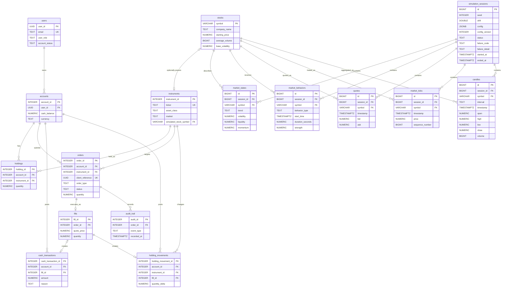

# Trading Season

Trading simulation monorepo with an Angular interface, a Spring Boot backend, and a NestJS authentication service. Reporting applications are placeholders.

The Java application follows a Spring Boot source layout rooted at `apps/business-backend/src/main/java/app`, with the bootstrap class in `app.Main` and feature packages such as `app.auth`, `app.order`, `app.user`, `app.account`, and `app.instrument`.

## Dependency Requirements

These are the recommended and minimum versions. The project has been tested with the defaults listed below. Other compatible versions may work but are not officially supported.

| Dependency | Recommended | Minimum | Purpose |
|---|---|---|---|
| Node.js | 24.8.0 | 24.8.0 | Runtime for Angular UI, NestJS auth, and build tools |
| npm | 11.16.0 | 11.16.0 | Package manager for all Node workspaces |
| Angular | 22.2.x | 22.2.x | Frontend framework with SSR |
| JDK | 21 | 21 | Java compilation and Spring Boot runtime |
| Maven | 3.9+ | 3.9.0 | Java build system |
| Spring Boot | 4.1.1 | 4.1.0 | Backend framework |
| NestJS | 12.0.1+ | 12.0.0 | Auth service framework |
| Python | 3.12 | 3.10+ | Market data generation scripts |
| PostgreSQL | 16 | 15+ | Primary and auth databases |
| Docker Compose | v2+ | v2.0 | Local development orchestration |

### Version Selection

Use the recommended versions in the table above for the best experience. If you have different versions installed (e.g., Node 24.8.0 or Angular 22.2.x), ensure they match the exact requirements listed in the table above.

Node.js version requirements:
- Must be 24.8.0 (exactly)
- Angular 22.2.x requires Node 24.8.0

Angular support:
- Required: Angular 22.2.x (exactly)
- Do not use Angular 21.x or 22.0.x or 22.1.x
- Ensure all @angular packages are on the 22.2.x line

Verification:

```sh
node --version          # Recommended: v24.8.0+, must be v24.x.x
npm --version           # Recommended: 11.16.0+, must be 10.x+
java -version           # Must be: openjdk 21
mvn --version           # Must be: Apache Maven 3.9+
python --version        # Recommended: Python 3.12, Minimum: 3.10+
docker --version        # For Docker database mode
docker compose version  # For Docker database mode
```

If your versions are below the minimums, update them. Higher patch versions on the same major.minor line are compatible.

---

## Start in a Linux VM

Install Git, Bash, Node.js 24.x (recommended 24.8.0+), npm 10.x+ (recommended 11.16.0), JDK 21, and Maven 3.9+. PostgreSQL client tools are required when reusing local PostgreSQL. Docker Engine with the Compose v2 plugin is required only for Docker database mode; Docker Desktop is not required.

From the repository root:

```sh
./scripts/setup-local.sh
```

The default `auto` mode reuses verified local databases or falls back to Docker. Select one explicitly with:

```sh
./scripts/setup-local.sh --database-mode local
./scripts/setup-local.sh --database-mode docker
```

`[READY]` means a valid stage was skipped, `[DONE]` means it was completed, and `[FAIL]` explains why setup stopped. Compose v2 standalone installations are linked into the current user's Docker plugin directory when needed; existing plugin paths are never overwritten.

Market data is not downloaded or generated automatically. Copy and validate an existing archive while retaining at least 3 GiB free with:

```sh
./scripts/setup-local.sh --parquet-source /path/to/synthetic-market-data-2026-v1
```

Press Ctrl+C to stop the applications. PostgreSQL data and Docker database containers are preserved.

### Linux VM toolchain troubleshooting

Node.js 24.8.0 is required. Install it exactly using NVM (Node Version Manager):

#### Install NVM (if not already installed)

```sh
curl -o- https://raw.githubusercontent.com/nvm-sh/nvm/v0.40.3/install.sh | bash
source ~/.bashrc
```

Verify NVM is installed:

```sh
nvm --version
```

#### Install Node 24.8.0

```sh
nvm install 24.8.0
nvm use 24.8.0
```

Verify you have the correct version:

```sh
node --version
```

Output should be: `v24.8.0`

#### Set Node 24.8.0 as the default

```sh
nvm alias default 24.8.0
```

Verify the default is set:

```sh
nvm current
```

Output should be: `v24.8.0`

#### Update npm to 11.16.0

```sh
sudo npm install -g npm@11.16.0
npm --version
```

To install Maven 3.9.11:

```sh
cd /tmp
curl -fLO https://archive.apache.org/dist/maven/maven-3/3.9.11/binaries/apache-maven-3.9.11-bin.tar.gz
sudo tar -xzf apache-maven-3.9.11-bin.tar.gz -C /opt
sudo ln -sfn /opt/apache-maven-3.9.11 /opt/maven
echo 'export M2_HOME=/opt/maven' >> ~/.bashrc
echo 'export PATH=$M2_HOME/bin:$PATH' >> ~/.bashrc
source ~/.bashrc
mvn -version
```

Return to the repository and rerun setup:

```sh
cd -
./scripts/setup-local.sh
```

To intentionally stop databases created by the Linux bootstrap without deleting their data:

```sh
docker compose --project-name trading-season-local --env-file apps/auth-service/.env \
  -f infrastructure/docker-compose/docker-compose.local.yml stop db auth-db
```

## Start locally on Windows

Install Node.js 24.x (recommended 24.8.0+), npm 10.x+ (recommended 11.16.0), JDK 21, Maven 3.9+, and PostgreSQL.

### Start all services with the startup script

After completing the database setup below, run from the repository root. Set the password to the value used by the business database (`password` in the example):

```powershell
$env:SPRING_DATASOURCE_PASSWORD = 'password'
.\scripts\start-local.ps1
```

The script starts UI, auth service, and Java backend in a single terminal and validates database connectivity and `.env` configuration. Press Ctrl+C to stop all services.

Open the UI at `http://localhost:4200`. Auth runs on `http://localhost:3001` and Java on `http://localhost:8081`.

### First-time setup

1. Install dependencies from the repository root:

   ```powershell
   npm ci
   npm --prefix apps/auth-service ci
   ```

2. Configure authentication:

   ```powershell
   Copy-Item apps/auth-service/.env.example apps/auth-service/.env
   (Get-Content apps/auth-service/.env) |
     Where-Object { $_ -notmatch '^JWT_(PRIVATE_KEY|PUBLIC_KEY|ISSUER)=' } |
     Set-Content apps/auth-service/.env
   cd apps/auth-service
   node scripts/generate-dev-keys.mjs | Add-Content .env
   cd ../..
   ```

3. Complete the PostgreSQL database setup below, then use the startup command above.

### Manual setup with local PostgreSQL

If you prefer to run PostgreSQL locally:

#### 1. Create business database

Connect to the default `postgres` database as your PostgreSQL admin user. In pgAdmin Query Tool or psql, run:

```sql
CREATE ROLE trading_season WITH LOGIN PASSWORD 'password';
```

```sql
CREATE DATABASE trading_season OWNER trading_season;
```

Then apply the business schema. Connect to `trading_season` as the `trading_season` user and run these migration files in order:

```powershell
psql -h localhost -p 5432 -U trading_season -d trading_season -W -v ON_ERROR_STOP=1 -f apps/business-backend/db/migrations/V001__Initial_schema.sql
psql -h localhost -p 5432 -U trading_season -d trading_season -W -v ON_ERROR_STOP=1 -f apps/business-backend/db/migrations/V002__Synthetic_market_data_replay_metadata.sql
psql -h localhost -p 5432 -U trading_season -d trading_season -W -v ON_ERROR_STOP=1 -f apps/business-backend/db/migrations/V003__Token_authentication.sql
```

#### 2. Create auth database

Connect to the default `postgres` database as your PostgreSQL admin user and run:

```sql
CREATE ROLE authuser WITH LOGIN PASSWORD 'password';
```

```sql
CREATE DATABASE auth_db OWNER authuser;
```

Then connect to `auth_db` as the `authuser` user and grant schema privileges:

```sql
GRANT ALL PRIVILEGES ON SCHEMA public TO authuser;
```

#### 3. Configure auth service

Copy and configure the auth `.env`:

```powershell
Copy-Item apps/auth-service/.env.example apps/auth-service/.env
```

Set `DB_PORT=5432` and `DB_PASSWORD=password` (since auth is on the manually configured PostgreSQL instance), remove the three placeholder JWT lines, then generate the JWT keys:

```powershell
(Get-Content apps/auth-service/.env) |
  Where-Object { $_ -notmatch '^JWT_(PRIVATE_KEY|PUBLIC_KEY|ISSUER)=' } |
  Set-Content apps/auth-service/.env
cd apps/auth-service
node scripts/generate-dev-keys.mjs | Add-Content .env
cd ../..
```

#### 4. Start applications

Use the startup script as above, or start each application in its own terminal:

```powershell
npm ci
npm --prefix apps/auth-service ci

# Terminal 1: UI from repository root
npm --workspace business-logic-ui start

# Terminal 2: Java backend
cd apps/business-backend
mvn spring-boot:run

# Terminal 3: Auth service (migrations run on startup)
cd apps/auth-service
npm run start:dev
```

### Verify auth database

To check registered users, connect pgAdmin's Query Tool to `auth_db` and run:

```sql
SELECT id, email, role, is_active, failed_attempts, locked_until, created_at
FROM users
ORDER BY created_at DESC;
```

See the [development guide](docs/guides/development.md) for additional commands, tests, and troubleshooting.

## Service map

| Area | Responsibility | Local port |
| --- | --- | --- |
| [Business UI](apps/business-logic-ui/README.md) | Login, registration, and a dashboard with live simulated stock tickers | 4200 |
| [Business backend](apps/business-backend/README.md) | Java registration/session login and public simulated stock data | 8081 |
| [Auth service](apps/auth-service/README.md) | RS256 tokens, refresh tokens, auth database | 3001 |
| [Shared UI](packages/shared-ui-components/README.md) | Reusable Angular components | — |
| [Reporting proposal](docs/reference/reporting.md) | Future analytics UI and service | — |
| [Infrastructure](infrastructure/README.md) | Compose and Jenkins configuration | — |

## Documentation

Browse the [documentation index](docs/README.md) to choose a guide or reference.

- [Development](docs/guides/development.md): setup, commands, tests, contribution workflow.
- [Architecture](docs/reference/architecture.md): boundaries, source navigation, current limitations.
- [API reference](docs/reference/api.md): implemented HTTP contracts.
- [Database](docs/reference/database.md): schema ownership, migrations, and ERD.
- [Operations](docs/guides/operations.md): configuration, CI, deployment limitations, troubleshooting.
- [Agent instructions](AGENTS.md): repository rules and completion checks.

[Javadocs](docs/JAVA_DOCS/index.html) are kept in the repository and generated from Java source; the generation and update requirements are in the development guide.

# Business database ERD

Canonical relationship diagram for the business SQL schema after V001, V002 and V003. SQL defines exact columns and constraints. See the [database reference](docs/reference/database.md) for ownership, initialization, and change rules.

The optional instruments.simulated_stock_symbol links an instrument to a simulator stock. Market data belongs to a simulation session and stock. Keep this diagram synchronized when schema relationships change.


