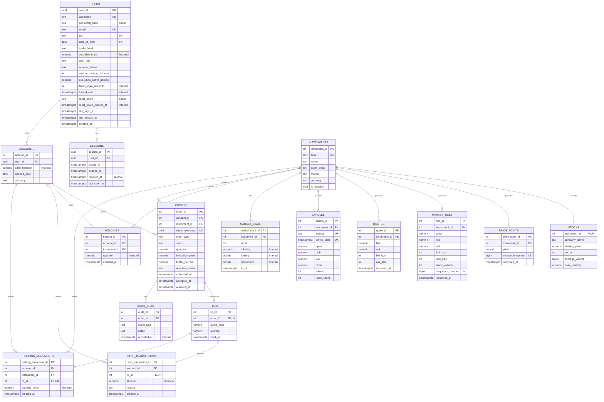

# DuaLEAPa - Trading Simulation Platform

Welcome to the **DuaLEAPa** ! This is a full-stack trading simulation platform built with Angular, Spring Boot, PostgreSQL, and Docker.


### Prerequisites
- **Node.js 22.x** (for Angular frontend)
- **Java 21** (for Spring Boot backend)
- **Maven 3.9+**
- **Docker & Docker Compose**
- **PostgreSQL 16** (runs in Docker)

### Run All Services Locally
```bash
# Clone and install dependencies
git clone <repo-url>
cd dualeapa-sprint1-project
docker-compose -f infrastructure/docker-compose/docker-compose.local.yml up

# In another terminal, start backend (Spring Boot)
cd apps/business-backend
mvn spring-boot:run

# In another terminal, start frontend (Angular)
cd apps/business-logic-ui
npm install
npm run dev
```

**Services will be available at:**
- **Frontend:** http://localhost:4200
- **Backend API:** http://localhost:8080
- **Database:** localhost:5432 (PostgreSQL)

---

## Directory Structure

### **`apps/`** — Deployable Applications
Each app is independently deployable and has its own `README.md` and `.agent.md`.

| App | Tech | Purpose |
|-----|------|---------|
| **business-logic-ui** | Angular 22.1 | Trading dashboard, login, registration |
| **reporting-ui** | Angular 22.1 | Analytics & reporting dashboard (WIP) |
| **business-backend** | Spring Boot 3.3.4 | REST API, authentication, order processing |
| **reporting-service** | Spring Boot | Analytics & reporting engine (WIP) |
| **auth-service** | NestJS | Centralized authentication (WIP) |

### **`packages/`** — Shared Libraries
Reusable code shared across apps.

| Package | Purpose |
|---------|---------|
| **shared-ui-components** | SpartanNG reusable Angular components (Button, Card, Field, Input, Select, etc.) |
| **api-contracts** | OpenAPI 3.0 schema, TypeScript interfaces, Java DTOs — single source of truth for backend/frontend contracts |

### **`scripts/`** — Analytics & Backtesting
Python tools for market simulation analysis.

| Script | Purpose |
|--------|---------|
| **backtesting/** | Run trading strategies against historical data |
| **analytics/** | Generate reports and performance metrics |

### **`infrastructure/`** — DevOps & Deployment
All Docker, Kubernetes, CI/CD, and deployment configs.

| Directory | Purpose |
|-----------|---------|
| **docker/** | Docker build utilities |
| **docker-compose/** | Compose files (local dev & production) |
| **nginx/** | Reverse proxy configuration |
| **jenkins/** | CI/CD pipeline (Jenkinsfile + scripts) |

### **`docs/`** — Centralized Documentation
Complete reference for the entire platform.

| Doc | Purpose |
|-----|---------|
| **ARCHITECTURE.md** | System design, tech stack, component relationships |
| **DATABASE.md** | PostgreSQL schema, migrations, entity relationships |
| **APIREFERENCE.md** | REST API endpoints, authentication, examples |
| **DEVELOPMENTWORKFLOW.md** | Local setup, running services, debugging |
| **DEPLOYMENT.md** | CI/CD, Docker, production setup, secrets management |
| **TEST_SUMMARY.md** | Test suite overview, coverage, running tests locally |
| **JAVA_DOCS.md** | Generated Javadoc reference |

### **`.github/workflows/`** — GitHub Actions
CI/CD pipelines (GitHub Actions).

---

## Development Workflow

### 1. **Set Up Local Environment**
See [docs/DEVELOPMENTWORKFLOW.md](docs/DEVELOPMENTWORKFLOW.md) for detailed setup.

### 2. **Running Services Individually**

#### Backend Only
```bash
cd apps/business-backend
mvn spring-boot:run
# Runs on http://localhost:8080
```

#### Frontend Only
```bash
cd apps/business-logic-ui
npm run dev
# Runs on http://localhost:4200
```

#### Database Only
```bash
docker-compose -f infrastructure/docker-compose/docker-compose.local.yml up postgres
# PostgreSQL on localhost:5432
```

### 3. **Building & Testing**

#### Backend
```bash
cd apps/business-backend
mvn clean test          # Run unit & integration tests
mvn clean package       # Build JAR
```

#### Frontend
```bash
cd apps/business-logic-ui
npm run test            # Run Vitest
npm run build           # Build for production
```

### 4. **Docker Workflow**

#### Local Development
```bash
docker-compose -f infrastructure/docker-compose/docker-compose.local.yml up
```

#### Production
```bash
docker-compose -f infrastructure/docker-compose/docker-compose.prod.yml up -d
```

---

## Documentation Guide

| Need | See |
|------|-----|
| High-level architecture overview | [docs/ARCHITECTURE.md](docs/ARCHITECTURE.md) |
| Database schema & relationships | [docs/DATABASE.md](docs/DATABASE.md) |
| REST API endpoints & authentication | [docs/APIREFERENCE.md](docs/APIREFERENCE.md) |
| Local development setup & troubleshooting | [docs/DEVELOPMENTWORKFLOW.md](docs/DEVELOPMENTWORKFLOW.md) |
| Production deployment & CI/CD | [docs/DEPLOYMENT.md](docs/DEPLOYMENT.md) |
| Test suite, running tests, coverage | [docs/TEST_SUMMARY.md](docs/TEST_SUMMARY.md) |
| Generated Java API documentation | [docs/JAVA_DOCS.md](docs/JAVA_DOCS.md) |

---

## Architecture Overview

```
┌─────────────────────────────────────────────────────────┐
│  Frontend (Angular 22.1)                                │
│  - Login/Register Components                            │
│  - Trading Dashboard                                    │
│  - Shared UI Components (Button, Card, Field, etc.)    │
└──────────────┬──────────────────────────────────────────┘
               │ HTTP/REST + JWT
┌──────────────▼──────────────────────────────────────────┐
│  Backend (Spring Boot 3.3.4)                            │
│  - Authentication Service                               │
│  - User Management                                      │
│  - Order Processing & Execution                         │
│  - WebSocket Support (future)                           │
└──────────────┬──────────────────────────────────────────┘
               │ JDBC
┌──────────────▼──────────────────────────────────────────┐
│  Database (PostgreSQL 16)                               │
│  - Identity & Access Control (6 tables)                │
│  - Simulation Setup (4 tables)                          │
│  - Market Behavior & Data (6 tables)                    │
│  - Orders & Execution (5 tables)                        │
│  - Audit Trail (1 table)                                │
└─────────────────────────────────────────────────────────┘
```

---

## Technology Stack

| Layer | Technology |
|-------|-----------|
| **Frontend** | Angular 22.1, TypeScript, TailwindCSS 4.3.3, Vitest |
| **Backend** | Spring Boot 3.3.4, Spring Security, JPA/Hibernate |
| **Database** | PostgreSQL 16, Flyway migrations |
| **DevOps** | Docker, Docker Compose, Jenkins, Nginx |
| **Analytics** | Python 3.11+, Pandas, NumPy (future) |

---

## Team

| Name | Role |
|------|------|
| Sean Cheema | Team Lead/Front End Developer |
| Chris Chang | Full Stack Engineer |
| Soli Ateefa | Data Engineer |
| Prisca Olose | Full Stack / Security |
| Mohammed Shaoib | Full Stack Engineer |

---


## Contributing

### Branch Strategy
- `main` — Production-ready code
- `develop` — Integration branch
- `feature/*` — Feature branches
- `bugfix/*` — Bug fix branches

### Commit Messages
Follow conventional commits:
```
feat: Add login form validation
fix: Correct order processing logic
docs: Update database schema and general documentation
test: Add unit tests for AuthService
```

### Pull Requests
1. Create feature branch from `develop`
2. Make changes & commit with meaningful messages
3. Push to origin
4. Create PR with description & link to issue
5. Ensure CI passes (all tests, linting)
6. Get code review approval
7. Merge to `develop`

### Code Style
- **Backend:** Follow Google Java Style Guide
- **Frontend:** ESLint + Prettier (configured in angular.json)
- **Commit history:** Preserve linearity with `git mv` for file movements

---

## Troubleshooting

### Backend won't start
- Check Java 21 is installed: `java -version`
- Check Maven version: `mvn -v`
- Check database is running: `docker ps | grep postgres`
- See [docs/DEVELOPMENTWORKFLOW.md](docs/DEVELOPMENTWORKFLOW.md#troubleshooting)

### Frontend build fails
- Delete `node_modules/` and `package-lock.json`, then run `npm install`
- Check Node 22.x: `node -v`
- Run `npm run lint` to check for style errors

### Docker Compose won't start
- Ensure Docker daemon is running
- Check port conflicts: `netstat -ano | find ":8080\|:5432\|:4200"`
- Review logs: `docker-compose logs -f`

See [docs/DEVELOPMENTWORKFLOW.md](docs/DEVELOPMENTWORKFLOW.md) for more troubleshooting.

---

## Support & Questions

- **Architecture Questions:** See [docs/ARCHITECTURE.md](docs/ARCHITECTURE.md)
- **Database Questions:** See [docs/DATABASE.md](docs/DATABASE.md)
- **API Questions:** See [docs/APIREFERENCE.md](docs/APIREFERENCE.md)
- **Development Setup:** See [docs/DEVELOPMENTWORKFLOW.md](docs/DEVELOPMENTWORKFLOW.md)
- **Deployment:** See [docs/DEPLOYMENT.md](docs/DEPLOYMENT.md)

---
## Project Topic
Trading Platform

## Project Overview

**Platform:** Trading Platform  
**Status:** Sprint 4 
**Last Updated:** 9/9/26


## Project Architecture

```
dualeapa-sprint1-project/
│
├── README.md                                  ← Navigation Hub
├── .agent.md                                  ← AI Guidance
│
├── apps/                                      ← Deployable Applications
│   │
│   ├── business-logic-ui/                     ← Angular 22.1 Business UI
│   │   ├── README.md
│   │   ├── .agent.md
│   │   ├── package.json
│   │   ├── angular.json
│   │   ├── src/
│   │   └── Dockerfile
│   │
│   ├── reporting-ui/                          ← Angular 22.1 Reporting UI
│   │   ├── README.md
│   │   ├── .agent.md
│   │   ├── package.json
│   │   ├── angular.json
│   │   ├── src/
│   │   └── Dockerfile
│   │
│   ├── business-backend/                      ← Spring Boot API + Database
│   │   ├── README.md
│   │   ├── .agent.md
│   │   ├── pom.xml
│   │   ├── src/
│   │   ├── db/
│   │   │   └── migrations/                    ← Flyway (V001, V002, V003...)
│   │   └── Dockerfile
│   │
│   ├── reporting-service/                     ← Spring Boot Reporting Service
│   │   ├── README.md
│   │   ├── .agent.md
│   │   ├── pom.xml
│   │   ├── src/
│   │   └── Dockerfile
│   │
│   └── auth-service/                          ← NestJS Authentication Service
│       ├── README.md
│       ├── .agent.md
│       ├── src/
│       │   └── app/api/auth/
│       │       ├── login/
│       │       ├── register/
│       │       ├── refresh/
│       │       └── verify/
│       └── Dockerfile
│
├── packages/                                  ← Shared Libraries
│   │
│   ├── shared-ui-components/                  ← Reusable Angular Components
│   └── api-contracts/                         ← OpenAPI Schemas & DTOs
│
├── scripts/                                   ← Python Analytics & Backtesting
│   ├── README.md
│   ├── .agent.md
│   ├── requirements.txt
│   ├── backtesting/
│   │   └── run_backtest.py + strategies
│   └── analytics/
│       └── report_generator.py
│
├── infrastructure/                            ← DevOps & Deployment
│   ├── README.md
│   ├── .agent.md
│   ├── docker/
│   ├── docker-compose/
│   │   ├── docker-compose.local.yml
│   │   └── docker-compose.prod.yml
│   ├── nginx/
│   └── jenkins/
│       ├── Jenkinsfile
│       └── pipeline-scripts/
│
├── docs/                                      ← Centralized Documentation
│   ├── ARCHITECTURE.md
│   ├── API_REFERENCE.md
│   ├── DATABASE.md
│   ├── DEVELOPMENT_WORKFLOW.md
│   ├── DEPLOYMENT.md
│   └── JAVA_DOCS.md
│
├── .github/
│   └── workflows/                             ← GitHub Actions
│
├── package.json                               ← Monorepo Configuration
└── turbo.json                                 ← Turborepo Task Runner

```

## Our Entity-relationship (ER) diagram

Column tags/sensitivity labels follow the legend above; enum values and long-form notes live in [dua-leapa-schema.sql](./dua-leapa-schema.sql) comments, not repeated here to keep this compact.


## Our Entity-Relationships (ER) Diagram

## Our Branching Strategy
Our branching strategy is trunking

## External Frameworks 
SpartanNG UI - accessible, customizable components for Angular application.
PrimeNG UI -  comprehensive UI component library specifically designed for Angular applications.
Figma - UI design mockups and prototypes 
Claude Design 

**Last Updated:** 2026-09-09  
**Version:** 1 (v0.1.0)
