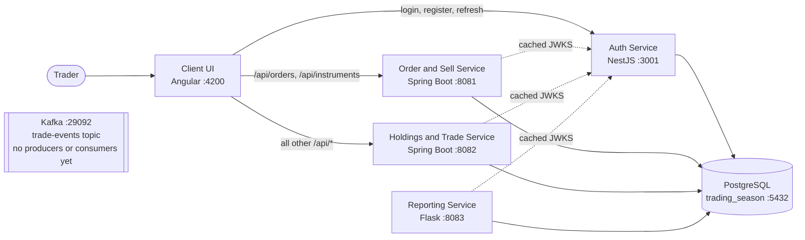
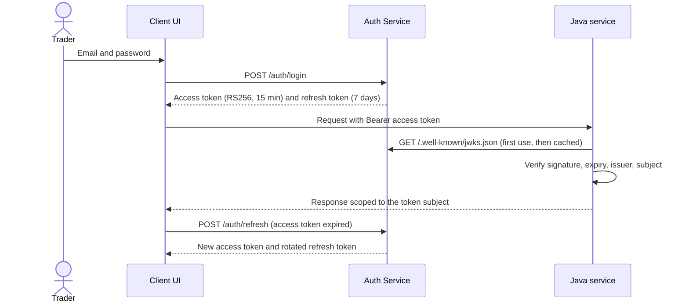
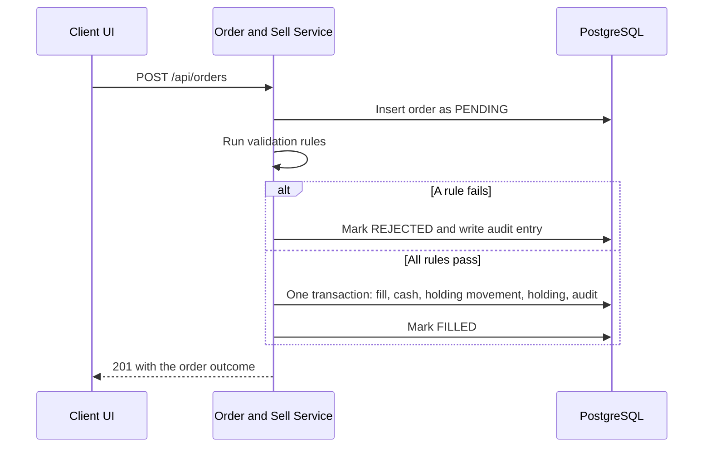
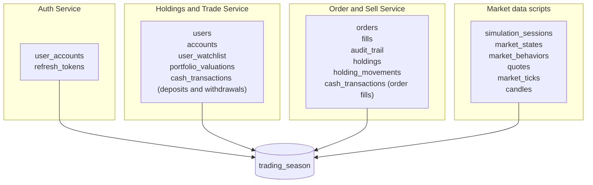
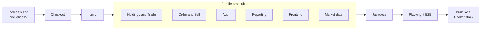

# Trading Season

A trading simulation platform: an Angular client, two Spring Boot services for trading and holdings, a NestJS authentication service, and a Flask reporting service, all sharing one PostgreSQL database.

## Services

| Service | Folder | Port | Responsibility |
| --- | --- | --- | --- |
| Client UI | [apps/client-ui](apps/client-ui/README.md) | 4200 | Landing, login, registration, trading dashboard |
| Auth Service | [apps/auth-service](apps/auth-service/README.md) | 3001 | Credentials, RS256 access tokens, refresh token rotation |
| Order and Sell Service | [apps/order-and-sell-service](apps/order-and-sell-service/README.md) | 8081 | Order submission, validation, execution, instruments |
| Holdings and Trade Service | [apps/holdings-and-trade-service](apps/holdings-and-trade-service/README.md) | 8082 | Profiles, accounts, holdings, cash, watchlist, market data |
| Reporting Service | [apps/reporting-service](apps/reporting-service/README.md) | 8083 | Portfolio and trade reporting (in development) |
| Reporting UI | [apps/reporting-ui](apps/reporting-ui/README.md) | 4300 | Placeholder page |
| Market Data | [apps/market-data](apps/market-data/README.md) | - | Synthetic market data generation and import |
| Database | [db](db/README.md) | 5432 | Migrations and schema for the shared `trading_season` database |

## Architecture


```mermaid
flowchart LR
    Trader([Trader]) --> UI["Client UI<br/>Angular :4200"]
    UI -- "login, register, refresh" --> Auth["Auth Service<br/>NestJS :3001"]
    UI -- "/api/orders, /api/instruments" --> OS["Order and Sell Service<br/>Spring Boot :8081"]
    UI -- "all other /api/*" --> HT["Holdings and Trade Service<br/>Spring Boot :8082"]

    OS -. "cached JWKS" .-> Auth
    HT -. "cached JWKS" .-> Auth
    RS["Reporting Service<br/>Flask :8083"] -. "cached JWKS" .-> Auth

    Auth --> DB[("PostgreSQL<br/>trading_season :5432")]
    OS --> DB
    HT --> DB
    RS --> DB

    Kafka[["Kafka :29092<br/>trade-events topic<br/>no producers or consumers yet"]]
```

The UI reaches both Java services through one relative `/api` prefix that the dev proxy and the Nginx image split by path. The Java services never call the Auth Service per request: they verify tokens locally against its cached public keys.

## Authentication and request flow


```mermaid
sequenceDiagram
    actor Trader
    participant UI as Client UI
    participant Auth as Auth Service
    participant API as Java service

    Trader->>UI: Email and password
    UI->>Auth: POST /auth/login
    Auth-->>UI: Access token (RS256, 15 min) and refresh token (7 days)
    UI->>API: Request with Bearer access token
    API->>Auth: GET /.well-known/jwks.json (first use, then cached)
    API->>API: Verify signature, expiry, issuer, subject
    API-->>UI: Response scoped to the token subject
    UI->>Auth: POST /auth/refresh (access token expired)
    Auth-->>UI: New access token and rotated refresh token
```

## Order flow


```mermaid
sequenceDiagram
    participant UI as Client UI
    participant OS as Order and Sell Service
    participant DB as PostgreSQL

    UI->>OS: POST /api/orders
    OS->>DB: Insert order as PENDING
    OS->>OS: Run validation rules
    alt A rule fails
        OS->>DB: Mark REJECTED and write audit entry
    else All rules pass
        OS->>DB: One transaction: fill, cash, holding movement, holding, audit
        OS->>DB: Mark FILLED
    end
    OS-->>UI: 201 with the order outcome
```

## Data ownership

Every service writes only its own tables. The schema is defined once, in [db/migrations](db/migrations), and no service runs migrations itself.


```mermaid
flowchart TB
    subgraph Auth["Auth Service"]
        A1["user_accounts<br/>refresh_tokens"]
    end
    subgraph HT["Holdings and Trade Service"]
        H1["users<br/>accounts<br/>user_watchlist<br/>portfolio_valuations<br/>cash_transactions (deposits and withdrawals)"]
    end
    subgraph OS["Order and Sell Service"]
        O1["orders<br/>fills<br/>audit_trail<br/>holdings<br/>holding_movements<br/>cash_transactions (order fills)"]
    end
    subgraph MD["Market data scripts"]
        M1["simulation_sessions<br/>market_states<br/>market_behaviors<br/>quotes<br/>market_ticks<br/>candles"]
    end
    DB[("trading_season")]
    A1 --> DB
    H1 --> DB
    O1 --> DB
    M1 --> DB
```

## CI pipeline

[infrastructure/jenkins/Jenkinsfile](infrastructure/jenkins/Jenkinsfile) runs on every branch. A failure in the parallel test group stops the pipeline.


```mermaid
flowchart LR
    Pre["Toolchain and<br/>disk checks"] --> Checkout --> Deps["npm ci"]
    Deps --> Tests
    subgraph Tests["Parallel test suites"]
        T1["Holdings and Trade"]
        T2["Order and Sell"]
        T3["Auth"]
        T4["Reporting"]
        T5["Frontend"]
        T6["Market data"]
    end
    Tests --> Docs["Javadocs"] --> E2E["Playwright E2E"] --> Stack["Build local<br/>Docker stack"]
```

## Getting started

Requirements: Node.js 24.8+ (24.x), npm 11.16, JDK 21, Maven 3.9+, and Docker (or a local PostgreSQL 16).

### Docker stack

```powershell
node apps/auth-service/scripts/generate-dev-keys.mjs | Add-Content infrastructure/docker-compose/.env
docker compose --project-name trading-season-local -f infrastructure/docker-compose/docker-compose.local.yml up -d --build
```

The UI is at http://localhost:4200. The database is created and migrated automatically.

### Local processes (Windows)

```powershell
npm --prefix apps/client-ui ci
npm --prefix apps/auth-service ci
Copy-Item apps/auth-service/.env.example apps/auth-service/.env
node apps/auth-service/scripts/generate-dev-keys.mjs | Add-Content apps/auth-service/.env
$env:SPRING_DATASOURCE_PASSWORD = 'password'
.\scripts\start-local.ps1
```

This needs a running `trading_season` database; see [db/README.md](db/README.md) to create and migrate one, and [apps/market-data](apps/market-data/README.md) to load synthetic market data. On Linux, `scripts/setup-local.sh` does the equivalent setup.

### Development login

In development the auth service seeds `admin@example.com` / `admin123`. Production never seeds it.

## VS Code workspace

Open [trading-season.code-workspace](trading-season.code-workspace) to load the repository and both Java Maven project folders explicitly. This lets Java language servers resolve each service's dependency classpath when working from the repository root.

## Checks

Run from the repository root. There is no root npm project.

| Check | Command |
| --- | --- |
| UI build | `npm --prefix apps/client-ui run build` |
| UI tests | `npm --prefix apps/client-ui test -- --no-watch` |
| UI end-to-end | `npm --prefix apps/client-ui run e2e` |
| Holdings and Trade tests | `mvn -B -f apps/holdings-and-trade-service/pom.xml test` |
| Order and Sell tests | `mvn -B -f apps/order-and-sell-service/pom.xml test` |
| Auth tests and lint | `npm --prefix apps/auth-service test` and `npm --prefix apps/auth-service run lint` |
| Reporting tests | `python -m pytest` in `apps/reporting-service` |

## API documentation

| Service | Swagger UI |
| --- | --- |
| Auth Service | http://localhost:3001/api/docs |
| Order and Sell Service | http://localhost:8081/swagger-ui.html |
| Holdings and Trade Service | http://localhost:8082/swagger-ui.html |
| Reporting Service | http://localhost:8083/docs |

Generated Java documentation is checked in under [docs/JAVA_DOCS](docs/JAVA_DOCS/index.html); see [AGENTS.md](AGENTS.md) for how to regenerate it.

## Team

- **Soli** - Team Lead
- **Chris** - Scrum Master
- **Sean** - Meeting Scribe and Front End Developer
- **Prisca** - Full Stack Developer
- **Mohammed** - Full Stack Developer
