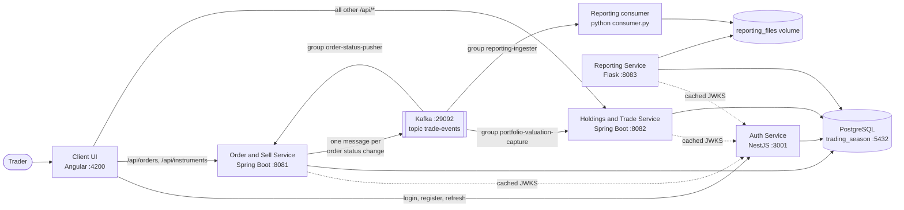
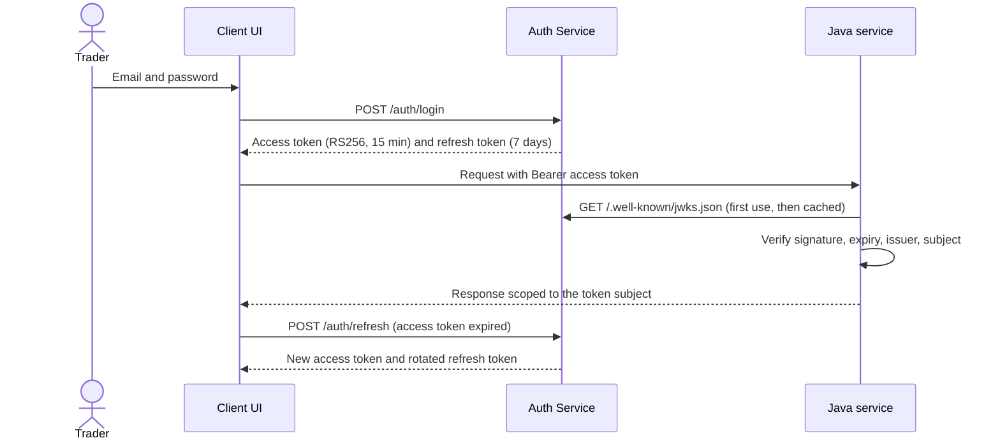
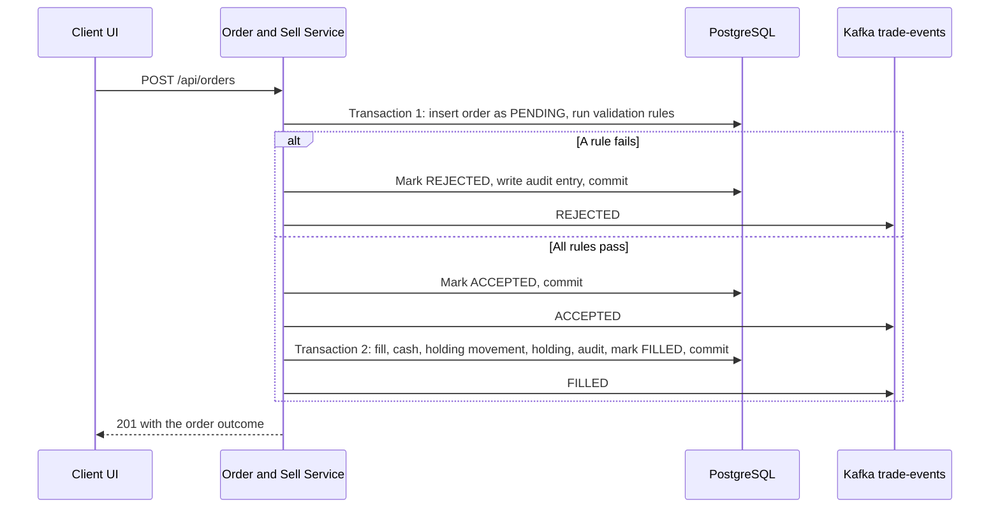
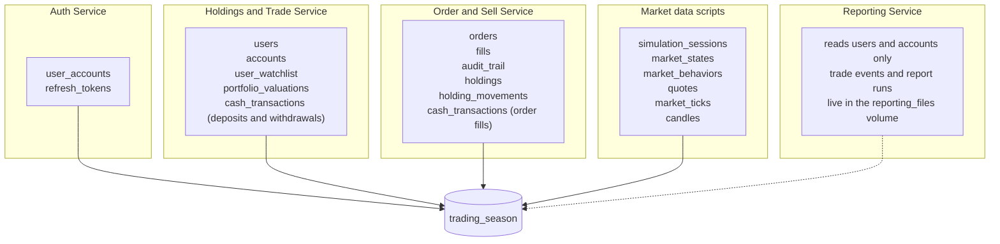
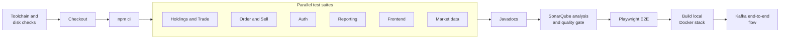

# Trading Season

A trading simulation platform: an Angular client, two Spring Boot services for trading and holdings, a NestJS authentication service, and a Flask reporting service, all sharing one PostgreSQL database. A Kafka topic, `trade-events`, carries every order status change from the Order and Sell Service to three consumers.

## Services

| Service | Folder | Port | Responsibility |
| --- | --- | --- | --- |
| Client UI | [apps/client-ui](apps/client-ui/README.md) | 4200 | Landing, login, registration, trading dashboard |
| Auth Service | [apps/auth-service](apps/auth-service/README.md) | 3001 | Credentials, RS256 access tokens, refresh token rotation |
| Order and Sell Service | [apps/order-and-sell-service](apps/order-and-sell-service/README.md) | 8081 | Order submission, validation, execution, instruments |
| Holdings and Trade Service | [apps/holdings-and-trade-service](apps/holdings-and-trade-service/README.md) | 8082 | Profiles, accounts, holdings, cash, watchlist, market data |
| Reporting Service | [apps/reporting-service](apps/reporting-service/README.md) | 8083 | Kafka consumer storing trade events as files, scheduled report runs with charts, endpoints serving the runs |
| Reporting UI | [apps/reporting-ui](apps/reporting-ui/README.md) | 4300 | Placeholder page |
| Market Data | [apps/market-data](apps/market-data/README.md) | - | Synthetic market data generation and import |
| Database | [db](db/README.md) | 5432 | Migrations and schema for the shared `trading_season` database |

## Architecture


```mermaid
flowchart LR
    Trader([Trader]) --> UI["Client UI<br/>Angular :4200"]
    UI -- "login, register, refresh" --> Auth["Auth Service<br/>NestJS :3001"]
    UI -- "/api/orders, /api/instruments" --> OS["Order and Sell Service<br/>Spring Boot :8081"]
    UI -- "all other /api/*" --> HT["Holdings and Trade Service<br/>Spring Boot :8082"]

    OS -. "cached JWKS" .-> Auth
    HT -. "cached JWKS" .-> Auth
    RS["Reporting Service<br/>Flask :8083"] -. "cached JWKS" .-> Auth

    Auth --> DB[("PostgreSQL<br/>trading_season :5432")]
    OS --> DB
    HT --> DB
    RS --> DB

    OS -- "one message per<br/>order status change" --> Kafka[["Kafka :29092<br/>topic trade-events"]]
    Kafka -- "group order-status-pusher" --> OS
    Kafka -- "group portfolio-valuation-capture" --> HT
    Kafka -- "group reporting-ingester" --> RC["Reporting consumer<br/>python consumer.py"]
    RC --> Files[("reporting_files volume")]
    RS --> Files
```

The UI reaches both Java services through one relative `/api` prefix that the dev proxy and the Nginx image split by path. The Java services never call the Auth Service per request: they verify tokens locally against its cached public keys.

The Order and Sell Service publishes one `trade-events` message after each committed order status change (ACCEPTED, FILLED or REJECTED), keyed by account id. Three consumer groups read the topic independently:

| Consumer group | Lives in | On each event |
| --- | --- | --- |
| `order-status-pusher` | Order and Sell Service | Pushes the status to the owning user's open `GET /api/orders/stream` connections (Server-Sent Events) |
| `portfolio-valuation-capture` | Holdings and Trade Service | On FILLED, records a portfolio valuation for the account so the portfolio chart gets a point at the moment of the trade |
| `reporting-ingester` | Reporting consumer (`reporting-consumer` container) | Appends the event to JSON Lines files in the `reporting_files` volume; a scheduled run turns them into `report.json` and charts that the Reporting Service serves |

A consumer that is down simply resumes from its committed offset when it returns. The producer never waits for a consumer, and an unreachable broker delays the order response but never changes the order outcome.

The two Java consumers run inside their services, because a Spring Boot service is one process and a listener in it is naturally the only one. The reporting consumer is the same code and the same image as the Reporting Service but runs as its own container, because the web side is served by gunicorn with several worker processes and a Kafka consumer that writes files must exist exactly once; a second process from the same image gives that without a second codebase.

### Tracing the event flow

Each part of the flow can be followed from its description here to the code that implements it, the tests that prove it, and where a Jenkins build shows it. Test classes appear by name under a build's Test Result. The "Build Local Docker Stack" stage proves the topic and the three consumer groups exist, and the "Kafka End-to-End Flow" stage then places a real order against the built stack and shows, step by step, the two messages it published and what each consumer did with them; that checklist is archived with the build as `reports/kafka-end-to-end/evidence.txt`. Requirement numbers refer to the LEAP Business Requirements Specification.

| Capability | Requirement | Documentation | Code | Tests | Jenkins evidence |
| --- | --- | --- | --- | --- | --- |
| An order is committed as accepted before it executes, and the fill ledger commits atomically | BR-06, BR-09 | [Order flow](#order-flow), [Order and Sell: order submission](apps/order-and-sell-service/README.md#order-submission) | [OrderService](apps/order-and-sell-service/src/main/java/app/order/OrderService.java), [OrderExecutionService](apps/order-and-sell-service/src/main/java/app/order/execution/OrderExecutionService.java), [V003 migration](db/migrations/V003__Order_status_accepted.sql) | [OrderServiceExecutionFailureTest](apps/order-and-sell-service/src/test/java/app/order/OrderServiceExecutionFailureTest.java), [OrderControllerIntegrationTest](apps/order-and-sell-service/src/test/java/app/order/OrderControllerIntegrationTest.java) | Stage "Order and Sell Service Tests" |
| One `trade-events` message per committed status change | Section 3 (loose coupling) | [Architecture](#architecture) | [TradeEventPublisher](apps/order-and-sell-service/src/main/java/app/order/event/TradeEventPublisher.java), [OrderStatusEvent](apps/order-and-sell-service/src/main/java/app/order/event/OrderStatusEvent.java) | [TradeEventPublisherTest](apps/order-and-sell-service/src/test/java/app/order/event/TradeEventPublisherTest.java), [TradeEventFlowIntegrationTest](apps/order-and-sell-service/src/test/java/app/order/event/TradeEventFlowIntegrationTest.java) (embedded broker) | Stage "Order and Sell Service Tests"; stack stage prints the `trade-events` topic with three partitions; end-to-end stage shows the ACCEPTED and FILLED messages published for a real order |
| Order status pushed live to the trader (`order-status-pusher`) | BR-07, section 9.2 | [Order and Sell README](apps/order-and-sell-service/README.md) | [OrderStatusPusherListener](apps/order-and-sell-service/src/main/java/app/order/event/OrderStatusPusherListener.java), [OrderStatusStreamRegistry](apps/order-and-sell-service/src/main/java/app/order/event/OrderStatusStreamRegistry.java), [OrderStatusStreamController](apps/order-and-sell-service/src/main/java/app/order/event/OrderStatusStreamController.java) | [OrderStatusPusherListenerTest](apps/order-and-sell-service/src/test/java/app/order/event/OrderStatusPusherListenerTest.java), [OrderStatusStreamRegistryTest](apps/order-and-sell-service/src/test/java/app/order/event/OrderStatusStreamRegistryTest.java), [OrderStatusStreamControllerTest](apps/order-and-sell-service/src/test/java/app/order/event/OrderStatusStreamControllerTest.java), [TradeEventFlowIntegrationTest](apps/order-and-sell-service/src/test/java/app/order/event/TradeEventFlowIntegrationTest.java) | Stage "Order and Sell Service Tests"; stack stage lists `order-status-pusher` as a live consumer group; end-to-end stage shows both status frames arriving on the order stream |
| Portfolio value captured at the moment of a fill (`portfolio-valuation-capture`) | Section 9.2, BR-18 | [Holdings and Trade: portfolio valuation on fill](apps/holdings-and-trade-service/README.md#portfolio-valuation-on-fill) | [PortfolioValuationListener](apps/holdings-and-trade-service/src/main/java/app/account/PortfolioValuationListener.java) | [PortfolioValuationListenerTest](apps/holdings-and-trade-service/src/test/java/app/account/PortfolioValuationListenerTest.java), [PortfolioValuationCaptureFlowIntegrationTest](apps/holdings-and-trade-service/src/test/java/app/account/PortfolioValuationCaptureFlowIntegrationTest.java) (embedded broker) | Stage "Holdings and Trade Service Tests"; stack stage lists `portfolio-valuation-capture` as a live consumer group; end-to-end stage shows the valuation row captured for the order |
| Trade events stored as files and turned into scheduled reports with charts (`reporting-ingester`) | BR-14, BR-16, BR-17 | [Reporting README](apps/reporting-service/README.md) | [consumer.py](apps/reporting-service/consumer.py), [event_store.py](apps/reporting-service/event_store.py), [report_run.py](apps/reporting-service/report_run.py), [routes.py](apps/reporting-service/routes.py) | [test_consumer.py](apps/reporting-service/tests/test_consumer.py), [test_event_store.py](apps/reporting-service/tests/test_event_store.py), [test_report_run.py](apps/reporting-service/tests/test_report_run.py), [test_runs_routes.py](apps/reporting-service/tests/test_runs_routes.py) | Stage "Reporting Service Tests"; stack stage requires the `reporting-consumer` container to be running and lists `reporting-ingester` as a live consumer group; end-to-end stage shows both events in the files and the report served with the order in it |
| Broker and topic provisioning | Section 3 | [Infrastructure README](infrastructure/README.md#local-stack) | [docker-compose.local.yml](infrastructure/docker-compose/docker-compose.local.yml) (`kafka`, `kafka-init`, `reporting-consumer`) | Stack stage of the pipeline | Stage "Build Local Docker Stack": every expected container running, topic described, all three groups registered; stage "Kafka End-to-End Flow": lag 0 on every group after the order |

## Authentication and request flow


```mermaid
sequenceDiagram
    actor Trader
    participant UI as Client UI
    participant Auth as Auth Service
    participant API as Java service

    Trader->>UI: Email and password
    UI->>Auth: POST /auth/login
    Auth-->>UI: Access token (RS256, 15 min) and refresh token (7 days)
    UI->>API: Request with Bearer access token
    API->>Auth: GET /.well-known/jwks.json (first use, then cached)
    API->>API: Verify signature, expiry, issuer, subject
    API-->>UI: Response scoped to the token subject
    UI->>Auth: POST /auth/refresh (access token expired)
    Auth-->>UI: New access token and rotated refresh token
```

Registration is two calls: the UI creates credentials with `POST /auth/register` on the Auth Service, then posts the profile with the returned token to `POST /api/registration` on the Holdings and Trade Service, which also opens the default account. Order and Sell exposes no registration endpoint.

## Order flow


```mermaid
sequenceDiagram
    participant UI as Client UI
    participant OS as Order and Sell Service
    participant DB as PostgreSQL

    participant K as Kafka trade-events

    UI->>OS: POST /api/orders
    OS->>DB: Transaction 1: insert order as PENDING, run validation rules
    alt A rule fails
        OS->>DB: Mark REJECTED, write audit entry, commit
        OS->>K: REJECTED
    else All rules pass
        OS->>DB: Mark ACCEPTED, commit
        OS->>K: ACCEPTED
        OS->>DB: Transaction 2: fill, cash, holding movement, holding, audit, mark FILLED, commit
        OS->>K: FILLED
    end
    OS-->>UI: 201 with the order outcome
```

Acceptance and execution are separate transactions, so an order is never recorded as FILLED before its execution has committed. If execution fails, the order stays ACCEPTED with an `EXECUTION_FAILED` audit entry and the response carries that state; nothing retries it automatically. Each message is published only after its transaction commits, so a consumer never sees a status the database does not hold.

## Data ownership

Every service writes only its own tables. The schema is defined once, in [db/migrations](db/migrations), and no service runs migrations itself.


```mermaid
flowchart TB
    subgraph Auth["Auth Service"]
        A1["user_accounts<br/>refresh_tokens"]
    end
    subgraph HT["Holdings and Trade Service"]
        H1["users<br/>accounts<br/>user_watchlist<br/>portfolio_valuations<br/>cash_transactions (deposits and withdrawals)"]
    end
    subgraph OS["Order and Sell Service"]
        O1["orders<br/>fills<br/>audit_trail<br/>holdings<br/>holding_movements<br/>cash_transactions (order fills)"]
    end
    subgraph MD["Market data scripts"]
        M1["simulation_sessions<br/>market_states<br/>market_behaviors<br/>quotes<br/>market_ticks<br/>candles"]
    end
    subgraph RS["Reporting Service"]
        R1["reads users and accounts only<br/>trade events and report runs<br/>live in the reporting_files volume"]
    end
    DB[("trading_season")]
    A1 --> DB
    H1 --> DB
    O1 --> DB
    M1 --> DB
    R1 -.-> DB
```

The Reporting Service writes no database tables. Its trade data comes from the `trade-events` topic and is kept as files; see [apps/reporting-service](apps/reporting-service/README.md).

## CI pipeline

[infrastructure/jenkins/Jenkinsfile](infrastructure/jenkins/Jenkinsfile) runs on every branch. A failure in the parallel test group stops the pipeline.


```mermaid
flowchart LR
    Pre["Toolchain and<br/>disk checks"] --> Checkout --> Deps["npm ci"]
    Deps --> Tests
    subgraph Tests["Parallel test suites"]
        T1["Holdings and Trade"]
        T2["Order and Sell"]
        T3["Auth"]
        T4["Reporting"]
        T5["Frontend"]
        T6["Market data"]
    end
    Tests --> Docs["Javadocs"] --> Sonar["SonarQube analysis<br/>and quality gate"] --> E2E["Playwright E2E"] --> Stack["Build local<br/>Docker stack"] --> Flow["Kafka end-to-end<br/>flow"]
```

## Getting started

Requirements: Node.js 24.8+ (24.x), npm 11.16, JDK 21, Maven 3.9+, and Docker (or a local PostgreSQL 16).

### Docker stack

```powershell
node apps/auth-service/scripts/generate-dev-keys.mjs | Add-Content infrastructure/docker-compose/.env
docker compose --project-name trading-season-local -f infrastructure/docker-compose/docker-compose.local.yml up -d --build
```

The UI is at http://localhost:4200. The database is created and migrated automatically, and a one-shot `kafka-init` container creates the `trade-events` topic before the Java services and the reporting consumer start. See [infrastructure/README.md](infrastructure/README.md) for ports and the broker.

### Local processes (Windows)

```powershell
npm --prefix apps/client-ui ci
npm --prefix apps/auth-service ci
Copy-Item apps/auth-service/.env.example apps/auth-service/.env
node apps/auth-service/scripts/generate-dev-keys.mjs | Add-Content apps/auth-service/.env
$env:SPRING_DATASOURCE_PASSWORD = 'password'
.\scripts\start-local.ps1
```

This needs a running `trading_season` database; see [db/README.md](db/README.md) to create and migrate one, and [apps/market-data](apps/market-data/README.md) to load synthetic market data. On Linux, `scripts/setup-local.sh` does the equivalent setup. The Java services also expect the Kafka broker from the Compose file on `localhost:29092`; start only the `kafka` and `kafka-init` services from it, or set `app.events.enabled=false` on both Java services to run without a broker.

### Development login

In development the auth service seeds `admin@example.com` / `admin123`. Production never seeds it.

## Checks

Run from the repository root. There is no root npm project.

| Check | Command |
| --- | --- |
| UI build | `npm --prefix apps/client-ui run build` |
| UI tests | `npm --prefix apps/client-ui test -- --no-watch` |
| UI end-to-end | `npm --prefix apps/client-ui run e2e` |
| Holdings and Trade tests | `mvn -B -f apps/holdings-and-trade-service/pom.xml test` |
| Order and Sell tests | `mvn -B -f apps/order-and-sell-service/pom.xml test` |
| Auth tests and lint | `npm --prefix apps/auth-service test` and `npm --prefix apps/auth-service run lint` |
| Reporting tests | `python -m pytest` in `apps/reporting-service` |

## API documentation

| Service | Swagger UI |
| --- | --- |
| Auth Service | http://localhost:3001/api/docs |
| Order and Sell Service | http://localhost:8081/swagger-ui.html |
| Holdings and Trade Service | http://localhost:8082/swagger-ui.html |
| Reporting Service | http://localhost:8083/docs |

Generated Java documentation is checked in under [docs/JAVA_DOCS](docs/JAVA_DOCS/index.html); see [AGENTS.md](AGENTS.md) for how to regenerate it.

## Team

- **Soli** - Team Lead
- **Chris** - Scrum Master
- **Sean** - Meeting Scribe and Front End Developer
- **Prisca** - Full Stack Developer
- **Mohammed** - Full Stack Developer
