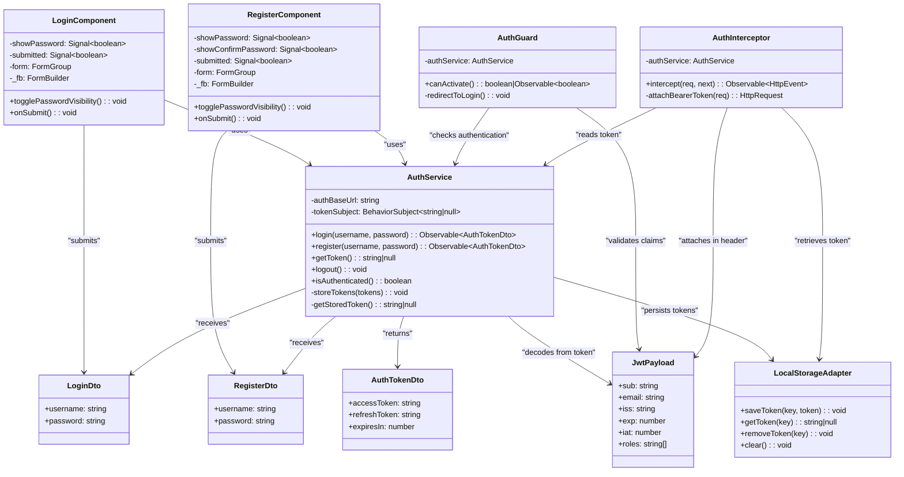

# Auth service

NestJS authentication service with PostgreSQL, RS256 access tokens, opaque refresh-token rotation, JWKS, and a liveness endpoint. See the [API reference](../../docs/reference/api.md) for contracts and the existing logout limitation.

## UML Diagram 
# Business Logic UI (Middle Tier) - Service Layer UML Diagram

## Class Diagram - Service Layer Architecture & Entity Relationships



##  Class Descriptions 


#### LoginComponent
**Purpose**: Collect and validate user login credentials

**Properties**:
- `showPassword: Signal<boolean>` - Toggles password field masking
- `submitted: Signal<boolean>` - Tracks form submission state
- `form: FormGroup` - Reactive form with validation rules
  - `username` - Required, alphanumeric + underscore only
  - `password` - Required, minimum 8 characters
- `_fb: FormBuilder` - Angular form builder for reactive forms

**Methods**:
- `togglePasswordVisibility()` - Toggles password masking
- `onSubmit()` - Validates form and calls `AuthService.login(username, password)`

**Authentication Flow**:
1. User enters username + password
2. Sends `LoginDto` to backend
3. Backend authenticates against stored password hash
4. If match (200 OK) → returns `AuthTokenDto` with tokens
5. If no match (401) → authentication fails, show error

**Dependencies**:
- `AuthService` - For authentication
- `LoginDto` - Sends username/password to auth service
- `AuthTokenDto` - Receives tokens on success

---

#### RegisterComponent
**Purpose**: Collect user registration credentials (username + password only for middle tier)

**Properties**:
- `showPassword: Signal<boolean>` - Password visibility toggle
- `showConfirmPassword: Signal<boolean>` - Confirm password visibility
- `submitted: Signal<boolean>` - Form submission state
- `form: FormGroup` - Registration form with validators:
  - `username` - Required, alphanumeric + underscore only
  - `password` - Required, min 8 chars, number, special character
  - `confirmPassword` - Required, must match password
- `_fb: FormBuilder` - Angular form builder for reactive forms

**Methods**:
- `togglePasswordVisibility()` - Password field visibility
- `onSubmit()` - Validates form and calls `AuthService.register(username, password)`

**Registration Flow (Middle Tier Only)**:
1. User enters username + password + confirm password
2. Sends `RegisterDto` (username + password only) to backend
3. Backend creates user account
4. If successful (200 OK) → returns `AuthTokenDto` with tokens
5. If fails (409 Conflict/400 Bad Request) → shows error

**Dependencies**:
- `AuthService` - For user registration
- `RegisterDto` - Sends username/password to auth service
- `AuthTokenDto` - Receives tokens on success

---

### **Service Layer**

#### AuthService
**Purpose**: Manage authentication via username + password, token lifecycle, and communication with backend auth server

**Properties**:
- `authBaseUrl: string` - Backend auth service URL (http://localhost:3001/auth)
- `tokenSubject: BehaviorSubject<string|null>` - Reactive authentication state

**Methods**:
- `login(username, password): Observable<AuthTokenDto>` - Authenticates user by username + password
  - Takes `LoginDto` credentials (username + password only)
  - Backend validates against stored password hash
  - Returns `AuthTokenDto` with access/refresh tokens
  - Stores tokens in localStorage
  - If authentication fails → throws 401 error
- `register(username, password): Observable<AuthTokenDto>` - Registers new user
  - Takes `RegisterDto` with username + password only
  - Backend validates username + password
  - Backend hashes password with bcrypt
  - Backend creates user account
  - On success (200 OK): Returns `AuthTokenDto` with tokens
  - On failure (409/400): Throws error
  -  Password never returned (only tokens)
- `getToken(): string|null` - Retrieves stored access token
- `logout(): void` - Clears tokens from localStorage
- `isAuthenticated(): boolean` - Checks if user has valid token

**Private Methods**:
- `storeTokens(tokens: AuthTokenDto)` - Saves access + refresh tokens to localStorage
- `getStoredToken()` - Retrieves token from localStorage

**Key Points**:
- Username + password is the only authentication method
- Password is hashed server-side, never transmitted back
- JWT tokens are returned instead of passwords
- Tokens are used for all subsequent API requests

**Dependencies**:
- `HttpClient` - Makes HTTP requests to auth backend
- `LoginDto` - Receives login credentials from LoginComponent
- `RegisterDto` - Receives registration credentials from RegisterComponent
- `AuthTokenDto` - Returns token response from backend
- `LocalStorageAdapter` - Persists tokens across sessions

---

#### AuthGuard
**Purpose**: Protect routes from unauthorized access

**Properties**:
- `authService: AuthService` - Reference to authentication service

**Methods**:
- `canActivate(): boolean | Observable<boolean>` - Checks if navigation is allowed
  - Returns `true` if authenticated
  - Returns `false` and redirects to login if not
- `redirectToLogin()` - Navigates user back to login page

**Dependencies**:
- `AuthService` - Checks authentication state
- `Router` - Navigates on unauthorized access

---

#### AuthInterceptor
**Purpose**: Automatically inject JWT token into all outgoing HTTP requests

**Properties**:
- `authService: AuthService` - Reference to auth service for token retrieval

**Methods**:
- `intercept(req, next): Observable<HttpEvent>` - Intercepts HTTP requests
  - Reads token from `AuthService`
  - Clones request and adds Authorization header
  - Passes modified request to backend
  - Returns response
- `attachBearerToken(req): HttpRequest` - Adds JWT to Authorization header

**Intercepted Requests**:
- All HTTP requests to backend automatically include: `Authorization: Bearer {accessToken}`

---

### **Data Models / DTOs (Data Transfer Objects)**

#### LoginDto
**Purpose**: Transfer login credentials from UI to auth service

**Properties**:
- `username: string` - Unique username for authentication
- `password: string` - User password (plaintext, will be hashed on backend)

**Flow**: `LoginComponent` → `AuthService` → Backend `/auth/login`

**Backend Processing**:
- Looks up user by username
- Compares plaintext password against stored bcrypt hash
- If match → returns 200 OK with `AuthTokenDto`
- If no match → returns 401 Unauthorized

---

#### RegisterDto
**Purpose**: Transfer registration credentials from UI to auth service

**Properties**:
- `username: string` - Unique username
- `password: string` - User password (plaintext, will be hashed on backend)

**Flow**: `RegisterComponent` → `AuthService` → Backend `/auth/register`

**Backend Processing**:
- Validates username + password
- Hashes password with bcrypt
- Creates user account
- Returns 200 OK with `AuthTokenDto` (tokens only, no password)

---

#### AuthTokenDto
**Purpose**: Response from backend containing JWT tokens

**Properties**:
- `accessToken: string` - JWT token for API authentication (RS256 signed)
- `refreshToken: string` - Token to refresh access token when expired
- `expiresIn: number` - Token expiration time in seconds (typically 900 = 15 minutes)

**Flow**: Backend → `AuthService` → Stored in `LocalStorageAdapter`

---

#### JwtPayload
**Purpose**: Decoded JWT token claims

**Properties**:
- `sub: string` - Subject (user ID)
- `email: string` - User email
- `iss: string` - Issuer (auth service)
- `exp: number` - Expiration timestamp
- `iat: number` - Issued at timestamp
- `roles: string[]` - User roles for authorization

**Flow**: Decoded from `accessToken` for validation and authorization

---

### **Persistence Layer**

#### LocalStorageAdapter
**Purpose**: Manage browser localStorage for token persistence

**Methods**:
- `saveToken(key, token): void` - Stores token in browser storage
- `getToken(key): string|null` - Retrieves token from storage
- `removeToken(key): void` - Removes single token
- `clear(): void` - Clears all authentication data

**Usage**:
- Stores `accessToken` → used by `AuthInterceptor` on every request
- Stores `refreshToken` → used to obtain new access token when expired

## Entity Relationships

### Dependency Graph

```
LoginComponent
  ├─→ AuthService
  ├─→ LoginDto (sends: username + password)
  └─→ AuthTokenDto (receives: access token + refresh token)

RegisterComponent
  ├─→ AuthService
  ├─→ RegisterDto (sends: username, password, profile data)
  └─→ AuthTokenDto (receives: tokens only, NOT password)

AuthService
  ├─→ HttpClient
  ├─→ LoginDto (receives from LoginComponent)
  ├─→ RegisterDto (receives from RegisterComponent)
  ├─→ AuthTokenDto (returns from backend)
  ├─→ JwtPayload (decodes from token)
  └─→ LocalStorageAdapter (persists tokens)

AuthGuard
  ├─→ AuthService (checks authentication)
  └─→ JwtPayload (validates claims)

AuthInterceptor
  ├─→ AuthService (reads token)
  ├─→ LocalStorageAdapter (retrieves token)
  └─→ JwtPayload (attaches in Authorization header)
```

### Data Flow: Login Process (Username + Password Only)

```
1. User fills LoginComponent form
   └─ username: "john_trader"
   └─ password: "SecurePass123!"

2. LoginComponent.onSubmit() calls
   └─ AuthService.login(username, password)

3. AuthService creates LoginDto
   └─ { username: "john_trader", password: "SecurePass123!" }

4. AuthService makes HTTP POST
   └─ Backend: POST /auth/login
   └─ Body: { username: "john_trader", password: "SecurePass123!" }

5. Backend processes authentication
   └─ Look up user by username
   └─ Compare plaintext password vs stored bcrypt hash
   └─ If match: return 200 OK
   └─ If no match: return 401 Unauthorized

6. Backend responds with AuthTokenDto
   └─ { 
       accessToken: "eyJhbGc...",
       refreshToken: "eyJhbGc...",
       expiresIn: 900
     }
   └─  Password NOT included in response

7. AuthService stores tokens
   └─ LocalStorage.accessToken = "eyJhbGc..."
   └─ LocalStorage.refreshToken = "eyJhbGc..."

8. AuthService decodes token to JwtPayload
   └─ {
       sub: "user-id-123",
       username: "john_trader",
       roles: ["USER"],
       exp: 1694821234
     }

9. LoginComponent receives Observable<AuthTokenDto>
   └─ Navigate to dashboard
```

### Data Flow: Registration Process (Username + Password Only)

```
1. User fills RegisterComponent form
   └─ username: "jane_trader"
   └─ password: "SecurePass456!"
   └─ confirmPassword: "SecurePass456!"

2. RegisterComponent.onSubmit() calls
   └─ AuthService.register(username, password)

3. AuthService creates RegisterDto
   └─ { username: "jane_trader", password: "SecurePass456!" }

4. AuthService makes HTTP POST
   └─ Backend: POST /auth/register
   └─ Body: RegisterDto (username + password only)

5. Backend processes registration
   └─ Validate username + password format
   └─ Check username doesn't already exist
   └─ Hash password with bcrypt
   └─ Create user account
   └─ Return 200 OK

6. Backend responds with AuthTokenDto
   └─ { 
       accessToken: "eyJhbGc...",
       refreshToken: "eyJhbGc...",
       expiresIn: 900
     }
   └─  Password NOT included
   └─  Only tokens returned

7. AuthService stores tokens
   └─ LocalStorage.accessToken = "eyJhbGc..."
   └─ LocalStorage.refreshToken = "eyJhbGc..."

8. RegisterComponent receives Observable<AuthTokenDto>
   └─ Navigate to dashboard
   └─ User is now registered AND logged in
```

### Data Flow: Protected API Request with JWT

```
1. Component needs user profile
   └─ UserService.getProfile()

2. UserService makes HTTP GET request
   └─ GET /api/user/profile

3. AuthInterceptor intercepts request

4. AuthInterceptor reads token
   └─ LocalStorage.getToken("accessToken")
   └─ Returns: "eyJhbGc..."

5. AuthInterceptor clones request and adds header
   └─ Authorization: "Bearer eyJhbGc..."

6. Request sent to backend with token in Authorization header

7. Backend validates token
   └─ Extracts JwtPayload from token
   └─ Verifies RS256 signature with public key
   └─ Checks expiration: exp > now

8. If valid (200): Backend returns user data
   If invalid (401): Backend returns Unauthorized

9. If 401: AuthGuard catches and redirects to /login
```

## Core Dependencies

```
business-logic-ui
├── @angular/core (22.1.0)      - DI, Component, Signal
├── @angular/forms (22.1.0)     - ReactiveFormsModule, FormBuilder, Validators
├── @angular/router (22.1.0)    - Router, Routes, canActivate guards
├── @angular/common (22.1.0)    - HttpClient, HttpInterceptor
├── rxjs (7.8.0)                - Observable, BehaviorSubject
└── typescript (6.0.2)          - Strict type checking
```

### Key Packages

- **@angular/forms** - Reactive form handling with validation
- **@angular/router** - Route guards for access control
- **@angular/common** - HTTP client and interceptors for API calls
- **rxjs** - Observables for async operations and state management

---

## Repository Structure

```
apps/business-logic-ui/src/
├── app/
│   ├── login/
│   │   ├── login.component.ts           ← LoginComponent class
│   │   ├── login.component.html         ← Template
│   │   ├── login.component.css          ← Styling
│   │   └── login.component.spec.ts      ← Tests
│   │
│   ├── register/
│   │   ├── register.component.ts        ← RegisterComponent class
│   │   ├── register.component.html      ← Template
│   │   ├── register.component.css       ← Styling
│   │   └── register.component.spec.ts   ← Tests
│   │
│   ├── services/ (to be created)
│   │   ├── auth.service.ts              ← AuthService
│   │   └── auth.service.spec.ts         ← Tests
│   │
│   ├── guards/ (to be created)
│   │   └── auth.guard.ts                ← AuthGuard
│   │
│   ├── interceptors/ (to be created)
│   │   └── auth.interceptor.ts          ← AuthInterceptor
│   │
│   ├── models/ (to be created)
│   │   ├── auth-token.dto.ts            ← AuthTokenDto
│   │   ├── login.dto.ts                 ← LoginDto
│   │   ├── register.dto.ts              ← RegisterDto
│   │   └── jwt-payload.dto.ts           ← JwtPayload
│   │
│   └── app.routes.ts                    ← Route definitions with guards
│
├── main.ts                              ← App bootstrap
└── index.html                           ← HTML entry point
```

## Key Features & Patterns

### Architecture Features
 **Standalone Components** - Modern Angular without NgModules  
 **Service Layer** - Centralized business logic in AuthService  
 **Dependency Injection** - Services injected via constructors  
 **Route Guards** - AuthGuard protects authenticated-only routes  
 **HTTP Interceptors** - AuthInterceptor automatically adds JWT to requests  
 **Token Persistence** - Tokens stored in localStorage survive page refreshes  

### Validation & Form Handling
 **Reactive Forms** - FormBuilder with real-time validation  
 **Cross-Field Validators** - Password confirmation validation  
 **Custom Validators** - Email format, SSN format, username pattern  
 **Input Formatting** - Auto-format SSN (XXX-XX-XXXX), strip invalid chars  
 **Real-Time Feedback** - Signal-based password strength indicators  

### Security & Type Safety
 **RS256 JWT Tokens** - Cryptographically signed access tokens  
 **Token Expiration** - 15-minute access token lifespan  
 **Refresh Tokens** - Server-side validated token renewal  
 **Full TypeScript** - Strict type checking, no `any` types  
 **DTO Contracts** - Type-safe data transfer between layers  

### Reactive Programming
 **Observables** - RxJS Observables for async operations  
 **BehaviorSubject** - Reactive authentication state tracking  
 **Signals** - Angular Signals for fine-grained UI reactivity  
 **Async Pipes** - Template subscription to observables  

---  

## Key Design Patterns

### 1. **Dependency Injection (DI)**
All services and guards are injected via constructor:
```typescript
constructor(
  private authService: AuthService,
  private router: Router
) {}
```

### 2. **Reactive Patterns**
- **BehaviorSubject** in AuthService tracks authentication state
- **Observables** returned from service methods allow async data handling
- **Signals** in components for reactive UI updates (showPassword, submitted)
- **FormGroup** reactive form validation

### 3. **HTTP Interceptors Chain**
Every HTTP request passes through:
1. `AuthInterceptor` - Adds Authorization header
2. `ErrorInterceptor` (future) - Handles 401/403 errors

### 4. **Token-Based Authentication Flow**
1. **Access Token** - Short-lived (15 min), stateless, RS256 signed
2. **Refresh Token** - Longer-lived, server-side validation
3. **Automatic Refresh** - When access token expires, use refresh token to get new one

### 5. **Route Protection**
```typescript
const routes: Routes = [
  { path: 'login', component: LoginComponent },
  { path: 'register', component: RegisterComponent },
  { path: 'dashboard', component: DashboardComponent, canActivate: [AuthGuard] }
];
```

### 6. **Cross-Field Validation**
```typescript
// Password confirmation validator
passwordsMatchValidator(): ValidatorFn {
  return (control: AbstractControl): ValidationErrors | null => {
    const password = control.get('password')?.value;
    const confirmPassword = control.get('confirmPassword')?.value;
    return password === confirmPassword ? null : { passwordMismatch: true };
  };
}
```

---

## Integration Points with Backend

### Auth Service Backend (NestJS on :3001)

**Input Data Structures**:
- `LoginDto` - Email and password for authentication
- `RegisterDto` - Full registration details

**Output Data Structures**:
- `AuthTokenDto` - JWT tokens (access + refresh)
- `JwtPayload` - Decoded token claims

**API Endpoints**:
- `POST /auth/login` - Authenticates and returns tokens
- `POST /auth/register` - Registers user and returns tokens
- `POST /auth/refresh` - Refreshes expired access token
- `GET /auth/verify` - Validates token still valid
- `GET /auth/.well-known/jwks.json` - Public key for verification

---

## TypeScript Type Safety

### Strict Typing Throughout

**Components use FormBuilder with type safety**:
```typescript
protected readonly form = this._fb.nonNullable.group({
  email: ['', [Validators.required, Validators.email]],
  password: ['', [Validators.required]],
});
```

**Service methods have explicit return types**:
```typescript
login(email: string, password: string): Observable<AuthTokenDto>
register(...): Observable<AuthTokenDto>
getToken(): string | null
isAuthenticated(): boolean
```

**DTOs define exact data contracts**:
```typescript
export class AuthTokenDto {
  accessToken: string;
  refreshToken: string;
  expiresIn: number;
}
```

---
## Local setup

Install dependencies from repository root with npm --prefix apps/auth-service ci. From this directory, create a new .env using these steps; do not overwrite an existing environment file:

1. Copy .env.example to .env.
2. Delete its placeholder JWT_PRIVATE_KEY, JWT_PUBLIC_KEY, and JWT_ISSUER lines.
3. Append one generated development key pair:

```sh
node scripts/generate-dev-keys.mjs >> .env
```

The generator writes PKCS8/SPKI RSA keys with literal backslash-n escapes. The application normalizes them on load. Do not commit or print the resulting private key. Use managed secrets for deployment.

Keep DB_HOST=localhost, DB_PORT=5433, DB_USER=authuser, DB_NAME=auth_db, and the matching local DB_PASSWORD. PORT defaults to 3001. Startup requires JWT_PRIVATE_KEY and JWT_PUBLIC_KEY; set JWT_ISSUER consistently. The .env.example CORS_ORIGIN entry is not wired into bootstrap.

Follow [development setup](../../docs/guides/development.md#run-locally) to start the auth database, then run npm run start:dev from this directory. Startup loads .env and applies the registered TypeORM migrations with synchronize disabled. The application does not automatically load .env.local.

## Commands

Run in this directory:

| Purpose | Command |
| --- | --- |
| Watch mode | npm run start:dev |
| Compile | npm run build |
| Tests | npm test |
| CI coverage/reports | npm run test:ci |
| Lint | npm run lint |
| Inspect migrations | npm run migration:show |

The migration CLI requires database environment variables exported in the shell; see [database guidance](../../docs/reference/database.md#auth-migrations). Tests generate ephemeral keys rather than using deployment credentials. GET /health checks liveness only.

The Java backend maintains a separate authentication implementation; see [architecture](../../docs/reference/architecture.md) before integrating clients.
