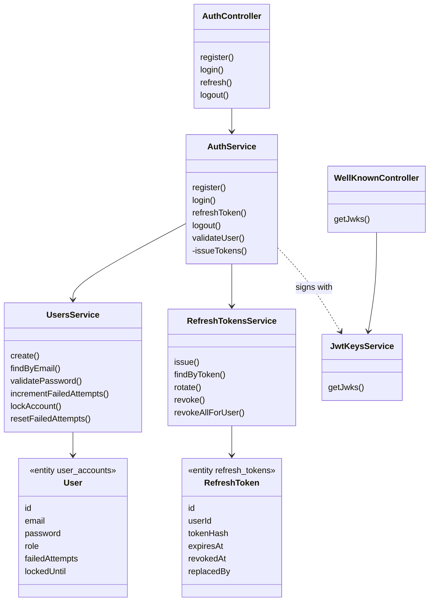
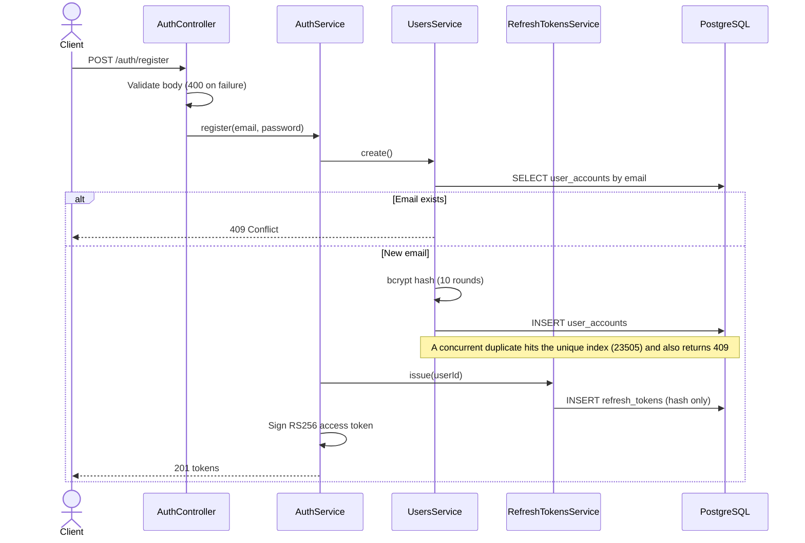
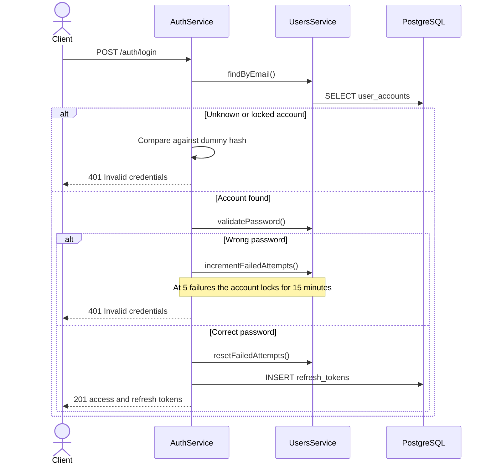
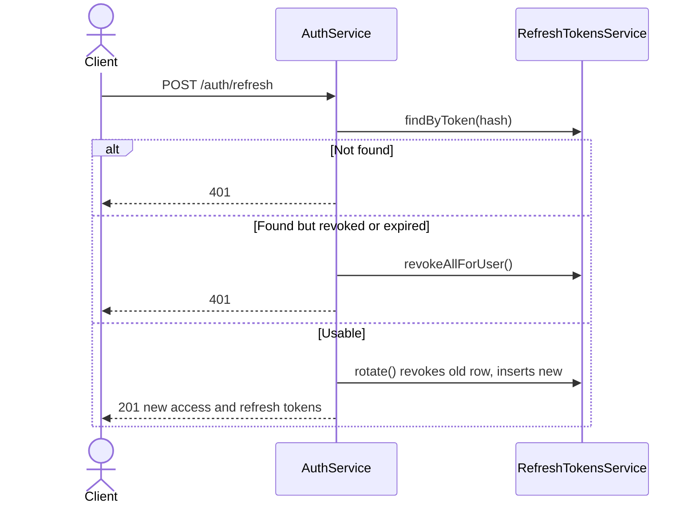

# Auth Service

NestJS service that owns credentials and sessions. It issues RS256 access tokens, rotates opaque refresh tokens, and publishes its public key as a JWKS. The Java services and the reporting service verify tokens against that key and never see a password.

- Port 3001, no `/api` prefix
- Swagger UI at http://localhost:3001/api/docs (spec at `/api-json`)
- Tables in the shared `trading_season` database: `user_accounts` and `refresh_tokens`. Their schema lives in [db/migrations](../../db/migrations); this service runs no migrations and leaves TypeORM `synchronize` off.

## Endpoints

| Method | Path | Body | Success |
| --- | --- | --- | --- |
| POST | `/auth/register` | `email` (valid, up to 254 chars), `password` (8-72 chars) | 201 token response |
| POST | `/auth/login` | `email`, `password` | 201 token response |
| POST | `/auth/refresh` | `refreshToken` | 201 rotated token response |
| POST | `/auth/logout` | `refreshToken` | 201, refresh token revoked |
| GET | `/.well-known/jwks.json` | none | 200 public keys |
| GET | `/health` | none | 200 liveness only |

The token response is `accessToken`, `refreshToken`, and `expiresIn` (900). Errors use standard NestJS bodies: 400 validation, 401 bad credentials or refresh token, 409 email already registered.

## Tokens and sessions

- **Access token**: RS256 JWT valid for 15 minutes with claims `sub` (user UUID), `email`, `roles` (`ADMIN` or `TRADER`), `iss`, `iat`, `exp`. It stays valid until expiry even after logout.
- **Refresh token**: opaque 256-bit random string valid for 7 days. Only its SHA-256 hash is stored. It rotates on every use, and presenting an already-used token revokes every live session for that user.
- **Lockout**: five failed logins lock the account for 15 minutes. Unknown account, wrong password, and locked all return the same generic 401, and each costs one bcrypt comparison so timing does not reveal which case occurred.
- Send refresh tokens in the JSON body; cookies are not used. Logout needs no access token, so a session can be ended after the access token expires.

## Design


```mermaid
classDiagram
    class AuthController {
        register()
        login()
        refresh()
        logout()
    }
    class WellKnownController {
        getJwks()
    }
    class AuthService {
        register()
        login()
        refreshToken()
        logout()
        validateUser()
        -issueTokens()
    }
    class UsersService {
        create()
        findByEmail()
        validatePassword()
        incrementFailedAttempts()
        lockAccount()
        resetFailedAttempts()
    }
    class RefreshTokensService {
        issue()
        findByToken()
        rotate()
        revoke()
        revokeAllForUser()
    }
    class JwtKeysService {
        getJwks()
    }
    class User {
        <<entity user_accounts>>
        id
        email
        password
        role
        failedAttempts
        lockedUntil
    }
    class RefreshToken {
        <<entity refresh_tokens>>
        id
        userId
        tokenHash
        expiresAt
        revokedAt
        replacedBy
    }

    AuthController --> AuthService
    WellKnownController --> JwtKeysService
    AuthService --> UsersService
    AuthService --> RefreshTokensService
    AuthService ..> JwtKeysService : signs with
    UsersService --> User
    RefreshTokensService --> RefreshToken
```

## Flows

### Register


```mermaid
sequenceDiagram
    actor Client
    participant C as AuthController
    participant A as AuthService
    participant U as UsersService
    participant R as RefreshTokensService
    participant DB as PostgreSQL

    Client->>C: POST /auth/register
    C->>C: Validate body (400 on failure)
    C->>A: register(email, password)
    A->>U: create()
    U->>DB: SELECT user_accounts by email
    alt Email exists
        U-->>Client: 409 Conflict
    else New email
        U->>U: bcrypt hash (10 rounds)
        U->>DB: INSERT user_accounts
        Note over U,DB: A concurrent duplicate hits the unique index (23505) and also returns 409
        A->>R: issue(userId)
        R->>DB: INSERT refresh_tokens (hash only)
        A->>A: Sign RS256 access token
        A-->>Client: 201 tokens
    end
```

### Login


```mermaid
sequenceDiagram
    actor Client
    participant A as AuthService
    participant U as UsersService
    participant DB as PostgreSQL

    Client->>A: POST /auth/login
    A->>U: findByEmail()
    U->>DB: SELECT user_accounts
    alt Unknown or locked account
        A->>A: Compare against dummy hash
        A-->>Client: 401 Invalid credentials
    else Account found
        A->>U: validatePassword()
        alt Wrong password
            A->>U: incrementFailedAttempts()
            Note over A,U: At 5 failures the account locks for 15 minutes
            A-->>Client: 401 Invalid credentials
        else Correct password
            A->>U: resetFailedAttempts()
            A->>DB: INSERT refresh_tokens
            A-->>Client: 201 access and refresh tokens
        end
    end
```

### Refresh


```mermaid
sequenceDiagram
    actor Client
    participant A as AuthService
    participant R as RefreshTokensService

    Client->>A: POST /auth/refresh
    A->>R: findByToken(hash)
    alt Not found
        A-->>Client: 401
    else Found but revoked or expired
        A->>R: revokeAllForUser()
        A-->>Client: 401
    else Usable
        A->>R: rotate() revokes old row, inserts new
        A-->>Client: 201 new access and refresh tokens
    end
```

## Local setup

```sh
npm --prefix apps/auth-service ci
cp apps/auth-service/.env.example apps/auth-service/.env
```

In `.env`, delete the placeholder `JWT_PRIVATE_KEY`, `JWT_PUBLIC_KEY`, and `JWT_ISSUER` lines, then append a generated development key pair from this directory:

```sh
node scripts/generate-dev-keys.mjs >> .env
```

Keep `DB_HOST=localhost`, `DB_PORT=5432`, `DB_NAME=trading_season` and the matching `DB_USER` and `DB_PASSWORD`. Start a migrated database first (see [db/README.md](../../db/README.md)), then run `npm run start:dev`. The service refuses to start without both JWT keys. The Java services must use the same issuer as `JWT_ISSUER`.

In development the service seeds `admin@example.com` / `admin123`; production never does.

| Variable | Purpose |
| --- | --- |
| `PORT` | HTTP port, default 3001 |
| `DB_HOST`, `DB_PORT`, `DB_USER`, `DB_PASSWORD`, `DB_NAME` | Database connection |
| `JWT_PRIVATE_KEY`, `JWT_PUBLIC_KEY` | RS256 key pair with literal `\n` escapes. Required, no fallback |
| `JWT_ISSUER` | `iss` claim, must match the Java services' `AUTH_JWT_ISSUER` |
| `CORS_ORIGINS` | Comma-separated allowed browser origins, default `http://localhost:4200` |

## Commands

Run from this directory, or use `npm --prefix apps/auth-service` from the repository root.

| Purpose | Command |
| --- | --- |
| Watch mode | `npm run start:dev` |
| Build | `npm run build` |
| Tests | `npm test` |
| Tests with coverage and JUnit (CI) | `npm run test:ci` |
| Lint | `npm run lint` |

Tests generate ephemeral keys and fail below 70 percent coverage.
