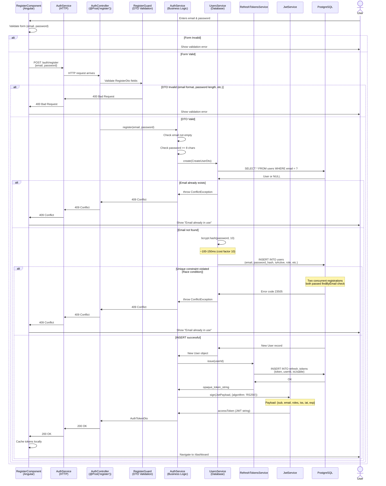

# Register Sequence Diagram

## Overview

The registration flow validates new account creation, hashes passwords with bcrypt, stores users in PostgreSQL, and issues RS256-signed access tokens paired with server-side opaque refresh tokens.

**Key Security Features:**
- Email uniqueness enforced by database unique index + application-level check
- Password hashing with bcrypt (10 rounds)
- Handles concurrent registration race conditions (two requests pass email check but only one wins)
- New accounts start with `isActive=true`, `failedAttempts=0`, `lockedUntil=null`
- Access token valid for 15 minutes; refresh token stored server-side for revocation

## Sequence Diagram (Mermaid)



## Message Flow

### 1. User submits registration form
```
RegisterComponent:
  form = {
    email: 'newuser@example.com',
    password: 'SecurePass123!'
  }
  → Call authService.register(email, password)
```

### 2. Frontend validation
```
RegisterForm validates:
  ✓ Email format valid (regex)
  ✓ Email max 254 chars
  ✓ Password min 8 chars
  ✓ Password max 72 chars
  → If invalid: Show error, don't call backend
  → If valid: POST /auth/register
```

### 3. DTO validation (server-side early)
```
Body Parser → RegisterDto validators:
  ✓ @IsEmail({}, { message: 'A valid email address is required' })
  ✓ @MaxLength(254)
  ✓ @IsString()
  ✓ @MinLength(8, { message: 'Password must be at least 8 characters long' })
  ✓ @MaxLength(72)
  
If any fails:
  → Return 400 Bad Request with validation errors
```

### 4. AuthService.register() starts
```typescript
async register(email: string, password: string): Promise<AuthTokenDto> {
  // Additional server-side checks
  if (!email || !password) {
    throw BadRequestException('Missing required fields');
  }
  if (password.length < 8) {
    throw BadRequestException('Password must be at least 8 characters long');
  }
  
  const createUserDto = { email, password };
  const user = await usersService.create(createUserDto);
  // ... continue to token generation
}
```

### 5. UsersService.create() - Email uniqueness check
```
Query 1: SELECT * FROM users WHERE email = 'newuser@example.com'
  ↓
[Email NOT found] → Continue to password hashing
[Email found] → throw ConflictException('Email is already in use')
                → Return 409 Conflict to client
```

### 6. Password hashing
```
bcrypt.hash(password, 10)
  - 10 rounds (cost factor matches all passwords in system)
  - Generates random salt internally
  - Takes ~100-150ms on typical hardware
  - Returns: '$2b$10$...' format hash
```

### 7. Database insert
```
INSERT INTO users (
  id (UUID),
  email,
  password (hashed),
  isActive (true),
  role ('TRADER'),
  failedAttempts (0),
  lockedUntil (null),
  createdAt,
  updatedAt
)

Possible outcomes:
  ✓ Row inserted successfully → New User object returned
  ✗ Unique constraint violated on email
    (Race condition: 2 concurrent requests both passed findByEmail check)
    → Catch error code 23505 → throw ConflictException
```

### 8. Refresh token generation
```
RefreshTokensService.issue(userId):
  - Generate random 32-byte string
  - Base64 encode
  - INSERT INTO refresh_tokens (token, userId, isUsable, rotatedAt)
  - Return: opaque token string (NOT a JWT)
```

### 9. Access token generation
```
JwtService.sign(payload, { algorithm: 'RS256' }):
  const now = Math.floor(Date.now() / 1000);
  const issuer = process.env.JWT_ISSUER || 'https://auth.dualeapa.com';
  
  payload = {
    sub: userId,
    email: 'newuser@example.com',
    roles: ['TRADER'],
    iss: issuer,
    iat: now,
    exp: now + 900  // 15 minutes from now
  }
  
  → Sign with private RS256 key
  → Return JWT string
```

### 10. Response to frontend
```
HTTP 200 OK
{
  "accessToken": "eyJhbGciOiJSUzI1NiIsInR5cCI6IkpXVCJ9...",
  "refreshToken": "OpAqU8l9mK3pJ2xF7vN5...",
  "expiresIn": 900
}

Frontend stores tokens and navigates to /dashboard
```

## Data Models

### RegisterComponent (Frontend)
```typescript
export class RegisterComponent {
  form: FormGroup;  // email, password form
  
  onSubmit() {
    if (form.valid) {
      authService.register(email, password)
        .subscribe(
          (response) => router.navigate(['/dashboard']),
          (error) => showError()
        );
    }
  }
}
```

### RegisterDto (Request Validation)
```typescript
export class RegisterDto {
  @IsEmail({}, { message: 'A valid email address is required' })
  @MaxLength(254)  // RFC 5321 limit
  email: string;

  @IsString()
  @MinLength(8, { message: 'Password must be at least 8 characters long' })
  @MaxLength(72)   // bcrypt max input length
  password: string;
}
```

### AuthService
```typescript
async register(email: string, password: string): Promise<AuthTokenDto> {
  // Validate required fields
  // Call usersService.create() to hash and store user
  // Issue refresh token via RefreshTokensService
  // Generate access token via JwtService
  // Return AuthTokenDto with both tokens
}

private issueTokens(
  userId: string,
  email: string,
  roles: Array<'ADMIN' | 'TRADER'>,
  refreshToken: string,
): AuthTokenDto {
  // Creates JwtPayload
  // Signs with RS256
  // Returns accessToken, refreshToken, expiresIn
}
```

### UsersService
```typescript
async create(createUserDto: CreateUserDto): Promise<UserDto> {
  // Check if email exists (application-level)
  // Hash password with bcrypt
  // INSERT into database
  // Handle race condition (unique constraint on email)
  // Return new User
}
```

### RefreshTokensService
```typescript
async issue(userId: string): Promise<string> {
  // Generate cryptographically secure random token
  // Store in database with userId association
  // Return opaque token string (not JWT)
}
```

### JwtService
```typescript
sign(payload: JwtPayload, options: SignOptions): string {
  // Takes JwtPayload object
  // Signs with RS256 private key
  // Returns JWT string
  // Payload includes: sub, email, roles, iss, iat, exp
}
```

### AuthTokenDto (Response)
```typescript
export class AuthTokenDto {
  accessToken: string;      // RS256 JWT (15-min expiration)
  refreshToken: string;     // Opaque token (stored server-side)
  expiresIn: number;        // 900 seconds
}
```

### User (Database Entity)
```typescript
export class User {
  id: UUID;
  email: string;            // Unique, max 254 chars
  password: string;         // bcrypt hash, 60 chars
  isActive: boolean = true; // New accounts always active
  role: 'ADMIN' | 'TRADER' = 'TRADER';
  failedAttempts: number = 0;   // Login failure counter
  lockedUntil: Date | null = null;  // Account lockout deadline
  createdAt: Date;
  updatedAt: Date;
}
```

### RefreshToken (Database Entity)
```typescript
export class RefreshToken {
  id: UUID;
  token: string;            // Opaque random string
  userId: UUID;             // Foreign key to User
  isUsable: boolean = true; // False if rotated/revoked
  rotatedAt: Date | null;   // When token was rotated
  createdAt: Date;
}
```

## Key Decision Points

### 1. Email Validation (Client vs Server)
- **Client:** Regex validation in RegisterForm (immediate feedback)
- **Server:** @IsEmail validator in RegisterDto (ensures backend never sees invalid emails)
- **Database:** UNIQUE constraint on email column (enforces at storage layer)
- **Application:** findByEmail() check before INSERT (handles race conditions)

### 2. Password Hashing
- **Tool:** bcrypt with cost factor 10
- **Timing:** ~100-150ms per hash (intentionally slow to resist brute force)
- **Input:** Plain text password from DTO
- **Output:** 60-character bcrypt hash in format `$2b$10$...`
- **Never stored/returned:** Plain password is immediately discarded

### 3. Email Uniqueness Race Condition
- **Problem:** Two concurrent registrations both read "email not found"
- **Application Check:** `findByEmail()` returns nothing for both
- **Database Check:** Postgres UNIQUE constraint on email column
- **Solution:** Catch error code 23505 (duplicate key), convert to ConflictException
- **Result:** Only one registration succeeds; other gets 409 Conflict

### 4. New Account Defaults
- **isActive:** true (account can log in immediately)
- **role:** 'TRADER' (not 'ADMIN')
- **failedAttempts:** 0 (no previous login failures)
- **lockedUntil:** null (not locked)
- These settings allow immediate login after successful registration

### 5. Refresh Token Generation
- **Type:** Opaque random string (NOT a JWT)
- **Storage:** Server-side in refresh_tokens table
- **Benefit:** Can be revoked on demand without waiting for expiration
- **Security:** Not readable by client (no claims to leak)
- **Rotation:** New token issued on each refresh, old token marked unusable

### 6. Access Token Generation
- **Type:** RS256-signed JWT
- **Payload:** sub, email, roles, iss, iat, exp
- **Expiration:** 900 seconds (15 minutes)
- **Stateless:** Backend doesn't track it; valid until exp time
- **Security:** Signed with private key, verified with public key
- **Logout limitation:** Revoking refresh token doesn't immediately invalidate access token

### 7. Password Constraints
- **Minimum:** 8 characters (enforced by @MinLength validator)
- **Maximum:** 72 characters (bcrypt limit; longer passwords are silently truncated)
- **No composition rules:** No digit/symbol/case requirements
- **Reasoning:** Composition requirements push users to predictable patterns
- **Best practice:** Length is the primary security factor

### 8. Token Storage (Frontend)
- **Access token:** Typically stored in memory or localStorage
- **Refresh token:** May be stored in httpOnly cookie (if backend supports)
- **Current implementation:** Application manages storage (verify with LocalStorageAdapter)
- **Security tradeoff:** Memory only = lost on refresh; localStorage = available to XSS

## Error Scenarios

| Scenario | HTTP Status | Response | Notes |
|----------|-------------|----------|-------|
| Invalid email format | 400 | `{"message": "A valid email address is required"}` | DTO validator |
| Email > 254 chars | 400 | `{"message": "Email is too long"}` | DTO validator |
| Password empty | 400 | `{"message": "Password is required"}` | DTO validator |
| Password < 8 chars | 400 | `{"message": "Password must be at least 8 characters long"}` | DTO validator + AuthService check |
| Password > 72 chars | 400 | `{"message": "Password is too long"}` | DTO validator |
| Email already in use (found by findByEmail) | 409 | `{"message": "Email is already in use"}` | UsersService.create() throws ConflictException |
| Email already in use (race condition, caught by unique index) | 409 | `{"message": "Email is already in use"}` | Catch error code 23505, throw ConflictException |
| Database error | 500 | `{"message": "Internal server error"}` | Rare; operator attention needed |
| Success | 200 | `{"accessToken": "...", "refreshToken": "...", "expiresIn": 900}` | New account created, tokens issued |

### Security Features
- ✅ Email uniqueness enforced (app + database)
- ✅ Password hashing with bcrypt (resistant to brute force)
- ✅ Race condition handling (concurrent registrations)
- ✅ No account enumeration (valid/invalid emails both return success if email unique)
- ✅ New accounts immediately usable (isActive=true by default)
- ✅ Refresh tokens can be revoked server-side
- ✅ Access tokens stateless but time-limited (15 minutes)

## NestJS Implementation

### AuthController
```typescript
@Controller('auth')
export class AuthController {
  constructor(private authService: AuthService) {}

  @Post('register')
  async register(@Body() registerDto: RegisterDto): Promise<AuthTokenDto> {
    return this.authService.register(registerDto.email, registerDto.password);
  }
}
```

### AuthService.register()
```typescript
async register(email: string, password: string): Promise<AuthTokenDto> {
  if (!email || !password) {
    throw new BadRequestException('Missing required fields');
  }

  if (password.length < 8) {
    throw new BadRequestException(
      'Password must be at least 8 characters long',
    );
  }

  const createUserDto: CreateUserDto = { email, password };
  const user = await this.usersService.create(createUserDto);

  const refreshToken = await this.refreshTokens.issue(user.id);
  return this.issueTokens(user.id, user.email, [user.role], refreshToken);
}

private issueTokens(
  userId: string,
  email: string,
  roles: Array<'ADMIN' | 'TRADER'>,
  refreshToken: string,
): AuthTokenDto {
  const now = Math.floor(Date.now() / 1000);
  const issuer = process.env.JWT_ISSUER || 'https://auth.dualeapa.com';

  const accessPayload: JwtPayload = {
    sub: userId,
    email,
    roles,
    iss: issuer,
    iat: now,
    exp: now + this.ACCESS_TOKEN_EXPIRATION,
  };

  const accessToken = this.jwtService.sign(accessPayload, {
    algorithm: 'RS256',
  });

  return {
    accessToken,
    refreshToken,
    expiresIn: this.ACCESS_TOKEN_EXPIRATION,
  };
}
```

### UsersService.create()
```typescript
async create(createUserDto: CreateUserDto): Promise<UserDto> {
  const existingUser = await this.usersRepository.findOne({
    where: { email: createUserDto.email },
  });
  if (existingUser) {
    throw new ConflictException('Email is already in use');
  }

  const hashedPassword = await bcrypt.hash(createUserDto.password, 10);

  const user = this.usersRepository.create({
    ...createUserDto,
    password: hashedPassword,
  });

  try {
    const savedUser = await this.usersRepository.save(user);
    return this.mapToDto(savedUser);
  } catch (error) {
    // Two concurrent registrations both pass findByEmail check,
    // but Postgres unique index catches the loser
    if ((error as { code?: string })?.code === '23505') {
      throw new ConflictException('Email is already in use');
    }
    throw error;
  }
}
```

## Frontend/Backend Integration

### Frontend RegisterComponent
```typescript
export class RegisterComponent {
  form = this.fb.group({
    email: ['', [Validators.required, Validators.email]],
    password: ['', [Validators.required, Validators.minLength(8)]]
  });

  onSubmit() {
    if (this.form.valid) {
      this.authService.register(
        this.form.value.email,
        this.form.value.password
      ).subscribe(
        (response: AuthTokenDto) => {
          this.router.navigate(['/dashboard']);
        },
        (error) => {
          if (error.status === 409) {
            this.errorMessage = 'Email already in use';
          } else {
            this.errorMessage = 'Registration failed. Try again later.';
          }
        }
      );
    }
  }
}
```

### Frontend AuthService (HTTP Call)
```typescript
export class AuthService {
  register(email: string, password: string): Observable<AuthTokenDto> {
    const dto = new RegisterDto(email, password);
    return this.http.post<AuthTokenDto>('/auth/register', dto)
      .pipe(
        tap(response => {
          // Store tokens locally for future requests
          this.cacheTokens(response);
          this.tokenSubject.next(response.accessToken);
        }),
        catchError(error => {
          return throwError(() => error);
        })
      );
  }
}
```

### Complete Request/Response Flow

1. **Frontend sends:**
   ```
   POST /auth/register
   Content-Type: application/json
   
   {
     "email": "newuser@example.com",
     "password": "SecurePass123!"
   }
   ```

2. **Backend validates (DTO)**
   - Email: @IsEmail, @MaxLength(254)
   - Password: @IsString, @MinLength(8), @MaxLength(72)

3. **Backend processes (AuthService.register)**
   - Check email not empty
   - Check password >= 8 chars
   - Call usersService.create()
     - Check email uniqueness (application-level)
     - Hash password with bcrypt (10 rounds)
     - INSERT into database
     - Handle race condition (unique constraint)
   - Generate refresh token via RefreshTokensService
   - Sign access token via JwtService

4. **Backend responds:**
   ```
   HTTP 200 OK
   Content-Type: application/json
   
   {
     "accessToken": "eyJhbGc...",
     "refreshToken": "OpAqU8l9mK3pJ2xF7vN5...",
     "expiresIn": 900
   }
   ```

5. **Frontend stores tokens and navigates to dashboard**

## Related Flows

- **Login:** [Login-Sequence-Diagram.md](Login-Sequence-Diagram.md) - Similar token generation after credential validation
- **Token Refresh:** TokenRefresh-Sequence-Diagram.md (pending) - Rotating refresh tokens and issuing new access tokens
- **Route Protection:** RouteProtection-Sequence-Diagram.md (pending) - Validating access tokens on protected routes
- **Logout:** Logout flow in main Sequence-Diagram.md - Revoking refresh tokens
