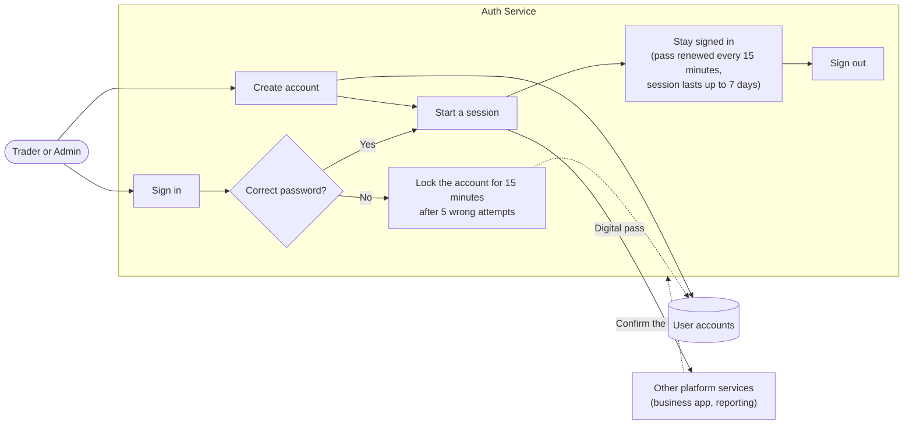
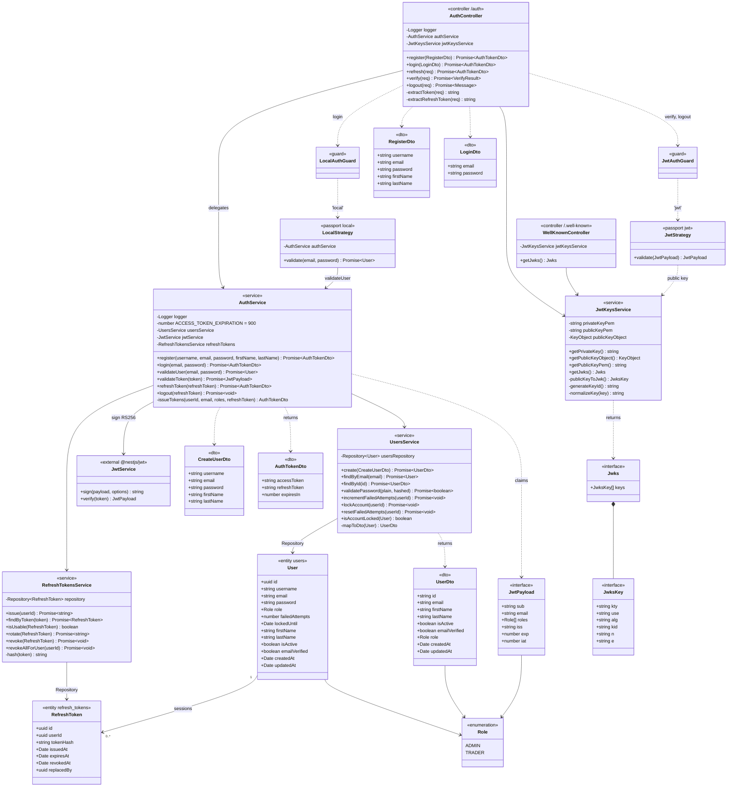

# Auth Service UML

## Business overview

The auth service controls who can use the platform. People create an account and
sign in. After that they stay signed in while they use the app, and they can
sign out when they're done. Other parts of the platform ask the auth service to
confirm who a person is before they show that person's data.

| What a user does | What happens |
| --- | --- |
| **Creates an account** | Enters a username, email, name and a password of at least 8 characters. Each username and email can only be used once. New accounts get the Trader role. |
| **Signs in** | Enters their email and password. If anything is wrong they see the same "Invalid credentials" message every time, so nobody can find out which emails have accounts. |
| **Enters the wrong password too many times** | After 5 wrong attempts in a row, the account is locked for 15 minutes. |
| **Keeps using the app** | They get a digital pass that lasts 15 minutes. The app renews it in the background, so they can stay signed in for up to 7 days without signing in again. |
| **Signs out** | Their session is ended. *(Known issue: this step doesn't end the session yet. See the technical notes below.)* |
| **Uses other parts of the platform** | Other services check the pass themselves, using a public key published by the auth service. The auth service never shares passwords with them. |

If someone steals a session and tries to reuse it, the service signs that user
out on every device.

## Technical class diagram

Class diagram of the NestJS auth service (`apps/auth-service/src`). Framework
wiring (`AppModule`, `AppController`, `HealthController`) is left out to keep the
focus on authentication.

## Notes

- **Access tokens** are RS256 JWTs valid for 15 minutes, signed with
  `JWT_PRIVATE_KEY`. Other services verify them using the public key published at
  `GET /.well-known/jwks.json`.
- **Refresh tokens** are opaque random strings valid for 7 days. Only their
  SHA-256 hash is stored. Each refresh rotates the token; presenting a revoked or
  expired token revokes every session for that user.
- **Lockout:** 5 failed logins lock the account for 15 minutes. Every failure path
  runs a bcrypt compare, so response timing doesn't reveal whether an account
  exists.
- **Known issue — logout:** `AuthController.logout` passes the *access* token
  from the `Authorization` header to `AuthService.logout`, which looks it up as a
  *refresh* token. It never matches, so no session is actually revoked.
- Nullable columns (`User.lockedUntil`, `RefreshToken.revokedAt`,
  `RefreshToken.replacedBy`) are shown without `| null`, because Mermaid can't
  render union types.
