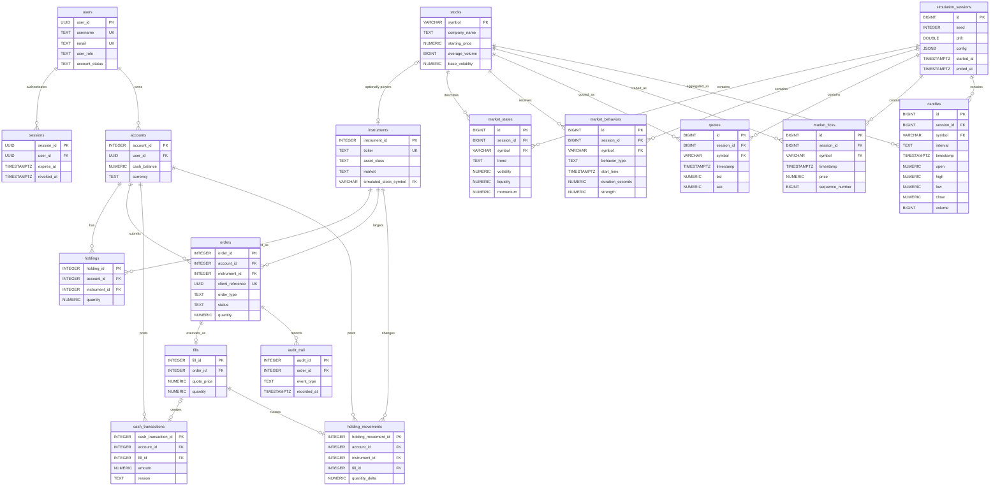

# Trading Platform Database

This directory contains the consolidated PostgreSQL schema for a trading platform backed by the FMS simulated U.S. stock market.

The schema combines two responsibilities:

- **FMS market simulation:** reproducible simulation sessions, stocks, market behaviors, quotes, ticks, and candles.
- **Trading platform:** users, login sessions, accounts, instruments, orders, fills, balances, holdings, and audit history.

The source of truth is [`Trading Platform Schema.sql`](./Trading%20Platform%20Schema.sql). It is a destructive bootstrap script intended for local development: running it drops and recreates its tables. Do not run it against a database containing data that must be retained.

## Builds

The SQL file is organized as one executable script with six logical builds.

### Build 1 — Identity and access

| Table | Responsibility |
| --- | --- |
| `users` | Stores login identity, profile, role, account status, security counters, and user-level execution settings. Passwords are stored only as hashes. |
| `sessions` | Tracks individual authenticated sessions, expiry, activity, and revocation. A user can have multiple sessions. |

This build establishes who can use the platform and how authenticated access is revoked without changing trading or market data.

### Build 2 — Simulation setup and instruments

| Table | Responsibility |
| --- | --- |
| `simulation_sessions` | Defines one deterministic FMS run using a random seed, drift, JSON configuration, and simulated start/end times. |
| `stocks` | Holds the symbol-keyed U.S. stocks supported by the simulator and their starting price, volume, and volatility settings. |
| `instruments` | Represents assets the trading platform can trade, including equities, FX, and crypto. `simulated_stock_symbol` optionally links a U.S. equity to FMS. |
| `accounts` | Represents a user's brokerage account and its cached single-currency cash balance. |

`stocks` is intentionally narrower than `instruments`: FMS currently generates data only for supported U.S. stocks, while the platform model can represent additional asset classes.

### Build 3 — Market behavior and state

| Table | Responsibility |
| --- | --- |
| `market_states` | Stores the current trend, volatility, liquidity, and momentum for each stock in a simulation session. There is one current row per session and symbol. |
| `market_behaviors` | Keeps the append-only history of behaviors applied to a stock, including their start, duration, and strength. |

State is the current snapshot; behavior rows are history. Both are scoped to a simulation session so a run can be reproduced or deleted independently.

### Build 4 — Generated market data

| Table | Responsibility |
| --- | --- |
| `quotes` | Stores timestamped bid/ask snapshots and available sizes. |
| `market_ticks` | Stores the raw simulated trade stream, including price, quote context, volume, and per-stock sequence number. |
| `candles` | Stores OHLCV bars aggregated from ticks for a requested interval. |

All generated rows use `(session_id, symbol)` to identify their run and stock. Constraints enforce valid spreads, prices within the spread, positive volumes, ordered tick sequences, and valid candle boundaries.

### Build 5 — Orders, execution, and accounting

| Table | Responsibility |
| --- | --- |
| `holdings` | Caches the current quantity held by an account for an instrument. |
| `orders` | Records a client's buy or sell instruction and its lifecycle independently of execution. |
| `fills` | Records the execution price and quantity for a successfully executed order. The schema currently permits at most one fill per order. |
| `cash_transactions` | Append-only cash ledger for fills, deposits, and withdrawals. |
| `holding_movements` | Append-only position ledger for quantity changes caused by fills. |

`accounts.cash_balance` and `holdings.quantity` are convenient current-value caches. The two append-only ledgers are the records used to reconcile those cached values.

### Build 6 — Audit and query support

| Object | Responsibility |
| --- | --- |
| `audit_trail` | Stores permanent order-lifecycle events such as submission, acceptance, rejection, fill, or execution failure. |
| Replay indexes | Speed up session/symbol time-range reads for quotes, ticks, candles, and behavior history. |

The application database role should receive `INSERT` and `SELECT`, but not `UPDATE` or `DELETE`, on append-only ledger and audit tables.

## Data flow

1. Create a `simulation_sessions` row with the seed and configuration for a run.
2. Generate state and behavior rows for symbols registered in `stocks`.
3. Generate `quotes` and `market_ticks`; aggregate ticks into `candles`.
4. Link a tradable U.S. equity in `instruments` to its FMS symbol through `simulated_stock_symbol`.
5. Submit an `order`, record a successful execution in `fills`, and append the related cash and holding movements.
6. Record each lifecycle transition in `audit_trail`.

Deleting a simulation session cascades through its generated state and market data. It does not delete stock reference data, instruments, accounts, or trading records.

## Schema diagram

The diagram shows foreign-key relationships. `instruments.simulated_stock_symbol` is optional; all other displayed child relationships use required foreign keys except `cash_transactions.fill_id`, which is absent for deposits and withdrawals.



## Running the build

The script requires PostgreSQL with the `pgcrypto` extension available.

PowerShell:

```powershell
psql $env:DATABASE_URL -v ON_ERROR_STOP=1 -f "Platform/Trading Platform Schema.sql"
```

Bash:

```bash
psql "$DATABASE_URL" -v ON_ERROR_STOP=1 -f "Platform/Trading Platform Schema.sql"
```

Because this is a destructive bootstrap build, use the numbered files under [`../migrations`](../migrations/) for incremental FMS schema changes.

## Important assumptions

- FMS migrations `0001` through `0008` are canonical for simulated-market persistence.
- FMS currently simulates U.S. equities only.
- One order produces at most one fill; partial fills are not currently modeled.
- Each account has one cached cash balance and currency rather than multiple currency wallets.
- Personally identifiable information such as SSNs must be encrypted or tokenized before production use.
- Reporting and analytics stores are downstream concerns and are not included in this schema.
