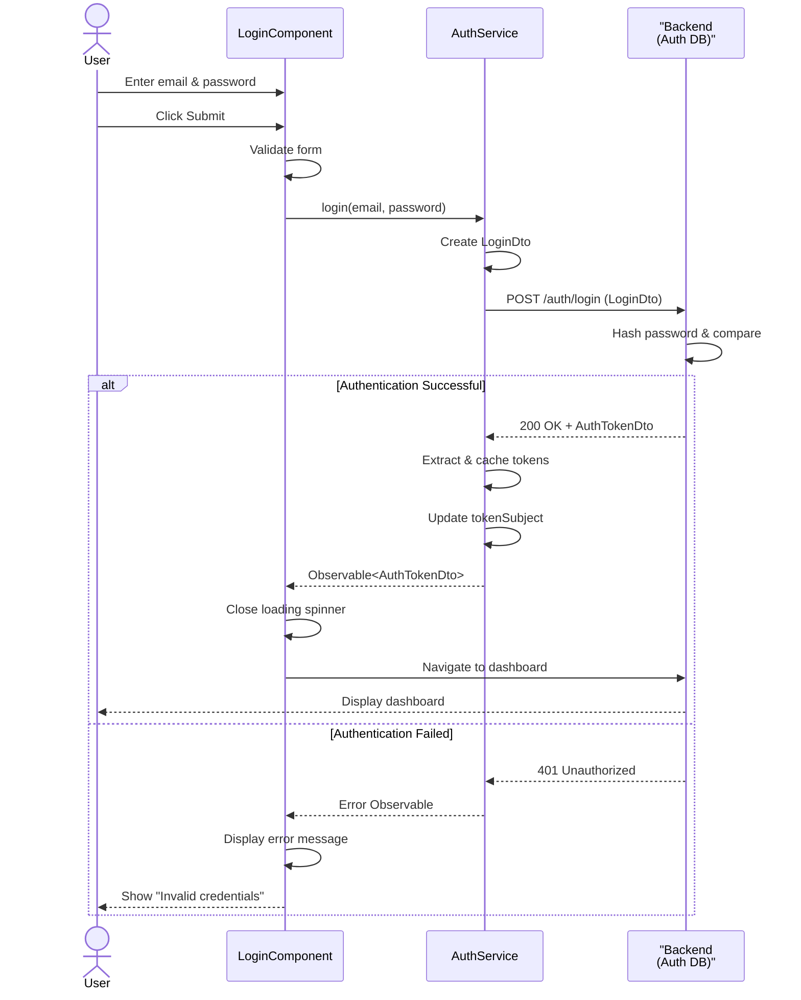
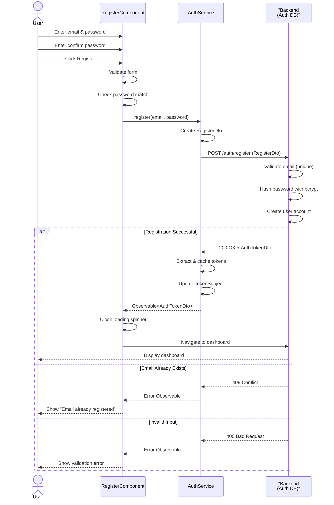
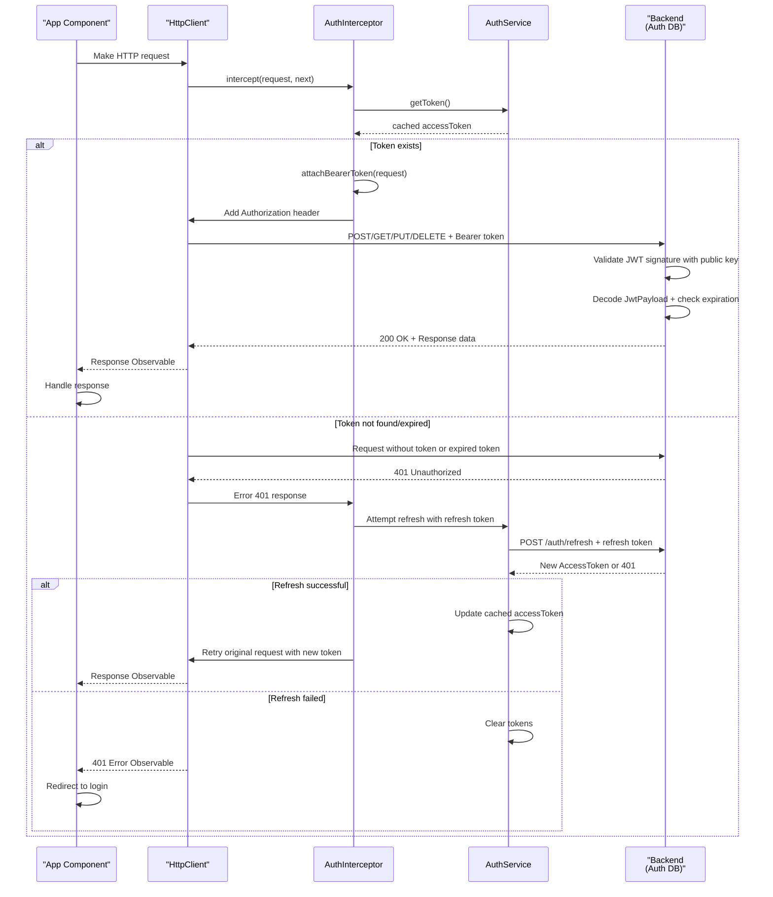
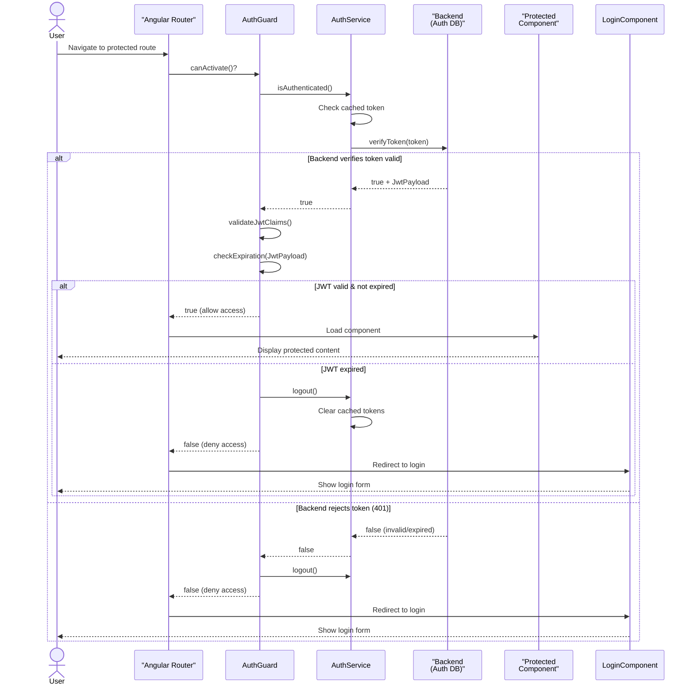
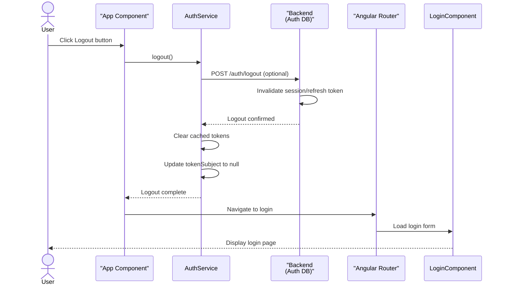

# Business Logic UI (Middle Tier) - Sequence Diagrams

## 1. Login Flow Sequence Diagram

---

## 2. Registration Flow Sequence Diagram

---

## 3. Token Retrieval & HTTP Request Interception

---

## 4. Authentication Guard Check Flow

---

## 5. Logout Flow Sequence Diagram

---

## Key Flow Insights

### **Login/Register Flow**
1. User submits credentials via form
2. Component validates and sends to AuthService
3. AuthService creates DTO and sends to backend
4. Backend authenticates/registers and returns tokens
5. AuthService caches tokens in memory and BehaviorSubject
6. Component navigates to protected area

### **Token Usage Flow**
1. Component makes HTTP request
2. AuthInterceptor intercepts and retrieves cached token
3. AuthInterceptor attaches Bearer token to Authorization header
4. Backend receives and validates JWT (signature + expiration)
5. Backend can verify token with server-side session store
6. Response returned to component
7. On 401: AuthInterceptor attempts refresh with BackendAuthService

### **Route Protection Flow**
1. Router triggers AuthGuard before navigation
2. AuthGuard calls AuthService to verify token with backend
3. Backend validates token (BackendAuthService.verifyToken)
4. If valid → allow navigation to protected component
5. If invalid/expired → AuthGuard redirects to login
6. Backend is source of truth for token validity

### **Logout Flow**
1. User initiates logout
2. AuthService clears cached tokens from memory
3. AuthService optionally calls backend to invalidate server-side session
4. Backend invalidates refresh token and session
5. Router redirects to login page
6. Application returns to unauthenticated state
