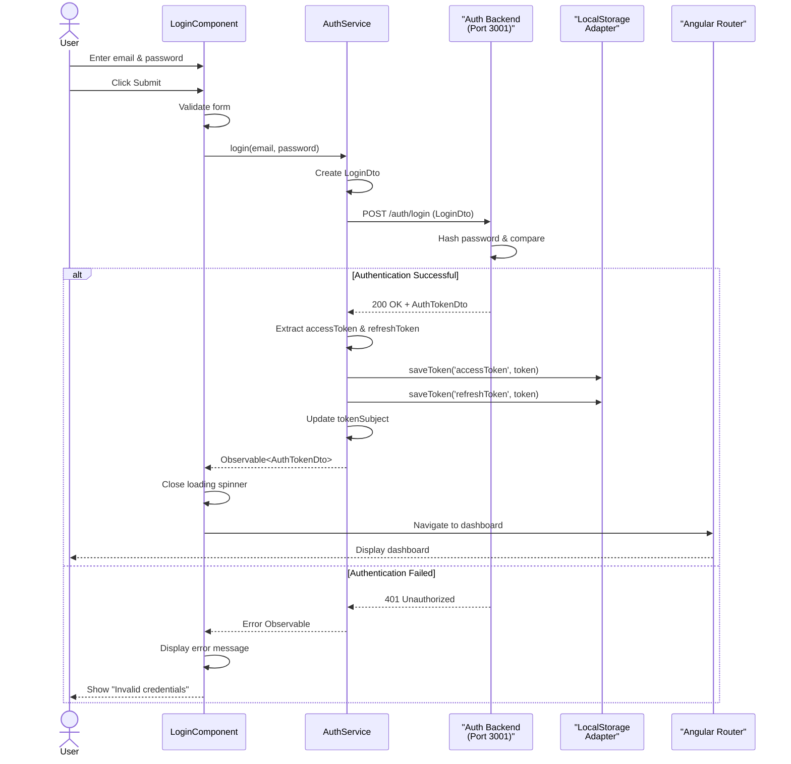
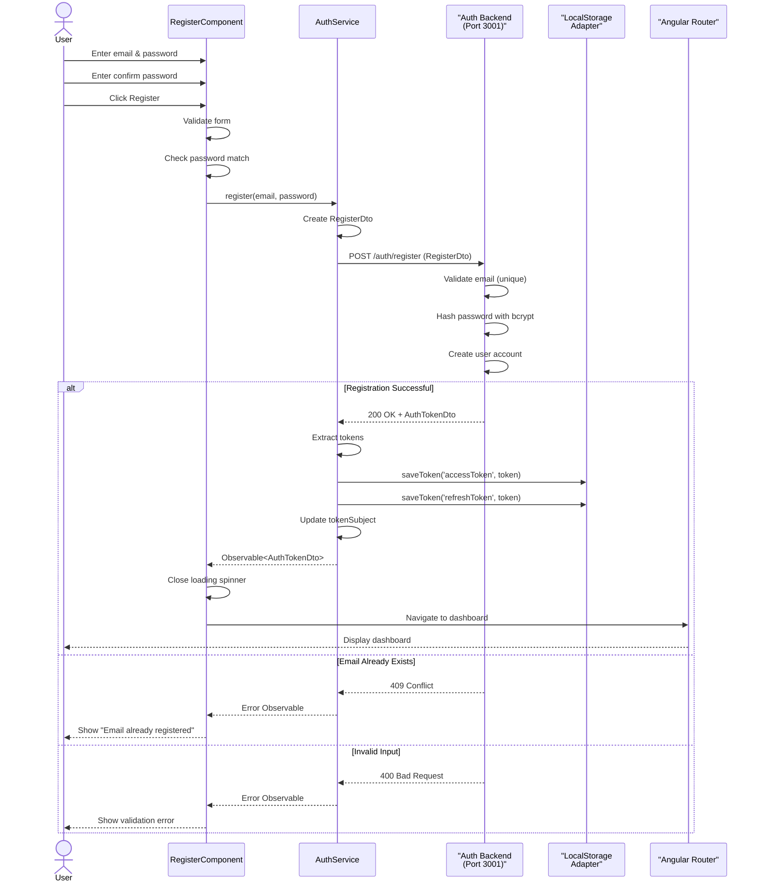
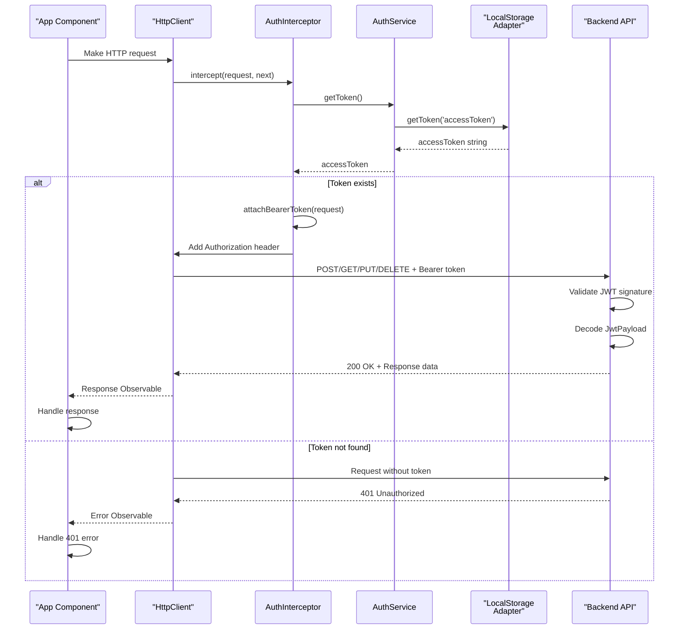
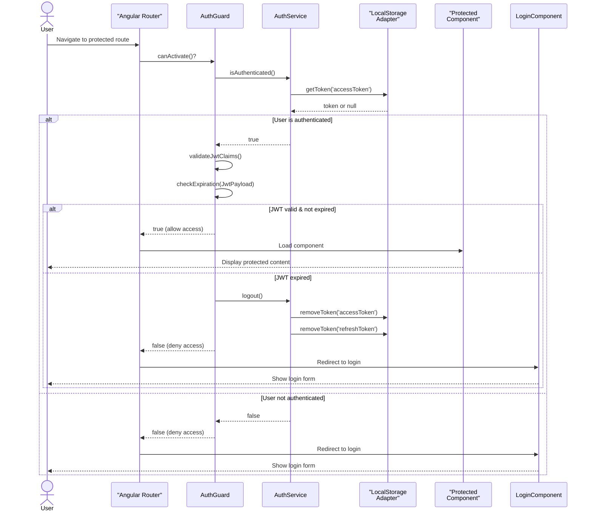
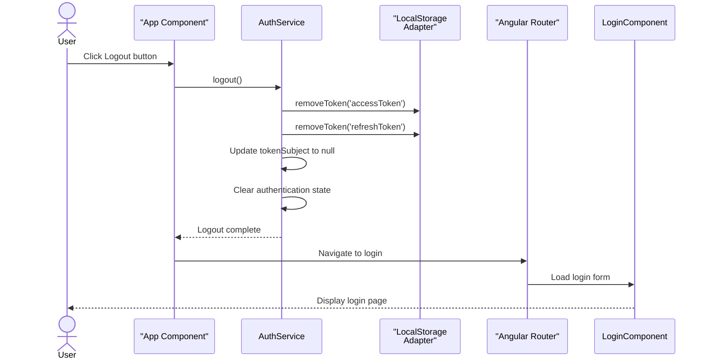

# Business Logic UI (Middle Tier) - Sequence Diagrams

## 1. Login Flow Sequence Diagram

---

## 2. Registration Flow Sequence Diagram

---

## 3. Token Retrieval & HTTP Request Interception

---

## 4. Authentication Guard Check Flow

---

## 5. Logout Flow Sequence Diagram

---

## Key Flow Insights

### **Login/Register Flow**
1. User submits credentials via form
2. Component validates and sends to AuthService
3. AuthService creates DTO and sends to backend
4. Backend authenticates/registers and returns tokens
5. AuthService stores tokens in LocalStorage
6. Component navigates to protected area

### **Token Usage Flow**
1. Component makes HTTP request
2. AuthInterceptor intercepts and attaches Bearer token
3. Backend receives and validates JWT
4. Response returned to component

### **Route Protection Flow**
1. Router triggers AuthGuard before navigation
2. AuthGuard checks token existence and expiration
3. If valid → allow navigation
4. If expired/missing → redirect to login

### **Logout Flow**
1. User initiates logout
2. AuthService clears all stored tokens
3. AuthService updates auth state
4. Router redirects to login page
5. Application returns to unauthenticated state
