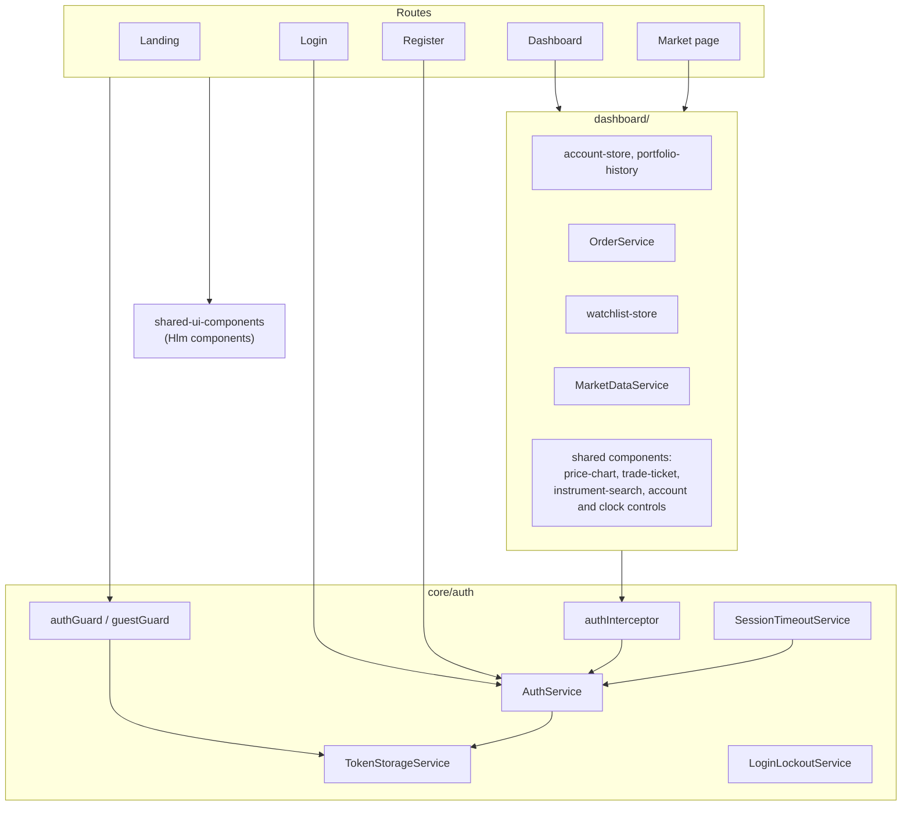
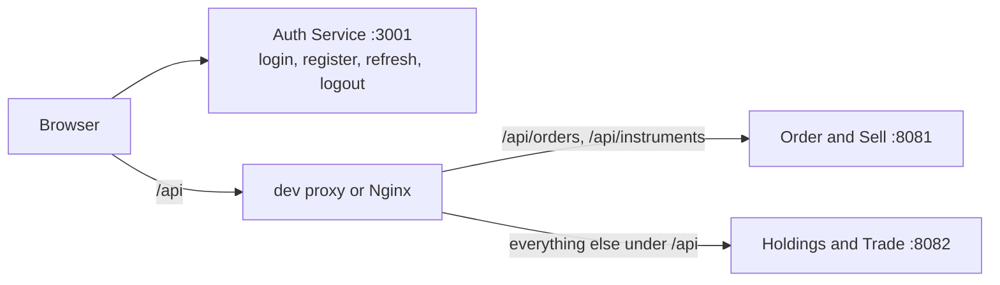
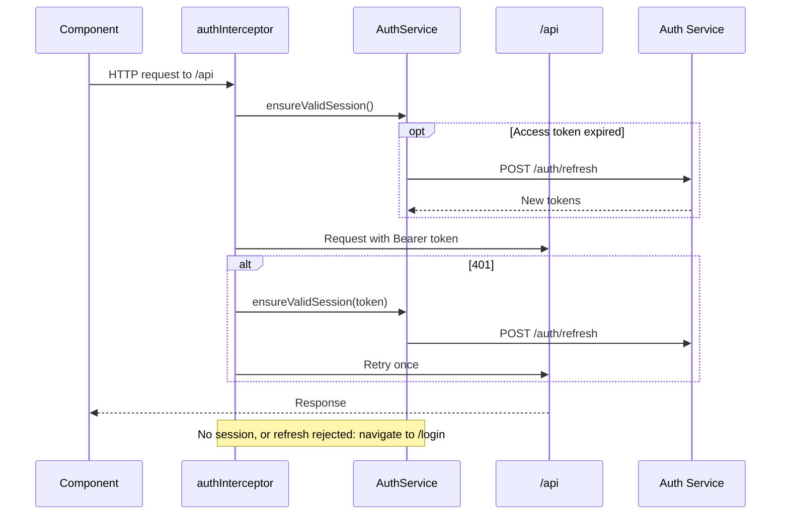

# Client UI

Angular 21 single-page app with standalone components, signals, reactive forms, and OnPush change detection. Server-side rendering runs through the Angular SSR server.

| Route | Guard | Screen |
| --- | --- | --- |
| `/` | none | Landing page |
| `/login`, `/register` | guests only | Sign in and registration |
| `/dashboard` | signed in | Accounts, holdings, portfolio history, watchlist, market ticker, order dialog, recent transactions |
| `/dashboard/markets/:symbol` | signed in | Full-screen instrument page: chart modes and indicators, account and simulation-time controls, order ticket, recent orders |

Live prices, candles, and the tick stream come from the Java market API. Metrics, news, and AI commentary on the market page are demo data. Users are signed out after a period of inactivity, 10 minutes by default and configurable in settings.

## Architecture



### Request routing



The split is configured twice: [proxy.conf.json](proxy.conf.json) for `ng serve` and [nginx.conf](nginx.conf) for the container image. Add a new backend path to both. The auth service is called directly; its CORS policy allows the dev origin.

### Token renewal



Network and refresh-service failures keep the credentials so the request can be retried; sign-out happens on explicit logout, inactivity, or missing or rejected refresh credentials.

### Order review

Every order passes through a review dialog before it is sent, from both the dashboard order dialog and the market page trade ticket. The dialog restates the order and the record-keeping disclaimer, and only its Confirm button places the order. The wording lives in [order-disclaimer.ts](src/app/dashboard/orders/order-disclaimer.ts); see the [trade record](../../docs/reference/trade-record.md).

## Commands

client-ui is an independent npm project with its own lockfile. From the repository root:

```sh
npm --prefix apps/client-ui ci
npm --prefix apps/client-ui start
npm --prefix apps/client-ui run build
npm --prefix apps/client-ui test -- --no-watch
npm --prefix apps/client-ui run e2e
```

`ng serve` runs on port 4200 and proxies `/api` as above. Use `--no-watch` for Angular tests; Vitest's `--run` is not supported by the builder.

The production [Dockerfile](Dockerfile) builds the app and serves it through unprivileged Nginx, with SPA fallback and the `/api` proxy.

## Tests

- **Unit**: `*.spec.ts` beside the code under `src`, on the Angular unit-test builder with Vitest. The run fails below 90 percent on statements, branches, functions, or lines (`coverageThresholds` in [angular.json](angular.json)). Add `--coverage` for the report.
- **End-to-end**: Playwright in [e2e](e2e), excluded from the unit-test builder. Install the browser once with `npx --prefix apps/client-ui playwright install chromium`; the suite builds the app and serves it on port 4200 (or reuses a server already there). The auth service and Java backend are replaced by an in-memory [API stand-in](e2e/fixtures/api-stub.ts), so no database or backend is needed. Update the stand-in whenever an auth, account, cash, or order contract changes.

## Shared components

[shared-ui-components](shared-ui-components/README.md) holds the Spartan/Tailwind component library compiled into this app. Only this app consumes it.
