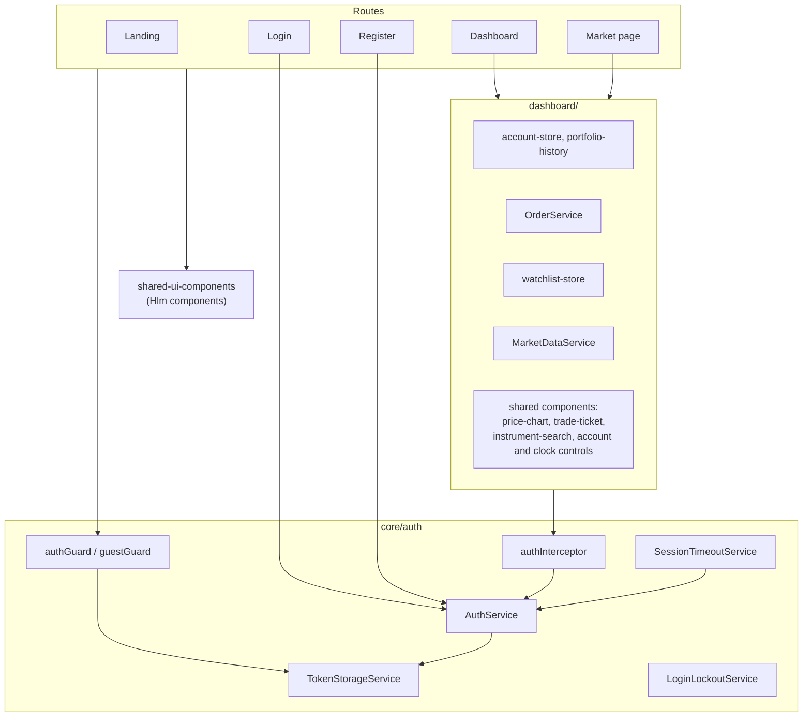
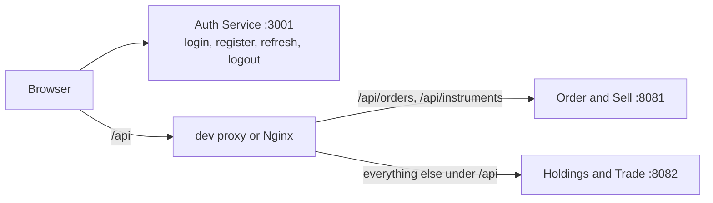
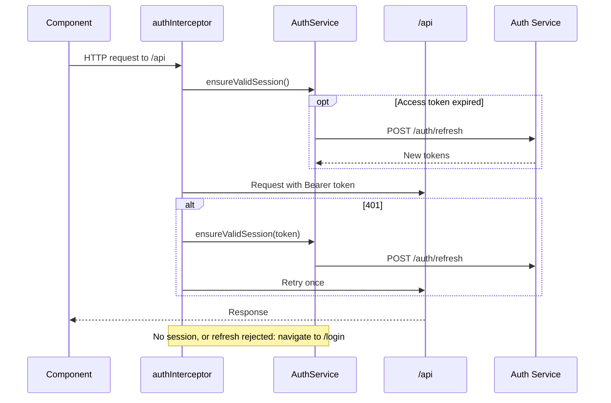

# Client UI

Angular 21 single-page app with standalone components, signals, reactive forms, and OnPush change detection. Server-side rendering runs through the Angular SSR server.

| Route | Guard | Screen |
| --- | --- | --- |
| `/` | none | Landing page |
| `/login`, `/register` | guests only | Sign in and registration |
| `/dashboard` | signed in | Accounts, holdings, portfolio history, watchlist, market ticker, order dialog, recent transactions |
| `/dashboard/markets/:symbol` | signed in | Full-screen instrument page: chart modes and indicators, account and simulation-time controls, order ticket, recent orders |

Live prices, candles, and the tick stream come from the Java market API. Metrics, news, and AI commentary on the market page are demo data. Users are signed out after a period of inactivity, 10 minutes by default and configurable in settings.

A user who has not accepted the platform terms in force sees them on the dashboard and on the market page in a dialog that cannot be dismissed, with everything behind it inert. They sign by typing their name and accept, or sign out. The wording and its version are in [terms-content.ts](src/app/dashboard/terms/terms-content.ts); the version must match the one [Holdings and Trade Service](../holdings-and-trade-service/README.md) and [Order and Sell Service](../order-and-sell-service/README.md) have in force, which a test in each of them checks. After changing the wording, run `npm --prefix apps/client-ui run terms:pdf` to regenerate [the PDF](../../docs/terms-and-conditions.pdf) from it.

## Architecture


```mermaid
flowchart TB
    subgraph Routes
        Landing
        Login
        Register
        Dashboard
        MarketPage["Market page"]
    end
    subgraph Core["core/auth"]
        Guard["authGuard / guestGuard"]
        Interceptor["authInterceptor"]
        AuthSvc["AuthService"]
        Storage["TokenStorageService"]
        Lockout["LoginLockoutService"]
        Timeout["SessionTimeoutService"]
    end
    subgraph Feature["dashboard/"]
        Accounts["account-store, portfolio-history"]
        Orders["OrderService"]
        Watch["watchlist-store"]
        Market["MarketDataService"]
        Shared["shared components:<br/>price-chart, trade-ticket,<br/>instrument-search, account and clock controls"]
    end
    Lib["shared-ui-components<br/>(Hlm components)"]

    Login --> AuthSvc
    Register --> AuthSvc
    Dashboard --> Feature
    MarketPage --> Feature
    Routes --> Guard
    Guard --> Storage
    AuthSvc --> Storage
    Interceptor --> AuthSvc
    Timeout --> AuthSvc
    Feature --> Interceptor
    Routes --> Lib
```

### Request routing


```mermaid
flowchart LR
    Browser --> Auth["Auth Service :3001<br/>login, register, refresh, logout"]
    Browser -- "/api" --> Proxy["dev proxy or Nginx"]
    Proxy -- "/api/orders, /api/instruments" --> OS["Order and Sell :8081"]
    Proxy -- "everything else under /api" --> HT["Holdings and Trade :8082"]
```

The split is configured twice: [proxy.conf.json](proxy.conf.json) for `ng serve` and [nginx.conf](nginx.conf) for the container image. Add a new backend path to both. The auth service is called directly; its CORS policy allows the dev origin.

### Token renewal


```mermaid
sequenceDiagram
    participant C as Component
    participant I as authInterceptor
    participant A as AuthService
    participant API as /api
    participant Auth as Auth Service

    C->>I: HTTP request to /api
    I->>A: ensureValidSession()
    opt Access token expired
        A->>Auth: POST /auth/refresh
        Auth-->>A: New tokens
    end
    I->>API: Request with Bearer token
    alt 401
        I->>A: ensureValidSession(token)
        A->>Auth: POST /auth/refresh
        I->>API: Retry once
    end
    API-->>C: Response
    Note over I,A: No session, or refresh rejected: navigate to /login
```

Network and refresh-service failures keep the credentials so the request can be retried; sign-out happens on explicit logout, inactivity, or missing or rejected refresh credentials.

### Selected account

The account chosen in the header is never part of a URL, where it would reach browser history, server logs and shared links. [AccountStore](src/app/dashboard/accounts/account-store.service.ts) holds it for the dashboard and the market page, and keeps it in this tab's `sessionStorage` under `ts.accounts.selected`, so moving between the two pages or reloading keeps it, and a new tab starts on the first account. Sign-out forgets it, and a saved id that is not one of the user's accounts selects the first one. Links made before this carried `?accountId=`; [dropAccountIdGuard](src/app/core/drop-account-id.guard.ts) opens them without it.

## Loading states

While data is on its way, the part of the screen that waits for it shows placeholders in the shape of what is coming: pulsing blocks where the figures, rows and charts will be. A figure is not shown as zero, and a list is not shown as empty, until the answer says so.

| Screen | Placeholder | Shown until |
| --- | --- | --- |
| Dashboard | Net worth, allocation and the invested and cash line; the portfolio card; the account menu's label and its accounts; rows of the assets table | The accounts, holdings and cash arrive |
| Dashboard | Rows of Recent Transactions | The orders and the accounts arrive |
| Dashboard | The portfolio chart | The portfolio history of the chosen range arrives |
| Dashboard | Rows of the watch list | The watch list arrives |
| Transactions dialog | Rows of the table, when there is nothing to list yet | The full cash ledger arrives |
| Market page | The whole page: summary, chart panel and tools column | The market snapshot arrives |
| Market page | The chart, and each chart of a comparison | Its candles arrive |
| Market page | Available cash, portfolio value, the account menu and the account named above Recent Orders | The accounts arrive |
| Market page | Rows of Recent Orders | The orders and the accounts arrive |

A placeholder is the `skeleton` class in [src/styles.css](src/styles.css), sized with utilities; a list row has its own in [activity-row.component.ts](src/app/dashboard/shared/activity-row.component.ts). The blocks are hidden from assistive technology, and a visually hidden status beside them says what is loading, so a screen reader hears "Loading accounts" as before. The pulse stops under `prefers-reduced-motion`. A load that fails shows its error and retry in place of the placeholder, and a refresh of data already on screen leaves it there. The [Reporting UI](../reporting-ui/README.md#design-system) declares the same class; keep the two alike.

## Themes

The app comes in the design system's dark theme, which is the default, and a light one. The switch is the sun or moon button in the header of the landing page, the dashboard and the market page, and at the top right of the sign-in and registration pages.

| Piece | What it does |
| --- | --- |
| [src/styles.css](src/styles.css) | The light tokens on `:root`, the dark ones on `:root.dark`. Light keeps the brand's ink and cyan but deepens each color used as text, primary, gain, loss and pending, until it reads at 4.5:1 on a white card. Besides the SpartanNG tokens there are tokens for the hero card, the surfaces the trading charts float, and the chart indicators |
| [ThemeService](src/app/core/theme/theme.service.ts) | Adds or removes the `dark` class on `<html>`, keeps the choice in this browser's `localStorage` under `ts.settings.theme`, and follows a choice made in another open tab. On the server it changes nothing but the class |
| [ThemeToggleComponent](src/app/core/theme/theme-toggle.component.ts) | The switch. Its label names the theme a click gives |
| [src/index.html](src/index.html) | Ships `class="dark"` and a script that removes it when light was saved, before the first paint, so a reload or a prerendered page does not flash dark |

Use a token, not a literal color, in new markup: a literal looks right in one theme only. The [Reporting UI](../reporting-ui/README.md#theme) declares the same values and has its own switch; the choice is kept per origin, so each app remembers its own.

## Commands

client-ui is an independent npm project with its own lockfile. From the repository root:

```sh
npm --prefix apps/client-ui ci
npm --prefix apps/client-ui start
npm --prefix apps/client-ui run build
npm --prefix apps/client-ui test -- --no-watch
npm --prefix apps/client-ui run e2e
```

`ng serve` runs on port 4200 and proxies `/api` as above. Use `--no-watch` for Angular tests; Vitest's `--run` is not supported by the builder.

The production [Dockerfile](Dockerfile) builds the app and serves it through unprivileged Nginx, with SPA fallback and the `/api` proxy.

## Tests

- **Unit**: `*.spec.ts` beside the code under `src`, on the Angular unit-test builder with Vitest. The run fails below 90 percent on statements, branches, functions, or lines (`coverageThresholds` in [angular.json](angular.json)). Add `--coverage` for the report.
- **End-to-end**: Playwright in [e2e](e2e), excluded from the unit-test builder. Install the browser once with `npx --prefix apps/client-ui playwright install chromium`; the suite builds the app and serves it on port 4200 (or reuses a server already there). The auth service and Java backend are replaced by an in-memory [API stand-in](e2e/fixtures/api-stub.ts), so no database or backend is needed. Update the stand-in whenever an auth, account, cash, order, or terms contract changes.

## Shared components

[shared-ui-components](shared-ui-components/README.md) holds the Spartan/Tailwind component library compiled into this app. Only this app consumes it.
