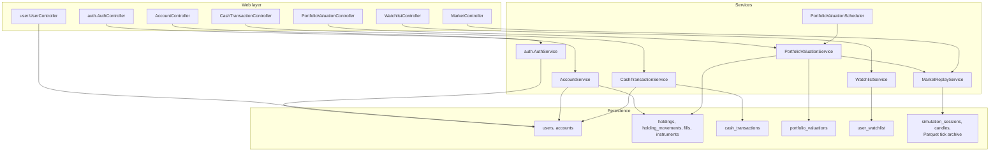
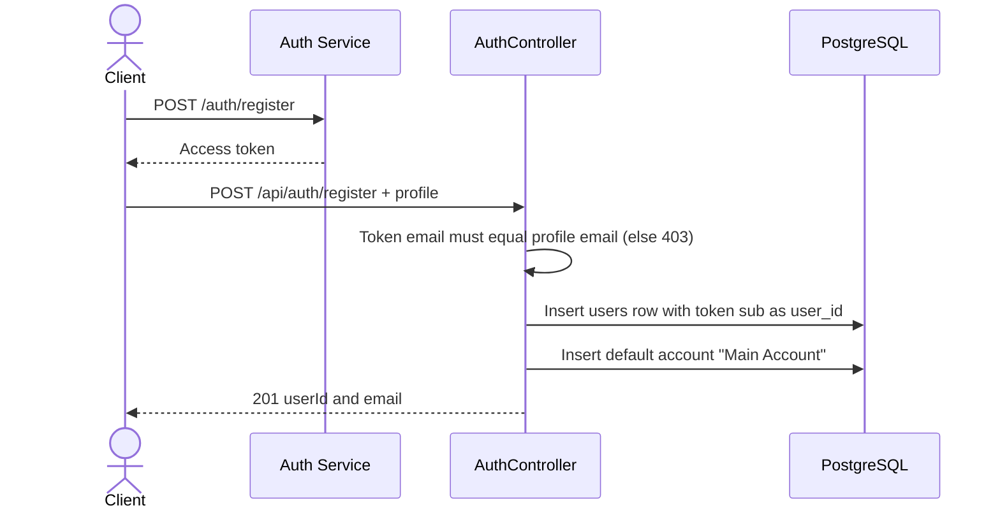
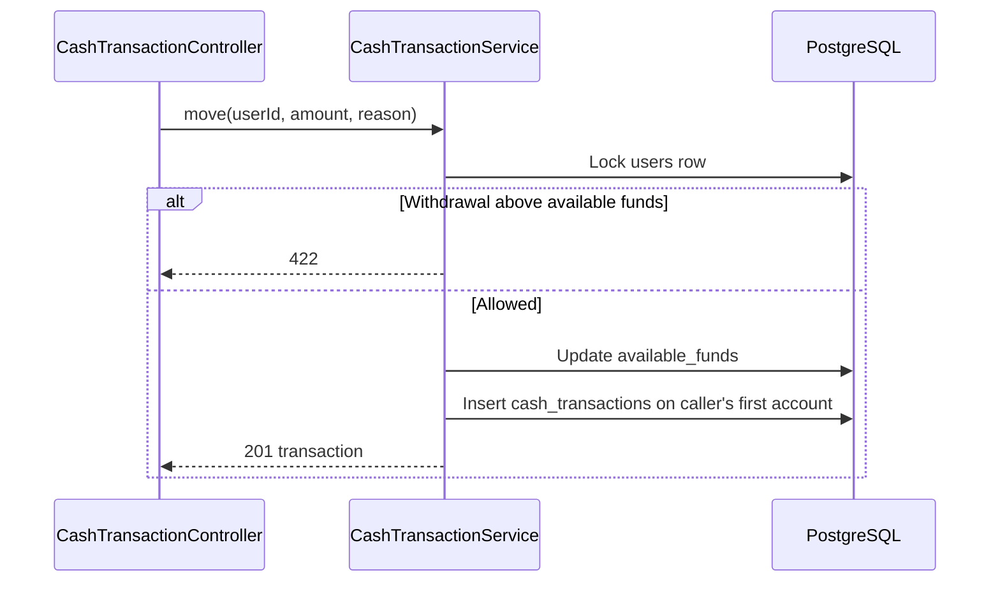
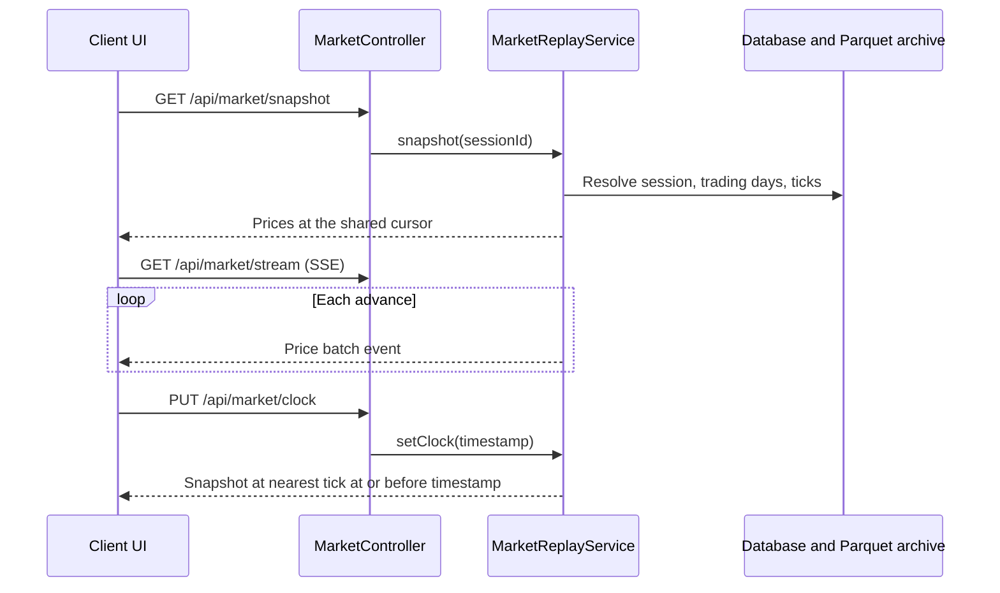

# Holdings and Trade Service

Spring Boot (Java 21) service for the signed-in user's own data: profile, accounts, holdings, shared cash, saved watchlist, and portfolio value history. It also serves the simulated market feed. Order submission and execution belong to the [Order and Sell Service](../order-and-sell-service/README.md).

- Port 8082, Swagger UI at http://localhost:8082/swagger-ui.html
- Shares the `trading_season` database. The schema comes from [db/migrations](../../db/migrations); Hibernate never alters it.
- Authenticates callers by verifying RS256 tokens from the [Auth Service](../auth-service/README.md) against its cached JWKS. Every user-specific endpoint resolves the owner from the token's `sub`; no path or body field can name another user. An account that belongs to someone else is 403 and a missing one is 404.

## Endpoints

All require a bearer token except where marked public.

| Method | Path | Purpose |
| --- | --- | --- |
| POST | `/api/auth/account-exists` | Whether an email is registered (public) |
| POST | `/api/auth/register` | Create the caller's profile and a default account |
| GET | `/api/users/me` | The caller's profile, without the SSN |
| GET, POST | `/api/me/accounts` | List (newest first) or open an account |
| PUT | `/api/me/accounts/{accountId}` | Rename an owned account |
| GET | `/api/accounts/{accountId}` | An owned account |
| GET | `/api/accounts/{accountId}/holdings` | Positions with symbol and average cost |
| GET | `/api/accounts/{accountId}/portfolio-history` | Value observations; `timeframe` is `1D`, `5D`, `1W`, `1M`, or `1Y` |
| POST | `/api/accounts/{accountId}/portfolio-valuations` | Record a server-calculated value now |
| GET, POST | `/api/me/cash-transactions` | List or record a deposit or withdrawal |
| GET | `/api/me/watchlist` | The caller's saved stocks |
| PUT, DELETE | `/api/me/watchlist/{symbol}` | Save or remove a stock |
| GET | `/api/market/snapshot`, `/candles`, `/stream` | Public market data (snapshot, OHLCV candles, SSE ticks) |
| PUT | `/api/market/clock` | Move the shared replay cursor (authenticated) |

Behavior worth knowing:

- Registration needs a bearer token whose `email` matches the profile email, a nonblank name and address, SSN as `NNN-NN-NNNN`, a past date of birth, `traderLevel` of `BEGINNER`, `INTERMEDIATE`, or `ADVANCED`, and `availableFunds` of at least 5000.00. Credentials are created first with the Auth Service; this service never sees a password.
- Cash belongs to the user, not the account: every account shares `users.available_funds`. Each deposit or withdrawal updates that balance and appends a `cash_transactions` row in one transaction with the user row locked. A withdrawal above the balance is 422.
- A holding's `averageCost` is derived by replaying `holding_movements` and `fills` oldest first as a moving weighted average. This service never writes those tables.
- Portfolio history is recorded once a minute for eligible accounts, and the UI also requests a capture after a fill. Value is held quantity times replay price, falling back to average cost; cash is excluded.
- Candles come from the seeded one-minute data and are capped at 500 points. The stream keeps 30 events for `Last-Event-ID` reconnection and then asks the client to reload the snapshot.
- Errors use `{"error": "..."}`.

## Design



### Registration



### Cash movement



### Market replay



Parquet-backed sessions read raw ticks from the archive: `MARKET_REPLAY_ARCHIVE_LOCATION` first, then the location recorded at import, then the matching archive under `apps/market-data/db/seeds`. A missing partition returns an unavailable error rather than falling back to one-minute candles.

## Configuration

Environment variables override [application.properties](src/main/resources/application.properties).

| Variable | Default | Purpose |
| --- | --- | --- |
| `SPRING_DATASOURCE_URL` | `jdbc:postgresql://localhost:5432/trading_season` | Database |
| `SPRING_DATASOURCE_USERNAME` | `trading_season` | Database user |
| `SPRING_DATASOURCE_PASSWORD` | `changeme` | Database password |
| `AUTH_JWK_SET_URI` | `http://localhost:3001/.well-known/jwks.json` | Auth service public keys |
| `AUTH_JWT_ISSUER` | `https://auth.dualeapa.local` | Required `iss`, must equal the auth service's `JWT_ISSUER` |
| `CORS_ORIGINS` | `http://localhost:4200` | Allowed browser origins, comma-separated |
| `MARKET_REPLAY_ARCHIVE_LOCATION` | empty | Absolute path to the Parquet archive |

## Run and test

Start a migrated database with market data ([db/README.md](../../db/README.md), [apps/market-data](../market-data/README.md)) and the auth service, then:

```sh
mvn spring-boot:run
mvn test
```

Tests use H2 with [application-test.properties](src/test/resources/application-test.properties), mirror the source packages under `src/test/java/app`, and cover cross-user isolation for every user-specific endpoint. Use `@SpringBootTest` with `@Transactional` for repository tests; `@DataJpaTest` is not available. JaCoCo fails the build below 85 percent on every counter in any package (`coverage.minimum` in [pom.xml](pom.xml)); reports are in `target/site/jacoco/`.

Keep HTTP validation in controllers, business logic in services, and persistence in repositories. After changing Java code, regenerate the Javadocs; see [AGENTS.md](../../AGENTS.md).
