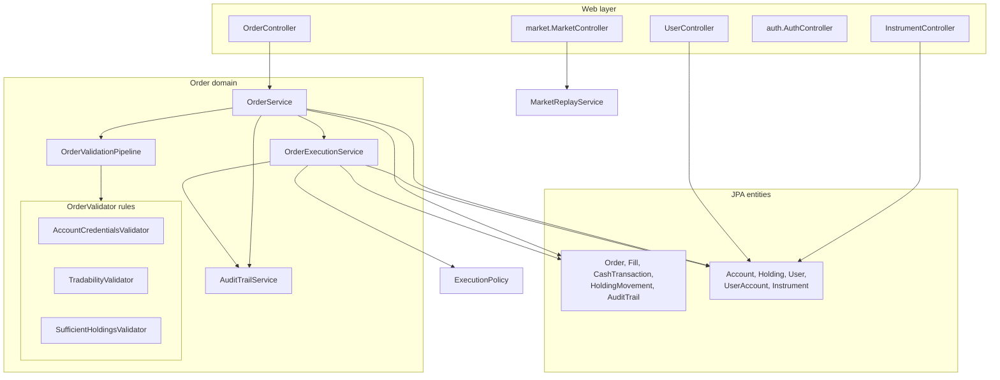
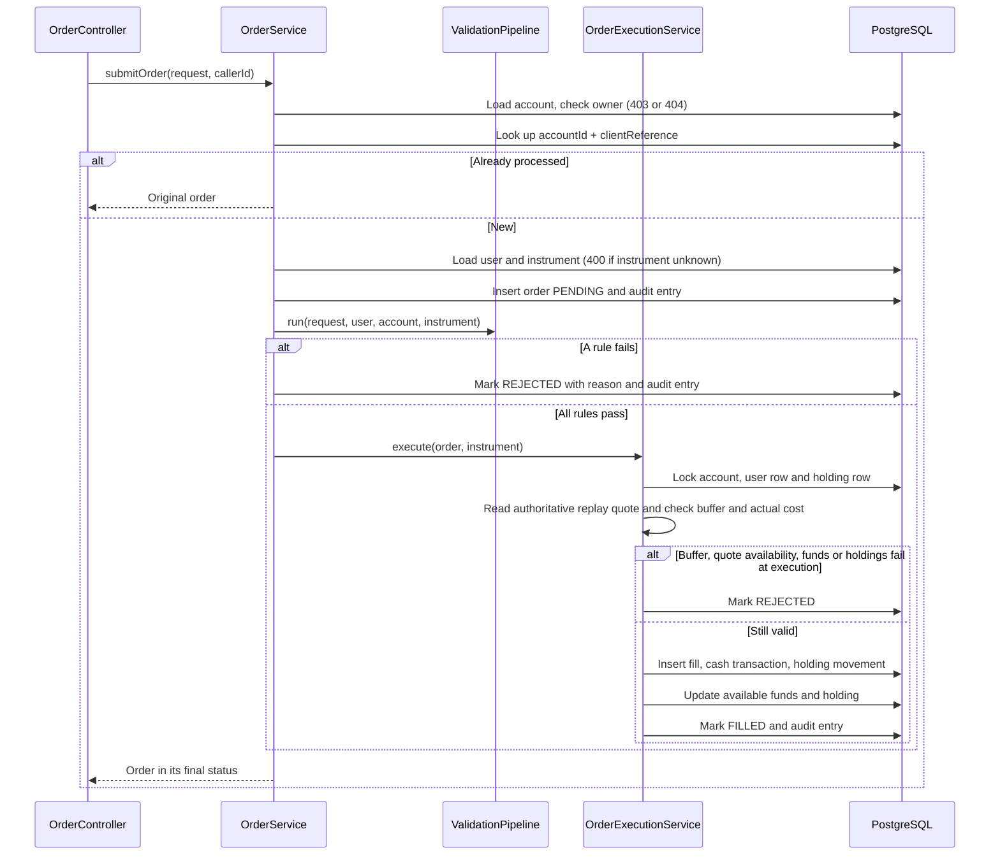
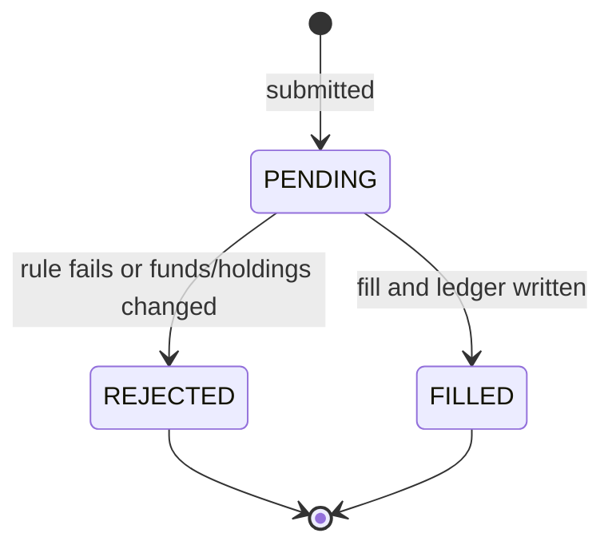

# Order and Sell Service

Spring Boot (Java 21) service that submits, validates, and executes buy and sell orders, and serves instrument reference data and order history. It is the trading half of the backend; accounts, cash, and holdings reads belong to the [Holdings and Trade Service](../holdings-and-trade-service/README.md).

- Port 8081, Swagger UI at http://localhost:8081/swagger-ui.html
- Shares the `trading_season` database. The schema comes from [db/migrations](../../db/migrations); Hibernate never alters it.
- Authenticates callers by verifying RS256 tokens from the [Auth Service](../auth-service/README.md) against its cached JWKS. The caller is always the token's `sub`.

## Endpoints

All require a bearer token except the public market reads.

| Method | Path | Purpose |
| --- | --- | --- |
| POST | `/api/orders/check` | Advisory eligibility check; no order or reservation is created |
| POST | `/api/orders` | Submit a buy or sell order. Returns 201 with the outcome (`FILLED` or `REJECTED`) |
| GET | `/api/orders` | The caller's orders across all their accounts, newest first |
| GET | `/api/instruments` | Every instrument with `tradable` and `simulatedStockSymbol` |
| POST | `/api/auth/account-exists` | Whether an email is registered (public) |
| POST | `/api/auth/register` | Create the caller's profile from the bearer token |
| GET | `/api/users/me` | The caller's profile, without the SSN |
| GET | `/api/market/snapshot`, `/candles`, `/stream` | Public market data (snapshot, OHLCV candles, SSE ticks) |
| PUT | `/api/market/clock` | Move the shared replay cursor |

Order request: `accountId`, `instrumentId`, `orderType` (`BUY` or `SELL`), `quantity`, `indicativePrice`, `clientReference` (UUID idempotency key), and optional `bufferPercent`, `simulatedAt`, and positive `sessionId`. The check accepts the same trade fields without requiring `clientReference`.

Behavior worth knowing:

- A rule failure is a normal outcome: the response is still 201 with `status: REJECTED` and a `rejectionReason`.
- Resubmitting the same `accountId` and `clientReference` returns the original outcome without executing again.
- Another user's account is 403 and a missing account is 404, checked before the idempotency lookup. An unknown `instrumentId` is 400.
- Cash belongs to the user, not the account: a fill moves `users.available_funds`. Orders fill at the authoritative Holdings and Trade replay price for the selected session.
- Responses include `bufferPercent`, `executionPrice` from the persisted fill (null for unfilled orders), and `executedSimulatedAt` from the execution quote.
- `simulatedAt` records the replay time chosen in the UI. `submittedAt`, `resolvedAt`, and fill times are always real server times.
- Errors use `{"error": "..."}`.

## Design



### Order submission



Submission runs in one transaction, so a persistence failure rolls back the order and its whole ledger together.

### Order status



Every transition is recorded in `audit_trail`. A new validation rule is a new `OrderValidator` class; the pipeline discovers it automatically and stops at the first rejection.

## Configuration

Environment variables override [application.properties](src/main/resources/application.properties).

| Variable | Default | Purpose |
| --- | --- | --- |
| `SPRING_DATASOURCE_URL` | `jdbc:postgresql://localhost:5432/trading_season` | Database |
| `SPRING_DATASOURCE_USERNAME` | `trading_season` | Database user |
| `SPRING_DATASOURCE_PASSWORD` | `changeme` | Database password |
| `AUTH_JWK_SET_URI` | `http://localhost:3001/.well-known/jwks.json` | Auth service public keys |
| `AUTH_JWT_ISSUER` | `https://auth.dualeapa.local` | Required `iss`, must equal the auth service's `JWT_ISSUER` |
| `CORS_ORIGINS` | `http://localhost:4200` | Allowed browser origins, comma-separated |
| `EXECUTION_MARKET_BASE_URL` | `http://localhost:8082` | Holdings and Trade URL for execution quotes |
| `MARKET_REPLAY_ARCHIVE_LOCATION` | empty | Absolute path to the Parquet archive when the recorded path is not reachable |

## Run and test

Start a migrated database ([db/README.md](../../db/README.md)) and the auth service, then:

```sh
mvn spring-boot:run
mvn test
```

Tests use H2 with the `test` profile and mirror the source packages under `src/test/java/app`. JaCoCo fails the build below 70 percent on every counter in any package (`coverage.minimum` in [pom.xml](pom.xml)); reports are in `target/site/jacoco/`.

After changing Java code, regenerate the Javadocs; see [AGENTS.md](../../AGENTS.md).

## Archived portfolio accounts

New orders and execution on archived accounts return 409 with an `error` message. Account row locks serialize trading with archiving before user cash and holdings locks. Existing client-reference retries still return the previous order outcome. Historical order reads continue to include archived accounts. Portfolio archiving is separate from credential records.

## Execution price protection

Execution reads `/api/market/snapshot` from Holdings and Trade so it uses the same server replay clock as the UI. The selected `sessionId` is passed through; an omitted session uses that market API's default. `simulatedAt` never selects a quote. Instruments require a `simulatedStockSymbol` mapping and a positive quote at the snapshot cursor. Missing prices or unavailable market data reject the trade without ledger changes. Quote requests have a two-second timeout and no application retry.

For reference price P and buffer B%, buys permit prices at or below P * (1 + B/100); sells permit prices at or above P * (1 - B/100). Boundaries pass and favorable movement always passes. Buffers accept 0 through 10 percent with up to two decimal places. A per-order override takes precedence over the user's saved setting; the effective value is recorded on the order. Invalid legacy user settings must be corrected or overridden before execution.

Buy affordability uses quantity times the actual quote, including a recheck under resource locks. The earlier indicative-price funds validator is removed. Immediate full fills remain a simulation assumption: no liquidity, spread, or partial-fill model is implemented.

`POST /api/orders/check` returns `eligible`, `rejectionCode`, `rejectionReason`, `bufferPercent`, `indicativePrice`, `executionPrice`, `estimatedTradeValue`, `priceBoundary`, `sessionId`, and `quoteTimestamp`. Quote-dependent fields are null when no quote is available. Business rejection returns 200 with `eligible: false`; authentication, ownership, archive, missing-resource, and malformed-input errors use normal HTTP errors. The check does not write orders, audits, fills, or reservations. Submission independently checks again and can reject after a successful check.
