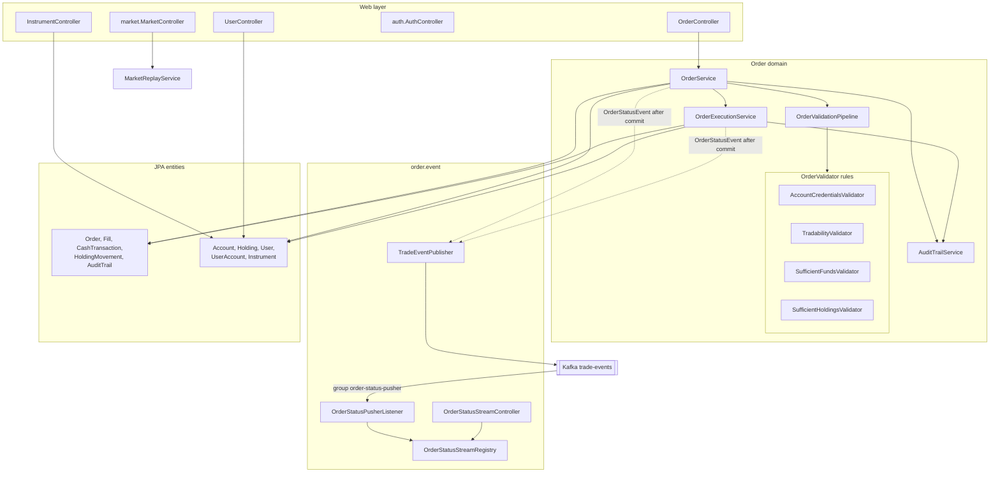
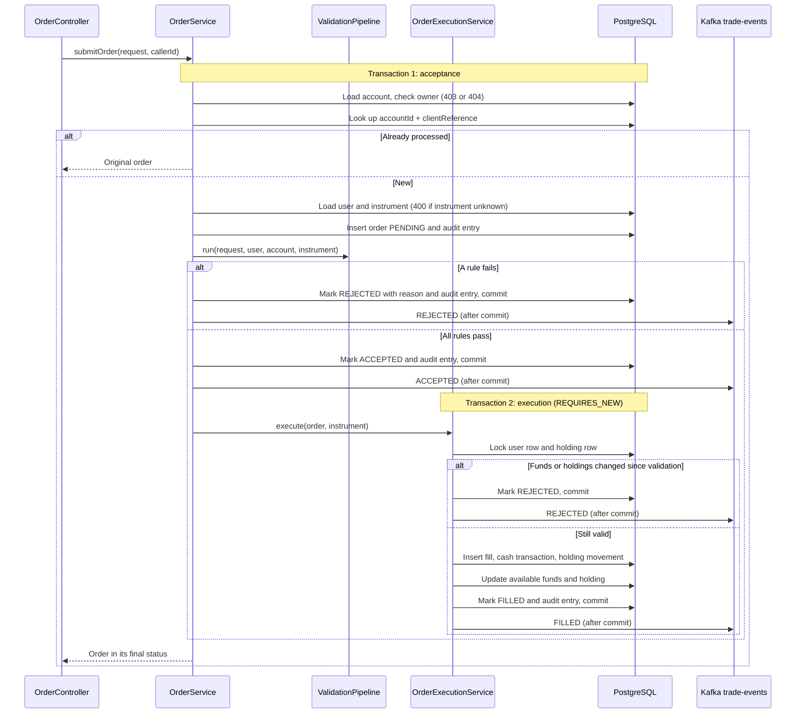
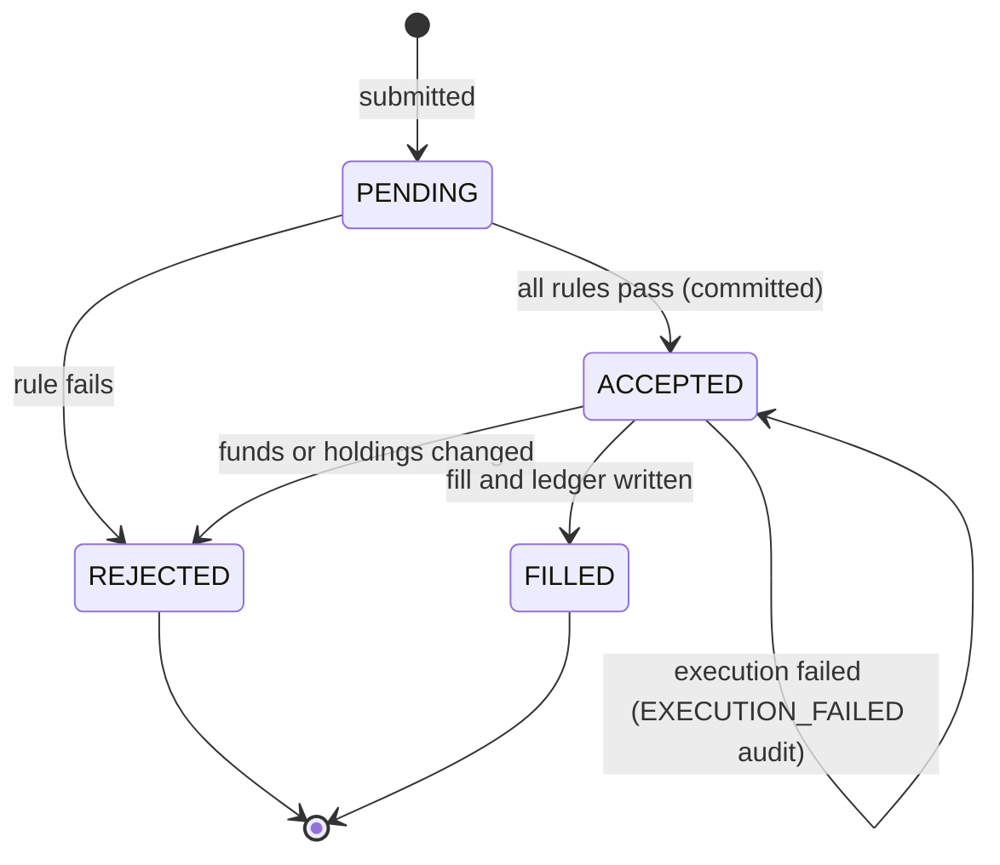

# Order and Sell Service

Spring Boot (Java 21) service that submits, validates, and executes buy and sell orders, and serves instrument reference data and order history. It is the trading half of the backend; accounts, cash, and holdings reads belong to the [Holdings and Trade Service](../holdings-and-trade-service/README.md).

- Port 8081, Swagger UI at http://localhost:8081/swagger-ui.html
- Shares the `trading_season` database. The schema comes from [db/migrations](../../db/migrations); Hibernate never alters it.
- Authenticates callers by verifying RS256 tokens from the [Auth Service](../auth-service/README.md) against its cached JWKS. The caller is always the token's `sub`.
- Publishes one Kafka `trade-events` message per committed order status change (`ACCEPTED`, `FILLED`, `REJECTED`) and runs the `order-status-pusher` consumer group, which forwards each change to the owner's open `GET /api/orders/stream` connections. The other two groups live in the [Holdings and Trade Service](../holdings-and-trade-service/README.md) and the [Reporting Service](../reporting-service/README.md).

## Endpoints

All require a bearer token except the public market reads.

| Method | Path | Purpose |
| --- | --- | --- |
| POST | `/api/orders` | Submit a buy or sell order. Returns 201 with the outcome (`FILLED`, `REJECTED`, or `ACCEPTED` when execution failed and the order stays on record) |
| GET | `/api/orders` | The caller's orders across all their accounts, newest first |
| GET | `/api/orders/stream` | Server-Sent Events: an `order-status` event with each committed status change's JSON body, and a `heartbeat` every 15 seconds |
| GET | `/api/instruments` | Every instrument with `tradable` and `simulatedStockSymbol` |
| POST | `/api/auth/account-exists` | Whether an email is registered (public) |
| POST | `/api/auth/register` | Create the caller's profile from the bearer token |
| GET | `/api/users/me` | The caller's profile, without the SSN |
| GET | `/api/market/snapshot`, `/candles`, `/stream` | Public market data (snapshot, OHLCV candles, SSE ticks) |
| PUT | `/api/market/clock` | Move the shared replay cursor |

Order request: `accountId`, `instrumentId`, `orderType` (`BUY` or `SELL`), `quantity`, `indicativePrice`, `clientReference` (UUID idempotency key), and optional `bufferPercent` and `simulatedAt`.

Behavior worth knowing:

- A rule failure is a normal outcome: the response is still 201 with `status: REJECTED` and a `rejectionReason`.
- Resubmitting the same `accountId` and `clientReference` returns the original outcome without executing again.
- Another user's account is 403 and a missing account is 404, checked before the idempotency lookup. An unknown `instrumentId` is 400.
- Cash belongs to the user, not the account: a fill moves `users.available_funds`. Orders fill at `indicativePrice`.
- `simulatedAt` records the replay time chosen in the UI. `submittedAt`, `resolvedAt`, and fill times are always real server times.
- `GET /api/orders/stream` needs the bearer header, which the browser's native `EventSource` cannot send; use `fetch` or an SSE client that sets headers. Only the caller's own order events are pushed.
- Errors use `{"error": "..."}`.

## Design



### Order submission



Acceptance and execution are separate transactions (BR-06). The accepted order is committed before any ledger row is written, and the fill, cash transaction, holding movement, holding update and FILLED status commit together or not at all (BR-09). If execution throws, only the execution rolls back: the order stays `ACCEPTED`, an `EXECUTION_FAILED` audit entry records the cause (truncated to 255 characters), and the response returns the order in that state. Nothing retries it automatically.

Each `trade-events` message is published by `TradeEventPublisher` from an `AFTER_COMMIT` transactional event listener, so a consumer never sees a status the database does not hold. The message key is the account id as a string; the body is JSON with `orderId`, `status`, `symbol`, `side`, `quantity`, `price`, `rejectionReason` and `occurredAt`. A send failure is logged and never fails the order.

### Order status



Every transition is recorded in `audit_trail`, and every committed `ACCEPTED`, `FILLED` and `REJECTED` status is also published to `trade-events`. A new validation rule is a new `OrderValidator` class; the pipeline discovers it automatically and stops at the first rejection.

## Configuration

Environment variables override [application.properties](src/main/resources/application.properties).

| Variable | Default | Purpose |
| --- | --- | --- |
| `SPRING_DATASOURCE_URL` | `jdbc:postgresql://localhost:5432/trading_season` | Database |
| `SPRING_DATASOURCE_USERNAME` | `trading_season` | Database user |
| `SPRING_DATASOURCE_PASSWORD` | `changeme` | Database password |
| `AUTH_JWK_SET_URI` | `http://localhost:3001/.well-known/jwks.json` | Auth service public keys |
| `AUTH_JWT_ISSUER` | `https://auth.dualeapa.local` | Required `iss`, must equal the auth service's `JWT_ISSUER` |
| `CORS_ORIGINS` | `http://localhost:4200` | Allowed browser origins, comma-separated |
| `MARKET_REPLAY_ARCHIVE_LOCATION` | empty | Absolute path to the Parquet archive when the recorded path is not reachable |
| `KAFKA_BOOTSTRAP_SERVERS` | `localhost:29092` | Broker for `trade-events`; Compose sets `kafka:9092` |

The property `app.events.enabled` (default `true`) registers the trade-event publisher and the `order-status-pusher` consumer; the test profile sets it to `false` so contexts without a broker never contact one. The stream endpoint is always present. `app.events.stream.heartbeat-millis` (default 15000) is the SSE keep-alive interval. Without a broker the service still starts, but every order then waits up to five seconds (`max.block.ms`) for it before responding.

## Run and test

Start a migrated database ([db/README.md](../../db/README.md)), the auth service, and the Kafka broker with its topic from the Compose file (`docker compose -f infrastructure/docker-compose/docker-compose.local.yml up -d kafka-init`), then:

```sh
mvn spring-boot:run
mvn test
```

Tests use H2 with the `test` profile and mirror the source packages under `src/test/java/app`. The trade-event flow test starts an embedded Kafka broker; no external broker is needed. JaCoCo fails the build below 70 percent on every counter in any package (`coverage.minimum` in [pom.xml](pom.xml)); reports are in `target/site/jacoco/`.

After changing Java code, regenerate the Javadocs; see [AGENTS.md](../../AGENTS.md).
