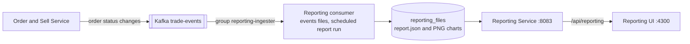
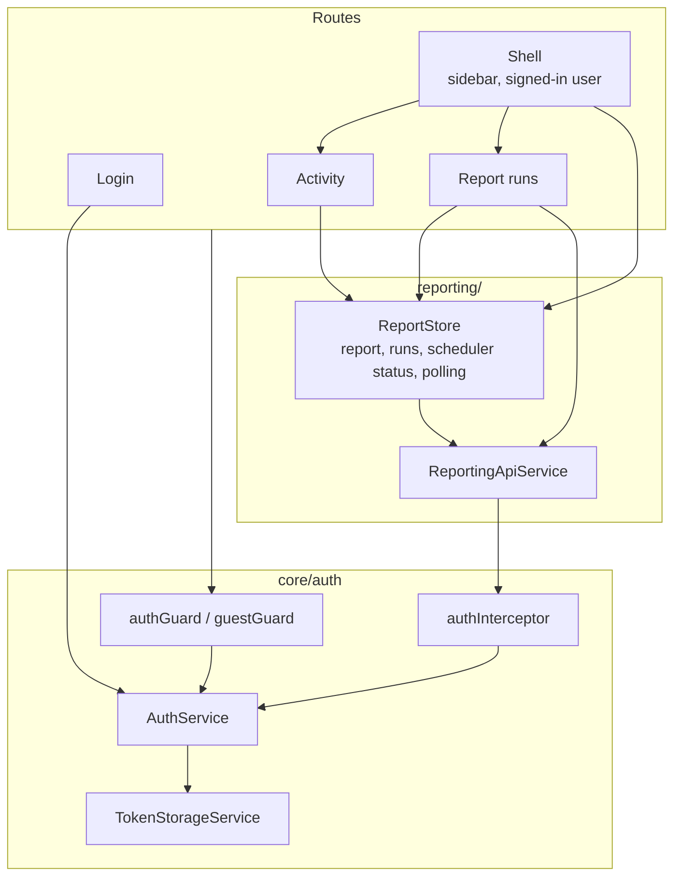
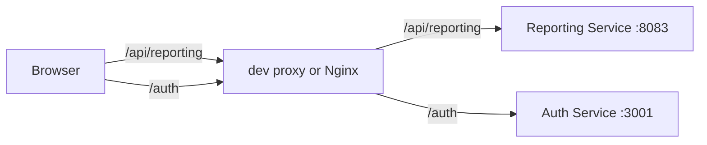

# Reporting UI

Angular 21 single-page app that presents the [Reporting Service](../reporting-service/README.md) output: the report runs the reporting consumer builds from the `trade-events` Kafka topic. Standalone components, signals, reactive forms, and OnPush change detection, with no server-side rendering.

- Port 4300, for both `ng serve` and the Compose container
- Signs in against the [Auth Service](../auth-service/README.md) with the same accounts as the Client UI. It has no registration screen.

| Route | Guard | Screen |
| --- | --- | --- |
| `/login` | guests only | Sign in |
| `/` | signed in | Activity: headline figures, trades per day, orders by status, report pipeline, most traded symbols, accounts |
| `/runs` | signed in | Report runs: the runs on disk and the PNG charts of the selected run, with download |

Every figure on screen comes from the Reporting Service. Nothing is demo data. Days are UTC days, as the report job buckets them; the time a run was generated is shown in the viewer's time zone with the zone named.

## How the data reaches the screen



The UI never talks to Kafka. The consumer writes a new run every `SCHEDULER_INTERVAL_MINUTES`; the UI asks `GET /api/reporting/scheduler/status` every 30 seconds and reloads the report when the latest run id changes, so a new run appears without a page reload. The Activity screen shows the run interval, when the next run is due, and whether it is overdue by the service's own clock.

| Screen element | Endpoint |
| --- | --- |
| Activity figures, chart and tables | `GET /api/reporting/runs/latest` |
| Run list | `GET /api/reporting/runs` |
| Chart images | `GET /api/reporting/runs/{runId}/files/{name}`, fetched as a blob because an image tag cannot send the bearer token |
| Run interval, next run, new-run check | `GET /api/reporting/scheduler/status` |
| Signed-in user's name and trader level | `GET /api/reporting/profile`; a sign-in without a trading profile (404) shows its email instead |

## Architecture



`ReportStore` is provided by the shell component, so it exists only while a signed-in screen is shown and its polling stops on sign-out.

### Request routing



Both backends are called on the UI's own origin, so neither needs a CORS entry for port 4300. The split is configured twice: [proxy.conf.json](proxy.conf.json) for `ng serve` and [nginx.conf](nginx.conf) for the container image. Add a new backend path to both. This differs from the Client UI, which calls the Auth Service directly.

Token handling matches the Client UI: the interceptor adds the bearer token to `/api/reporting` calls, refreshes an expired access token through `POST /auth/refresh`, retries once after a 401, and sends the user to `/login` when the refresh token is missing or rejected. The session is kept in `localStorage` under its own key, separate from the Client UI's because the two apps are different origins.

## Design system

The screens follow the TradingSeason design system: dark only, Archivo, the cyan accent, filled orders in the gain color and rejected orders in the loss color, dashboard cards with quiet uppercase labels, Lucide icons through `@ng-icons/lucide`. The tokens are declared in [src/styles.css](src/styles.css) with the same values as the Client UI's dark theme, and Tailwind v4 maps them to utilities. The design system export itself is not checked in.

The layout adapts the design system's proposed reporting console. Its Customers and Orders screens are not built: the Reporting Service has no endpoints for customer lookup, per-order history, or audit trails.

This app does not use the Client UI's [shared-ui-components](../client-ui/shared-ui-components/README.md). Its own markup is styled directly from the tokens, so that library still has one consumer.

## Commands

reporting-ui is an independent npm project with its own lockfile. From the repository root:

```sh
npm --prefix apps/reporting-ui ci
npm --prefix apps/reporting-ui start
npm --prefix apps/reporting-ui run build
npm --prefix apps/reporting-ui test -- --no-watch
```

`ng serve` runs on port 4300 and expects the Auth Service on `localhost:3001` and the Reporting Service on `localhost:8083`. A report appears once the reporting consumer has written its first run; until then the screens say that no report exists yet. Use `--no-watch` for the tests; Vitest's `--run` is not supported by the builder.

The production [Dockerfile](Dockerfile) builds the app and serves it through unprivileged Nginx, with SPA fallback and the two proxies. In [Local Compose](../../infrastructure/docker-compose/docker-compose.local.yml) the container starts after `reporting-service` and `auth-service`, because Nginx resolves both upstream names when it starts.

## Tests

`*.spec.ts` beside the code under `src`, on the Angular unit-test builder with Vitest. The run fails below 90 percent on statements, branches, functions, or lines (`coverageThresholds` in [angular.json](angular.json)). Add `--coverage` for the report. Shared test data lives in [src/testing](src/testing) and is excluded from the application build. There is no end-to-end suite for this app.

## Known limitations

- Any signed-in account can read the reports. The Reporting Service does not enforce an admin role, and this UI does not hide anything by role.
- The service keeps only the newest run, so the run list normally has one entry.
- There is no time-range filter: a run covers every event on disk.
- Users are not signed out for inactivity, unlike the Client UI.
