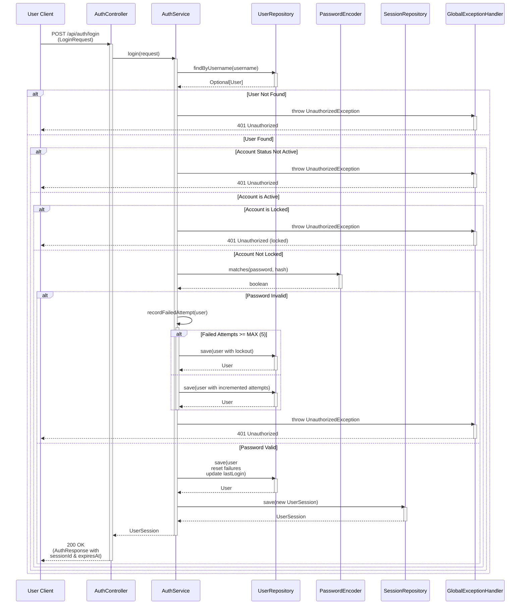

# User Login Sequence Diagram

This document illustrates the complete user authentication flow when logging into the trading application.

## Login Flow Overview

The login process involves the following sequence of interactions:

## Key Components

### AuthController (`app.auth.AuthController`)
- **Responsibility**: HTTP endpoint handling
- **Method**: `login(LoginRequest)` → `AuthResponse`
- **Status Code**: 200 (success), 401 (authentication failure)

### AuthService (`app.auth.AuthService`)
- **Responsibility**: Authentication logic and session management
- **Key Behaviors**:
  - Username/password validation
  - Account status verification
  - Account lockout enforcement (5 failed attempts → 15-minute lockout)
  - Session token generation
  - Failed attempt tracking

### UserRepository (`app.user.UserRepository`)
- **Responsibility**: User entity persistence
- **Methods Used**:
  - `findByUsername(String)` - locate user by username
  - `save(User)` - persist user updates (login counts, lockout status)

### PasswordEncoder (Spring Security)
- **Responsibility**: Cryptographic password validation
- **Method**: `matches(rawPassword, encodedPassword)`

### SessionRepository (`app.user.SessionRepository`)
- **Responsibility**: User session persistence
- **Method**: `save(UserSession)` - create new session token

### GlobalExceptionHandler (`app.auth.GlobalExceptionHandler`)
- **Responsibility**: Convert exceptions to HTTP responses
- **Handles**:
  - `UnauthorizedException` → 401 Unauthorized
  - `ConflictException` → 409 Conflict
  - Other validation errors → appropriate HTTP status

## Security Features

| Feature | Implementation |
|---------|-----------------|
| **Password Hashing** | BCrypt via PasswordEncoder |
| **Account Lockout** | 5 failed attempts → 15-minute lockout |
| **Session Timeout** | Configurable per user (stored in User entity) |
| **Account Status** | Verified at login (must be "ACTIVE") |
| **Last Login Tracking** | Recorded on successful authentication |
| **Last Activity Tracking** | Updated on successful authentication |

## Error Scenarios

### 1. User Not Found
- **Exception**: `UnauthorizedException`
- **HTTP Status**: 401 Unauthorized
- **Message**: "Invalid username or password"

### 2. Account Inactive
- **Exception**: `UnauthorizedException`
- **HTTP Status**: 401 Unauthorized
- **Message**: "Account is not active"

### 3. Account Locked
- **Exception**: `UnauthorizedException`
- **HTTP Status**: 401 Unauthorized
- **Message**: "Account is temporarily locked due to failed login attempts"

### 4. Invalid Password
- **Exception**: `UnauthorizedException`
- **HTTP Status**: 401 Unauthorized
- **Message**: "Invalid username or password"
- **Side Effect**: Increments `failedLoginAttempts`; locks account if attempts ≥ 5

## Success Flow Summary

1. ✅ User found by username
2. ✅ Account status is "ACTIVE"
3. ✅ Account is not locked (or lockout expired)
4. ✅ Password hash matches supplied password
5. ✅ Failed attempt counter reset to 0
6. ✅ Lock status cleared
7. ✅ Last login timestamp updated
8. ✅ New `UserSession` created and persisted
9. ✅ `AuthResponse` returned with session ID and expiry time

## Related Flows

- **Registration Flow** - New user account creation
- **Token Refresh** - Extend active session
- **Logout** - Terminate user session

---

**Last Updated**: 2026-09-15  
**Package**: `app.auth`  
**Related Classes**: `AuthController`, `AuthService`, `UserSession`, `LoginRequest`, `AuthResponse`
