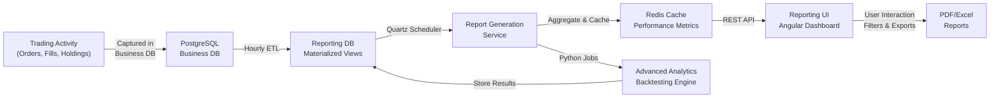

# Reporting Architecture

## Overview

The **DuaLEAPa Trading Platform** reporting architecture provides comprehensive analytics, performance metrics, and audit trail reporting for trading activities. This document defines the structure, technology stack, data flow, and update frequency for the reporting system.

---

## 1. Reporting Architecture Overview

```
┌─────────────────────────────────────────────────────────────┐
│  Frontend (Angular - Reporting UI)                          │
│  ├─ Performance Dashboard                                   │
│  ├─ Trade Analytics                                         │
│  ├─ Risk Metrics                                            │
│  ├─ Portfolio Summary                                       │
│  └─ Audit Trail Reports                                     │
└────────────┬────────────────────────────────────────────────┘
             │ HTTP/REST (Polling or WebSocket)
             │
┌────────────▼────────────────────────────────────────────────┐
│  Reporting Service (Spring Boot)                            │
│  ├─ Report Generation Engine                               │
│  ├─ Metrics Aggregation                                    │
│  ├─ Caching Layer (Redis)                                  │
│  └─ Scheduled Jobs (Quartz)                                │
└────────────┬────────────────────────────────────────────────┘
             │ JDBC
             │
┌────────────▼────────────────────────────────────────────────┐
│  PostgreSQL (Reporting Database)                            │
│  ├─ Materialized Views                                     │
│  ├─ Aggregated Metrics Tables                              │
│  └─ Audit Trail Tables                                     │
└─────────────────────────────────────────────────────────────┘
```

---

## 2. Reporting Project Structure

```
apps/reporting-service/
├── README.md                                    ← Service documentation
├── .agent.md                                    ← AI agent guidance
├── pom.xml                                      ← Maven dependencies
├── Dockerfile                                   ← Container configuration
│
├── src/main/java/com/neueda/leap/
│   ├── report/
│   │   ├── controller/
│   │   │   ├── PerformanceReportController.java
│   │   │   ├── TradeAnalyticsController.java
│   │   │   ├── RiskMetricsController.java
│   │   │   └── AuditTrailController.java
│   │   │
│   │   ├── service/
│   │   │   ├── ReportGenerationService.java
│   │   │   ├── PerformanceService.java
│   │   │   ├── AnalyticsService.java
│   │   │   ├── RiskMetricsService.java
│   │   │   └── AuditTrailService.java
│   │   │
│   │   ├── repository/
│   │   │   ├── PerformanceMetricsRepository.java
│   │   │   ├── TradeAnalyticsRepository.java
│   │   │   ├── RiskMetricsRepository.java
│   │   │   └── AuditTrailRepository.java
│   │   │
│   │   ├── dto/
│   │   │   ├── PerformanceReportDTO.java
│   │   │   ├── TradeAnalyticsDTO.java
│   │   │   ├── RiskMetricsDTO.java
│   │   │   └── AuditEventDTO.java
│   │   │
│   │   ├── entity/
│   │   │   ├── PerformanceMetrics.java
│   │   │   ├── TradeAnalytics.java
│   │   │   ├── RiskMetrics.java
│   │   │   └── AuditEvent.java
│   │   │
│   │   └── scheduler/
│   │       ├── ReportingScheduler.java
│   │       ├── MetricsAggregationJob.java
│   │       └── CacheRefreshJob.java
│   │
│   └── config/
│       ├── ReportingConfig.java
│       ├── CacheConfig.java
│       └── SchedulerConfig.java
│
├── src/main/resources/
│   ├── application.properties
│   ├── application-prod.properties
│   └── reports/
│       ├── templates/
│       │   ├── performance_report.html
│       │   ├── analytics_report.html
│       │   └── risk_metrics_report.html
│       └── styles/
│           └── report_styles.css
│
├── src/test/java/
│   ├── report/
│   │   ├── service/
│   │   │   ├── PerformanceServiceTest.java
│   │   │   ├── AnalyticsServiceTest.java
│   │   │   └── RiskMetricsServiceTest.java
│   │   │
│   │   └── controller/
│   │       └── ReportControllerTest.java
│   │
│   └── resources/
│       └── application-test.properties
│
└── db/migrations/
    ├── V002__Create_Reporting_Tables.sql
    ├── V003__Create_Materialized_Views.sql
    └── V004__Create_Indexes_For_Performance.sql


apps/reporting-ui/
├── README.md
├── .agent.md
├── package.json
├── angular.json
├── tsconfig.json
│
├── src/
│   ├── index.html
│   ├── main.ts
│   ├── styles.css
│   │
│   └── app/
│       ├── app.ts
│       ├── app.routes.ts
│       │
│       ├── dashboard/
│       │   ├── dashboard.component.ts
│       │   ├── dashboard.component.html
│       │   ├── dashboard.component.css
│       │   └── dashboard.component.spec.ts
│       │
│       ├── performance/
│       │   ├── performance.component.ts
│       │   ├── performance.component.html
│       │   ├── performance.component.css
│       │   └── performance.component.spec.ts
│       │
│       ├── analytics/
│       │   ├── trade-analytics.component.ts
│       │   ├── trade-analytics.component.html
│       │   └── trade-analytics.component.css
│       │
│       ├── risk/
│       │   ├── risk-metrics.component.ts
│       │   ├── risk-metrics.component.html
│       │   └── risk-metrics.component.css
│       │
│       └── services/
│           ├── reporting.service.ts
│           ├── performance.service.ts
│           └── analytics.service.ts
│
└── Dockerfile
```

---

## 3. Technology Stack

| Layer | Technology | Purpose |
|-------|-----------|---------|
| **Frontend** | Angular 22.1, TypeScript, TailwindCSS, ng-charts | Interactive dashboards, real-time metrics |
| **Backend** | Spring Boot 3.3.4, Spring Data JPA, Quartz Scheduler | Report generation, metrics aggregation |
| **Caching** | Redis 7.0+ | Performance optimization, session storage |
| **Database** | PostgreSQL 16, Materialized Views | Reporting data warehouse |
| **Analytics** | Python 3.11+, Pandas, NumPy | Advanced analytics, backtesting |
| **Export** | Apache POI, iText | PDF/Excel report generation |
| **Monitoring** | Prometheus, Grafana | System & application metrics |

---

## 4. Reporting Flow Diagram



---

## 5. Reporting Data Model

### Performance Metrics
```sql
CREATE TABLE performance_metrics (
    metric_id SERIAL PRIMARY KEY,
    account_id INT NOT NULL REFERENCES accounts(account_id),
    date_calculated TIMESTAMP NOT NULL,
    total_return_percent NUMERIC(10, 4),
    ytd_return_percent NUMERIC(10, 4),
    sharpe_ratio NUMERIC(10, 4),
    max_drawdown_percent NUMERIC(10, 4),
    win_rate_percent NUMERIC(10, 4),
    profit_factor NUMERIC(10, 4),
    avg_trade_return NUMERIC(10, 4),
    total_trades_count INT,
    winning_trades_count INT,
    losing_trades_count INT,
    created_at TIMESTAMP DEFAULT CURRENT_TIMESTAMP,
    UNIQUE(account_id, date_calculated)
);

CREATE INDEX idx_perf_metrics_account_date 
ON performance_metrics(account_id, date_calculated DESC);
```

### Trade Analytics
```sql
CREATE TABLE trade_analytics (
    analytics_id SERIAL PRIMARY KEY,
    account_id INT NOT NULL REFERENCES accounts(account_id),
    instrument_id INT NOT NULL REFERENCES instruments(instrument_id),
    period_start TIMESTAMP NOT NULL,
    period_end TIMESTAMP NOT NULL,
    total_trades_count INT,
    total_volume NUMERIC(15, 2),
    total_cost NUMERIC(15, 2),
    realized_pnl NUMERIC(15, 2),
    avg_entry_price NUMERIC(10, 4),
    avg_exit_price NUMERIC(10, 4),
    win_rate_percent NUMERIC(10, 4),
    created_at TIMESTAMP DEFAULT CURRENT_TIMESTAMP,
    UNIQUE(account_id, instrument_id, period_start)
);
```

### Risk Metrics
```sql
CREATE TABLE risk_metrics (
    risk_metric_id SERIAL PRIMARY KEY,
    account_id INT NOT NULL REFERENCES accounts(account_id),
    date_calculated TIMESTAMP NOT NULL,
    portfolio_value NUMERIC(15, 2),
    at_risk_value NUMERIC(15, 2),
    var_95_percent NUMERIC(15, 2),
    cvar_95_percent NUMERIC(15, 2),
    beta NUMERIC(10, 4),
    correlation_to_market NUMERIC(10, 4),
    concentration_percent NUMERIC(10, 4),
    leverage_ratio NUMERIC(10, 4),
    created_at TIMESTAMP DEFAULT CURRENT_TIMESTAMP,
    UNIQUE(account_id, date_calculated)
);
```

---

## 6. Reporting Update Frequency

### Real-Time (Every Minute)
- **Active Trade Counters** — Current open orders, recent fills
- **Portfolio Value** — Live position valuations
- **Profit/Loss (P&L)** — Unrealized gains/losses

### Hourly
- **Trade Summary** — Completed trades in the hour
- **Performance Snapshots** — Interim performance calculations
- **Risk Metrics** — Updated portfolio risk assessment

### Daily (End of Day)
- **Daily Performance Reports** — Complete day summary
- **Trade Analytics** — Full trading activity breakdown
- **Audit Trail Reports** — Complete transaction log
- **Risk Assessment** — Daily risk exposure review

### Weekly
- **Performance Comparison** — Week-over-week metrics
- **Strategy Performance** — Weekly strategy effectiveness
- **Risk Trends** — Weekly risk evolution

### Monthly
- **Comprehensive Performance Report** — Full month overview
- **Detailed Analytics** — Complete trading statistics
- **Reconciliation Reports** — Audit & compliance reports
- **PDF/Excel Exports** — Downloadable reports

---

## 7. Reporting UI Mockup Guide

### Dashboard Layout

```
┌────────────────────────────────────────────────────────────┐
│  REPORTING DASHBOARD                          [Date Range] │
└────────────────────────────────────────────────────────────┘

┌─────────────────────┬──────────────────┬──────────────────┐
│  Total Return       │ Sharpe Ratio     │  Max Drawdown    │
│  +15.24%            │ 1.85             │  -8.32%          │
│  ↑ 2.14% vs prev    │ ↑ 0.21 vs prev   │  ↓ 1.23% vs prev │
└─────────────────────┴──────────────────┴──────────────────┘

┌──────────────────────────────────────────────────────────┐
│  Portfolio Performance (Line Chart)                       │
│  ┌──────────────────────────────────────────────────────┐ │
│  │                                                  ╱   │ │
│  │                                            ╱         │ │
│  │                                    ╱                 │ │
│  │                        ╱────                         │ │
│  │            ╱───╲                                     │ │
│  │       ╱──╲                                           │ │
│  │___╱                                                  │ │
│  └──────────────────────────────────────────────────────┘ │
│  Jan  Feb  Mar  Apr  May  Jun  Jul  Aug  Sep             │
└──────────────────────────────────────────────────────────┘

┌───────────────────────┬─────────────────────────────────┐
│  Win Rate             │  Trade Summary                  │
│  ┌─────────────────┐  │  Total Trades: 245              │
│  │ ██████████░░░░░ │  │  Winning: 158 (64.5%)           │
│  │ 64.5%           │  │  Losing: 87 (35.5%)             │
│  └─────────────────┘  │  Avg Trade: +$1,250             │
│                       │  Profit Factor: 2.15            │
└───────────────────────┴─────────────────────────────────┘

┌──────────────────────────────────────────────────────────┐
│  Recent Trades (Table)                                   │
│  Date      | Instrument | Qty  | Entry  | Exit  | P&L   │
│  09/09/26  | AAPL       | 100  | 228.50 | 230.12| +162  │
│  09/08/26  | MSFT       | 50   | 425.00 | 424.50| -25   │
│  09/08/26  | GOOGL      | 200  | 142.30 | 143.00| +140  │
└──────────────────────────────────────────────────────────┘
```

### Key UI Components

1. **Metrics Cards** — KPI summaries with trend indicators
2. **Performance Charts** — Line charts, area charts, candlesticks
3. **Analytics Tables** — Sortable, filterable trade data
4. **Risk Heatmaps** — Portfolio risk visualization
5. **Audit Trail** — Transaction history with search
6. **Export Buttons** — PDF, Excel, CSV download options

---

## 8. API Endpoints

### Performance Reports
```
GET /api/v1/reports/performance
  Parameters: accountId, startDate, endDate
  Response: PerformanceReportDTO
  
GET /api/v1/reports/performance/daily/{date}
  Response: Daily performance snapshot
  
GET /api/v1/reports/performance/metrics
  Response: List of performance KPIs
```

### Trade Analytics
```
GET /api/v1/reports/analytics
  Parameters: accountId, instrumentId, startDate, endDate
  Response: TradeAnalyticsDTO
  
GET /api/v1/reports/analytics/by-instrument
  Response: Analytics grouped by instrument
  
GET /api/v1/reports/analytics/summary
  Response: High-level trading summary
```

### Risk Metrics
```
GET /api/v1/reports/risk
  Parameters: accountId, date
  Response: RiskMetricsDTO
  
GET /api/v1/reports/risk/portfolio
  Response: Portfolio-level risk assessment
  
GET /api/v1/reports/risk/history
  Parameters: accountId, startDate, endDate
  Response: Risk metrics over time
```

### Audit Trail
```
GET /api/v1/reports/audit
  Parameters: accountId, startDate, endDate, eventType
  Response: List of audit events
  
GET /api/v1/reports/audit/export
  Response: PDF or Excel export
```

---

## 9. Scheduling & Jobs

### Quartz Jobs Configuration

```properties
# Metrics aggregation - Daily at 9 PM
reporting.schedule.metrics-aggregation.cron=0 0 21 * * ?

# Cache refresh - Every 5 minutes
reporting.schedule.cache-refresh.cron=0 */5 * * * ?

# Report generation - Daily at 6 AM
reporting.schedule.report-generation.cron=0 0 6 * * ?

# Archive old data - Weekly on Sunday at 2 AM
reporting.schedule.data-archive.cron=0 0 2 ? * SUN
```

---

## 10. Performance Optimization

### Caching Strategy
- **TTL (Time-to-Live):** 5 minutes for real-time metrics, 1 hour for daily summaries
- **Cache Keys:** `report:{accountId}:{reportType}:{date}`
- **Invalidation:** Event-driven on order completion, scheduled refresh

### Database Optimization
- **Materialized Views:** Pre-aggregated data for common queries
- **Indexes:** On account_id, date_calculated, instrument_id
- **Partitioning:** Monthly partitions on performance_metrics by date_calculated
- **Query Optimization:** Use aggregation functions in SQL, minimize application-level processing

### Frontend Optimization
- **Lazy Loading:** Load reports on demand
- **Pagination:** 50 rows per page for large datasets
- **Client-Side Filtering:** Real-time filter on loaded data
- **Chart Virtualization:** Render only visible data points

---

## 11. Security & Compliance

### Access Control
- **Role-Based:** Only users can view their own reports
- **Admin Access:** Admin users can view platform-wide analytics
- **Data Retention:** 24 months of historical data (configurable)

### Audit & Compliance
- **Complete Audit Trail:** Every report access logged
- **Data Encryption:** Sensitive fields encrypted at rest
- **API Rate Limiting:** 100 requests/minute per user
- **Export Restrictions:** Exported reports are watermarked with user ID & timestamp

---

## 12. Future Enhancements

- [ ] Real-time WebSocket updates for live metrics
- [ ] Custom report builder UI
- [ ] Machine learning-based anomaly detection
- [ ] Comparison reports (trader vs benchmark)
- [ ] Mobile app for reporting access
- [ ] Advanced charting (Plotly, Echarts)
- [ ] Scheduled email reports
- [ ] Integration with TradingView, Yahoo Finance APIs

---

## 13. Getting Started

### Backend Setup
```bash
cd apps/reporting-service
mvn clean install
mvn spring-boot:run
```

### Frontend Setup
```bash
cd apps/reporting-ui
npm install
npm run dev
```

### Database Setup
```bash
# Flyway migrations run automatically on startup
# Or manually:
mvn flyway:migrate -Dflyway.configFiles=src/main/resources/application.properties
```

---

## 14. Related Documentation

- [ARCHITECTURE.md](ARCHITECTURE.md) — System-wide architecture
- [DATABASE.md](DATABASE.md) — Complete database schema
- [API_REFERENCE.md](API_REFERENCE.md) — All API endpoints
- [DEVELOPMENT_WORKFLOW.md](DEVELOPMENT_WORKFLOW.md) — Development setup
- [TEST_SUMMARY.md](TEST_SUMMARY.md) — Testing guidelines

---

**Last Updated:** 2026-09-09  
**Status:** Sprint 1 - Reporting Architecture Established  
**Maintained By:** DuaLEAPa Team
