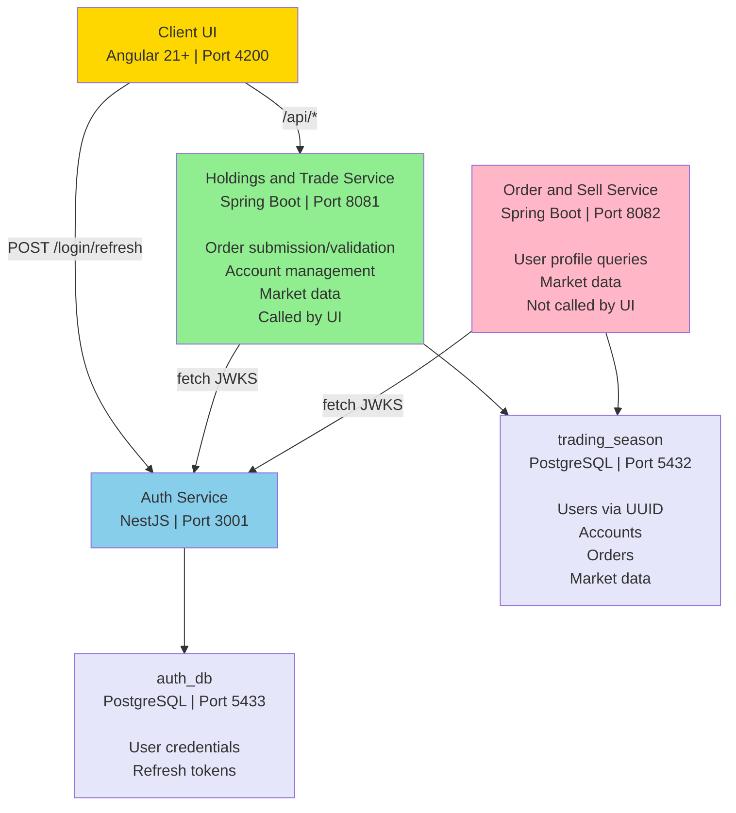

# Architecture

This document describes the system-level structure of Trading Season. For per-service detail, implementation status, and verified endpoints, see [Service Reference](services/).

## System overview

Trading Season is a monorepo containing:

- **Frontend** – Angular-based Client UI with reusable component library
- **Authentication** – NestJS service with email/password authentication and RS256 tokens
- **Backend** – Two independent Spring Boot microservices sharing a single PostgreSQL database
- **Shared Infrastructure** – Database migrations, synthetic market data tooling, Docker Compose configuration

## Service topology



## Service boundaries

| Service | Technology | Port | Responsibility |
| --- | --- | --- | --- |
| **Client UI** | Angular 21+ | 4200 | User interface, login, registration, dashboard |
| **Auth Service** | NestJS | 3001 | User credentials, token issuance, session management |
| **Holdings and Trade Service** | Spring Boot (Java 21) | 8081 | Order submission/validation/execution, account management |
| **Order and Sell Service** | Spring Boot (Java 21) | 8082 | User profile queries, market data access |
| **Market Data** | Infrastructure | — | Database migrations, synthetic data generation |

## The naming does not match the split

This is the most common source of confusion when navigating this codebase:

- **Holdings and Trade Service** implements order processing (submission, validation, execution) and executes all orders. It is also the exclusive backend target of Client UI.
- **Order and Sell Service** does not handle orders; it provides user profile queries and public market data only.

The names reference an earlier architectural split that was not completed in code. See [Holdings and Trade Service documentation](services/holdings-and-trade-service.md) and [Order and Sell Service documentation](services/order-and-sell-service.md) for current status.

## Databases

Two separate PostgreSQL databases:

| Database | Owner | Purpose |
| --- | --- | --- |
| `auth_db` | Auth Service | User credentials, refresh tokens, sessions |
| `trading_season` | Shared (Market Data) | Business data: users, accounts, orders, holdings, market data |

The only value shared between them is the user UUID (auth.users.id ↔ trading_season.users.user_id). Credentials and tokens stay in auth_db; profile and trading data stay in trading_season.

## Authentication flow

```
1. Client → Auth Service (POST /auth/login)
   Email + password → RS256 access token + refresh token

2. Client → Holdings and Trade Service (API request with Bearer token)
   Service verifies signature independently using cached JWKS from Auth Service

3. On token expiry:
   Client → Auth Service (POST /auth/refresh)
   Refresh token → New access token
```

Neither Java service calls the Auth Service per request. Each fetches and caches the JWKS independently.

## Data ownership

The `trading_season` database is shared by Holdings and Trade Service and Order and Sell Service:

- **Holdings and Trade Service** – Reads and writes accounts, orders, fills, holdings, cash transactions, holding movements, audit trail
- **Order and Sell Service** – Reads user profiles and account metadata only (repository present but unused)
- **Market Data** – Owns all migrations; neither service owns the schema

Both services use JPA to map to the same tables directly. This requires schema version alignment across deployments. See [Market Data documentation](services/market-data.md) for migration rules.

## Client UI integration

The dev proxy (`apps/client-ui/proxy.conf.json`) forwards all `/api` requests to Holdings and Trade Service (port 8081) exclusively:

- Auth Service (port 3001) is called directly for login/register/refresh
- Order and Sell Service (port 8082) is never called from the UI

## Known limitations

1. **Duplication** – Holdings and Trade Service and Order and Sell Service both contain auth registration code and market data endpoints. See [Holdings and Trade Service documentation](services/holdings-and-trade-service.md) for why.

2. **Order and Sell Service isolation** – This service is not called by Client UI in normal operation. It runs independently and could serve other clients, but currently has no caller.

3. **Incomplete order history** – Order and Sell Service's README documents order history as a responsibility, but the endpoint is not implemented. See [Order and Sell Service documentation](services/order-and-sell-service.md) for discussion and next steps.

4. **NestJS integration edge cases** – Bootstrap does not install global validation, cookie parser, or CORS. Refresh tokens must be sent as JSON body, not cookies. See [Auth Service documentation](services/auth-service.md) for details.

## Change boundaries

- Put reusable UI components in the shared package; application logic stays in its owning app
- Keep business database (`trading_season`) and auth database (`auth_db`) changes in separate migrations
- Never edit an applied database migration; always add new ones
- Both Java services must deploy against the same `trading_season` schema version

## See also

- [Service Reference](services/) for per-service structure and endpoints
- [API Reference](api.md) for implemented HTTP contracts
- [Database Reference](database.md) for schema, ownership, and relationships
- [Development Guide](../guides/development.md) for local setup and verification
- [Operations Guide](../guides/operations.md) for configuration and troubleshooting
