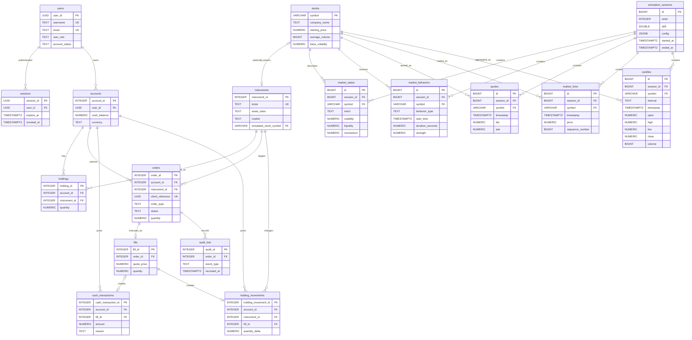

# Database

## Two separate stores

The Java business backend and NestJS auth service have separate PostgreSQL databases and user models. Do not assume identities or sessions are shared.

| Store | Schema source | Application behavior |
| --- | --- | --- |
| Business: paysprint | [V001 bootstrap SQL](../../apps/business-backend/db/migrations/V001__Initial_schema.sql) | Hibernate ddl-auto=none; no Flyway dependency or automatic migration runner |
| Auth: auth_db | [TypeORM migrations](../../apps/auth-service/src/database/migrations/) | Migrations run on startup; synchronize=false |

The business bootstrap defines more of the trading model than the currently implemented Java auth API. The [ERD](../../apps/business-backend/db/erd.md) is the canonical diagram; SQL remains authoritative for exact columns and constraints.

## Business model

| Group | Tables and responsibility |
| --- | --- |
| Identity | users and sessions: profile, credentials, login sessions |
| Simulation/reference | simulation_sessions, stocks, instruments: reproducible runs and tradable assets |
| Market data | market_states, market_behaviors, quotes, market_ticks, candles: state, history, replay data |
| Accounts/execution | accounts, holdings, orders, fills: balances, positions, instructions and executions |
| Ledgers/audit | cash_transactions, holding_movements, audit_trail: accounting and event history |

Orders are distinct from fills. The schema allows at most one fill per order. The account/client_reference pair supplies order idempotency. Cash balances and holdings are caches reconciled against append-only ledgers. Application grants should limit ledger/audit access to the appropriate insert/read operations; table definitions alone do not enforce every operational policy.

Simulation data is scoped by run and stock. Deleting a simulation session cascades through its generated market data. The optional unique instruments.simulated_stock_symbol connects U.S. equity instruments to simulator stocks. Trading schema support for other asset classes does not imply their simulation or APIs are implemented.

## Disposable business database setup

The V001 file drops and recreates tables. Run it only against a database whose contents can be discarded. It is not a safe upgrade for an existing populated database. It needs PostgreSQL with pgcrypto available.

After starting the business database, run from repository root with psql installed (it prompts for the database password):

```sh
psql -h localhost -p 5432 -U paysprint -d paysprint -W -v ON_ERROR_STOP=1 -f apps/business-backend/db/migrations/V001__Initial_schema.sql
```

Do not use db/init.sql for this application: it is a separate SQL Server-style SampleDB example. Do not claim that the V001 filename means Flyway is configured; inspect the Java POM and application properties.

## Auth migrations

[Runtime configuration](../../apps/auth-service/src/config/database.config.ts) and the [CLI data source](../../apps/auth-service/src/database/data-source.ts) must retain matching entity and migration lists. The initial schema creates auth users and refresh-token storage; the subsequent migration requires username.

From apps/auth-service, npm run migration:show and npm run migration:run inspect/apply migrations. Export the matching database environment variables before invoking the CLI: its data source does not itself load dotenv. Normal application startup loads .env and runs migrations automatically.

Refresh tokens are stored as hashes with expiry, revocation, and rotation metadata. See the [auth README](../../apps/auth-service/README.md) for connection and key setup.

## Change rules

Add incremental migrations rather than editing already applied files. For business changes, explicitly document the application procedure because no migration runner is installed. Review SQL, affected entity mappings, and the ERD together. Use test fixtures instead of production identities or secrets. Back up retained data and verify migrations on a disposable copy before deployment.

# Business database ERD

Canonical relationship diagram for [V001 bootstrap SQL](migrations/V001__Initial_schema.sql). SQL defines exact columns and constraints. See the [database reference](../../../docs/reference/database.md) for ownership, initialization, and change rules.

The optional instruments.simulated_stock_symbol links an instrument to a simulator stock. Market data belongs to a simulation session and stock. Keep this diagram synchronized when schema relationships change.


